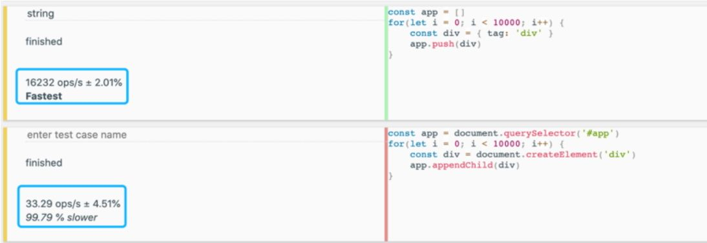

考虑到有些读者可能不知道什么是虚拟 DOM，这里我们不会对其做深入讨论，但这既不影响你理解本节内容，也不影响你阅读后续章节。
如果实在看不明白，也没关系，至少有个印象，等后面我们深入讲解虚拟 DOM 后再回来看这里的内容，相信你会有不同的感受。

前文说到，**声明式代码的更新性能消耗 = 找出差异的性能消耗 + 直接修改的性能消耗**，
因此，**如果我们能够让找出差异的这一环节所消耗的性能最小化，就可以让声明式代码的性能无限接近命令式代码的性能**。
而**所谓的虚拟 DOM，就是为了让找出差异的这一环节所消耗的性能最小化而出现的**。

至此，相信你也应该清楚一件事了，那就是采用虚拟 DOM 的更新技术的性能理论上不可能比原生 JS 操作 DOM 更高。
这里我们强调了理论上三个字，因为这很关键，为什么呢？因为在大部分情况下，我们很难写出绝对优化的命令式代码，
尤其是当应用程序的规模很大的时候，即使你写出了极致优化的代码，也一定耗费了巨大的精力，这时的投入产出比其实并不高。

那么，有没有什么办法能够让我们不用付出太多的努力（写声明式代码），还能够保证应用程序的性能下限，
让应用程序的性能不至于太差，甚至想办法逼近命令式代码的性能呢？这其实就是虚拟 DOM 要解决的问题。

不过前文中所说的原生 JS 实际上指的是像 document.createElement 之类的 DOM 操作方法，
并不包含 innerHTML，因为它比较特殊，需要单独讨论。在早年使用 jQuery 或者直接使用 JS 编写页面的时候，
使用 innerHTML 来操作页面非常常见。其实我们可以思考一下：使用 innerHTML 操作页面和虚拟 DOM 相比性能如何？
innerHTML 和 document.createElement 等 DOM 操作方法有何差异？

先来看第一个问题，为了比较 innerHTML 和虚拟 DOM 的性能，我们需要了解它们创建、更新页面的过程。
对于 innerHTML 来说，为了创建页面，我们需要构造一段 HTML 字符串：

```js
const html = `<div><span>...</span></div>`
```

接着将该字符串赋值给 DOM 元素的 innerHTML 属性：

```js
div.innerHTML = html
```

然而这句话远没有看上去那么简单。为了渲染出页面，首先要把字符串解析成 DOM 树，这是一个 DOM 层面的计算。
我们知道，涉及 DOM 的运算要远比 JavaScript 层面的计算性能差，这有一个跑分结果可供参考，如图 1-1 所示。


> 图1-1　跑分结果

在图中，上边是纯 JavaScript 层面的计算，循环 10000 次，每次创建一个 JavaScript 对象并将其添加到数组中；
下边是 DOM 操作，每次创建一个 DOM 元素并将其添加到页面中。跑分结果显示，纯 JavaScript 层面的操作要比 DOM 操作快得多，
它们不在一个数量级上。基于这个背景，我们可以用一个公式来表达通过 innerHTML 创建页面的性能：
> HTML 字符串拼接的计算量 + innerHTML 的 DOM 计算量。

接下来，我们讨论虚拟 DOM 在创建页面时的性能。虚拟 DOM 创建页面的过程分为两步：
第一步是创建 JavaScript 对象，这个对象可以理解为真实 DOM 的描述；
第二步是递归地遍历虚拟 DOM 树并创建真实 DOM。
我们同样可以用一个公式来表达：
> 创建 JavaScript 对象的计算量 + 创建真实 DOM 的计算量。

图 1-2 直观地对比了 innerHTML 和虚拟 DOM 在创建页面时的性能。


> 图1-2　innerHTML 和虚拟 DOM 在创建页面时的性能

可以看到，无论是纯 JavaScript 层面的计算，还是 DOM 层面的计算，其实两者差距不大。
这里我们从宏观的角度只看数量级上的差异。如果在同一个数量级，则认为没有差异。在创建页面的时候，都需要新建所有 DOM 元素。

刚刚我们讨论了创建页面时的性能情况，大家可能会觉得虚拟 DOM 相比 innerHTML 没有优势可言，甚至细究的话性能可能会更差。
别着急，接下来我们看看它们在更新页面时的性能。

使用 innerHTML 更新页面的过程是重新构建 HTML 字符串，再重新设置 DOM 元素的 innerHTML 属性，
这其实是在说，哪怕我们只更改了一个文字，也要重新设置 innerHTML 属性。
而**重新设置 innerHTML 属性就等价于销毁所有旧的 DOM 元素，再全量创建新的 DOM 元素**。

再来看虚拟 DOM 是如何更新页面的。它需要重新创建 JavaScript 对象（虚拟 DOM 树），
然后比较新旧虚拟 DOM，找到变化的元素并更新它。图 1-3 可作为对照。


> 图1-3　虚拟 DOM 和 innerHTML 在更新页面时的性能

可以发现，在更新页面时，虚拟 DOM 在JavaScript 层面的运算要比创建页面时多出一个 Diff 的性能消耗，
然而它毕竟也是 JavaScript 层面的运算，所以不会产生数量级的差异。
再观察 DOM 层面的运算，可以发现**虚拟 DOM 在更新页面时只会更新必要的元素，但 innerHTML 需要全量更新**。这时**虚拟 DOM 的优势**就体现出来了。

另外，我们发现，当更新页面时，影响虚拟 DOM 的性能因素与影响 innerHTML 的性能因素不同。
对于虚拟 DOM 来说，无论页面多大，都只会更新变化的内容，而对于 innerHTML 来说，页面越大，
就意味着更新时的性能消耗越大。如果加上性能因素，那么最终它们在更新页面时的性能如图 1-4 所示。


> 图1-4　虚拟 DOM 和 innerHTML 在更新页面时的性能（加上性能因素）

基于此，我们可以粗略地总结一下 innerHTML、虚拟 DOM 以及原生 JavaScript（指 createElement 等方法）在更新页面时的性能，如图 1-5 所示。


> 图1-5　innerHTML、虚拟 DOM 以及原生 JavaScript 在更新页面时的性能

我们分了几个维度：心智负担、可维护性和性能。其中**原生 DOM 操作方法的心智负担最大**，因为你要手动创建、删除、修改大量的 DOM 元素。
**但它的性能是最高的**，不过为了使其性能最佳，我们同样要承受巨大的心智负担。另外，以这种方式编写的代码，可维护性也极差。

而对于 innerHTML 来说，由于我们编写页面的过程有一部分是通过拼接 HTML 字符串来实现的，这有点儿接近声明式的意思，
但是拼接字符串总归也是有一定心智负担的，而且对于事件绑定之类的事情，我们还是要使用原生 JavaScript 来处理。
**如果 innerHTML 模板很大，则其更新页面的性能最差**，尤其是在只有少量更新时。

最后，我们来看看虚拟 DOM，它是声明式的，因此**心智负担小，可维护性强**，性能虽然比不上极致优化的原生 JavaScript，但是在保证心智负担和可维护性的前提下相当不错。

至此，我们有必要思考一下：有没有办法做到，既声明式地描述 UI，又具备原生 JavaScript 的性能呢？看上去有点儿鱼与熊掌兼得的意思，我们会在下一章中继续讨论。
