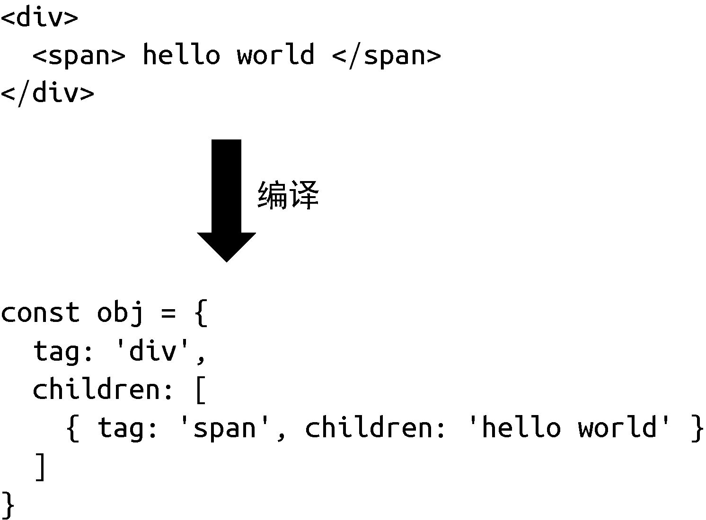

当设计一个框架的时候，我们有三种选择：纯运行时的、运行时 + 编译时的或纯编译时的。这需要你根据目标框架的特征，以及对框架的期望，做出合适的决策。
另外，为了做出合适的决策，你需要清楚地知道什么是运行时，什么是编译时，它们各自有什么特征，它们对框架有哪些影响，本节将会逐步讨论这些内容。

我们先聊聊纯运行时的框架。假设我们设计了一个框架，它提供一个 Render 函数，用户可以为该函数提供一个树型结构的数据对象，
然后 Render 函数会根据该对象递归地将数据渲染成 DOM 元素。我们规定树型结构的数据对象如下：

```js
const obj = {
  tag: 'div',
  children: [
    { tag: 'span', children: 'hello world' }
  ]
}
```

每个对象都有两个属性：tag 代表标签名称，children 既可以是一个数组（代表子节点），也可以直接是一段文本（代表文本子节点）。接着，我们来实现 Render 函数：

```js
function Render(obj, root) {
  const el = document.createElement(obj.tag)
  if (typeof obj.children === 'string') {
    const text = document.createTextNode(obj.children)
    el.appendChild(text)   
  } else if (obj.children) {
    // 数组，递归调用 Render，使用 el 作为 root 参数
    obj.children.forEach((child) => Render(child, el))
  }

  // 将元素添加到 root
  root.appendChild(el)
}
```

有了这个函数，用户就可以这样来使用它：

```js
const obj = {
  tag: 'div',
  children: [
    { tag: 'span', children: 'hello world' }
  ]
}
// 渲染到 body 下
Render(obj, document.body)
```

在浏览器中运行上面这段代码，就可以看到我们预期的内容。

现在我们回过头来思考一下用户是如何使用 Render 函数的。可以发现，用户在使用它渲染内容时，直接为 Render 函数提供了一个树型结构的数据对象。
这里面不涉及任何额外的步骤，用户也不需要学习额外的知识。
但是有一天，你的用户抱怨说：“手写树型结构的数据对象太麻烦了，而且不直观，能不能支持用类似于 HTML 标签的方式描述树型结构的数据对象呢？
”你看了看现在的 Render 函数，然后回答：“抱歉，暂不支持。”实际上，我们刚刚编写的框架就是一个纯运行时的框架。

为了满足用户的需求，你开始思考，能不能引入编译的手段，把 HTML 标签编译成树型结构的数据对象，这样不就可以继续使用 Render 函数了吗？思路如图 1-6 所示。


> 图1-6　把 HTML 标签编译成树型结构的数据对象

为此，你编写了一个叫作 Compiler 的程序，它的作用就是**把 HTML 字符串编译成树型结构的数据对象**，于是交付给用户去用了。那么用户该怎么用呢？其实这也是我们要思考的问题，最简单的方式就是让用户分别调用Compiler 函数和 Render 函数：

```js
const html = `
<div>
  <span>hello world</span>
</div>
`
// 调用 Compiler 编译得到树型结构的数据对象
const obj = Compiler(html)
// 再调用 Render 进行渲染
Render(obj, document.body)
```

上面这段代码能够很好地工作，这时我们的框架就变成了一个运行时 + 编译时的框架。它既支持运行时，用户可以直接提供数据对象从而无须编译；
又支持编译时，用户可以提供 HTML 字符串，我们将其编译为数据对象后再交给运行时处理。准确地说，上面的代码其实是**运行时编译，
意思是代码运行的时候才开始编译**，而这会产生一定的性能开销，因此我们也可以在构建的时候就执行 Compiler 程序将用户提供的内容编译好，
等到运行时就无须编译了，这对性能是非常友好的。
