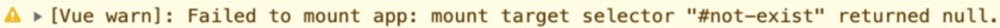
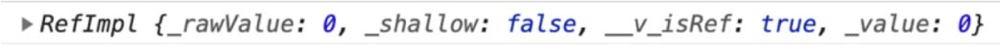
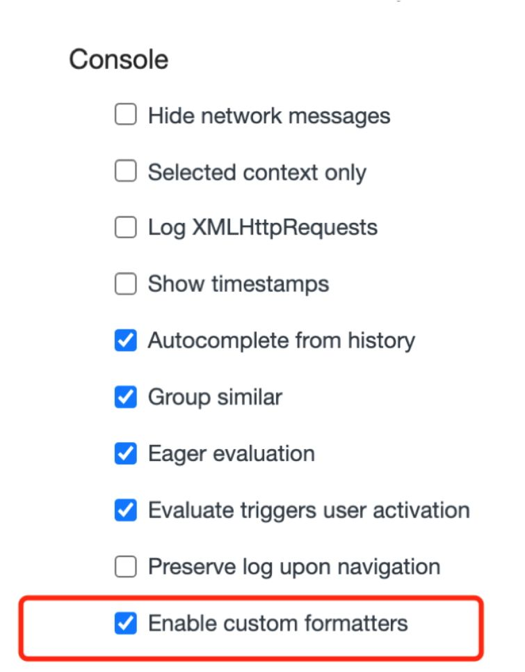
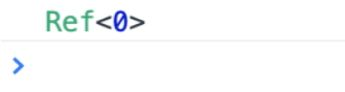

::: info
框架设计要比想象得复杂，并不是说只把功能开发完成，能用就算大功告成了，这里面还有很多学问。比如，我们的框架应该给用户提供哪些构建产物？产物的模块格式如何？
当用户没有以预期的方式使用框架时，是否应该打印合适的警告信息从而提供更好的开发体验，让用户快速定位问题？开发版本的构建和生产版本的构建有何区别？
热更新（hot module replacement，HMR）需要框架层面的支持，我们是否也应该考虑？另外，当你的框架提供了多个功能，而用户只需要其中几个功能时，
用户能否选择关闭其他功能从而减少最终资源的打包体积？上述问题是我们在设计框架的过程中应该考虑的。

学习本章时，要求大家对常用的模块打包工具有一定的使用经验，尤其是 rollup.js 和 webpack。如果你只用过或了解过其中一个，也没关系，因为它们的很多概念其实是类似的。
如果你没有使用过任何模块打包工具，那么需要自行了解一下，有了初步认识之后再来阅读本章会更好一些。
:::

衡量一个框架是否足够优秀的指标之一就是看它的开发 体验如何，这里我们拿 Vue.js 3 举个例子：

```js
createApp(App).mount('#not-exist')
```

当我们创建一个 Vue.js 应用并试图将其挂载到一个不存在的 DOM 节点时，就会收到一条警告信息，如图 2-1所示。


> 图2-1　警告信息

这条信息告诉我们挂载失败了，并说明了失败的原因：Vue.js 根据我们提供的选择器无法找到相应的 DOM 元素（返回 null）。
这条信息让我们能够清晰且快速地定位问题。试想一下，如果 Vue.js 内部不做任何处理，那么我们很可能得到的是 JS 层面的错误信息，
例如 Uncaught TypeError: Cannot read property 'xxx'of null，而根据此信息我们很难知道问题出在哪里。

所以在框架设计和开发过程中，提供友好的警告信息至关重要。如果这一点做得不好，那么很可能会经常收到用户的抱怨。
始终提供友好的警告信息不仅能够帮助用户快速定位问题，节省用户的时间，还能够让框架收获良好的口碑，让用户认可框架的专业性。

在 Vue.js 的源码中，我们经常能够看到 warn 函数的调用，例如图 2-1 中的信息就是由下面这个 warn 函数调用打印的：

```js
warn(`Failed to mount app: mount target selector "${container}" returned null.`)
```

对于 warn 函数来说，由于它需要尽可能提供有用的信息，因此它需要收集当前发生错误的组件栈信息。
如果你去看源码，就会发现有些复杂，但其实最终就是调用了 console.warn 函数。

除了提供必要的警告信息外，还有很多其他方面可以作为切入口，进一步提升用户的开发体验。例如，在 Vue.js 3 中，当我们在控制台打印一个 ref 数据时：

```js
const count = ref(0)
console.log(count)
```

打开控制台查看输出，结果如图 2-2 所示。


> 图2-2　控制台输出结果

可以发现，打印的数据非常不直观。当然，我们可以选择直接打印 count.value 的值，这样就只会输出 0，非常直观。
那么有没有办法在打印 count 的时候让输出的信息更友好呢？

当然可以，**浏览器允许我们编写自定义的 formatter，从而自定义输出形式**。
在 Vue.js 3 的源码中，你可以搜索到名为 **initCustomFormatter** 的函数，该函数就是用来在开发环境下初始化自定义 formatter 的。
以 Chrome 为例，我们可以打开 DevTools 的设置，然后勾选“Console”→“Enablecustom formatters”选项，如图 2-3 所示。

</img>
> 图2-3　勾选“Console”→“Enable custom formatters”选项

然后刷新浏览器并查看控制台，会发现输出内容变得非常直观，如图 2-4 所示。


> 图2-4　直观的输出内容
