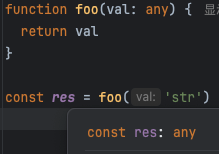
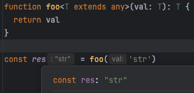

TypeScript 是由微软开源的编程语言，简称 TS，它是 JavaScript 的超集，能够为 JS 提供类型支持。
现在越来越多的开发者和团队在项目中使用 TS。**使用 TS 的好处有很多，如代码即文档、编辑器自动提示、一定程度上能够避免低级 bug、代码的可维护性更强等**。
因此对 TS 类型的支持是否完善也成为评价一个框架的重要指标。

::: details 来自社区的一些负面评价
“有时需要写很多甚至不必要的代码来弥补 TS 在 JS 弱类型上添加的类型约束，JS 简单能实现的，TS 却不容易实现...

刚开始学 TS，最大的感受是，不同于 java， C++ 等强类型语言，它们的 null 值可以直接赋值给对象，TS 中还要单独来个 null 类型，
如果我想使用 null 初始化，然后再赋值，需要写 let person: Person | null = null，后续在写代码的时候，你明知 person 赋值之后不
会为 null 了，但是 TS 还是报错提示可能为 null，你就得加个判断不为空的语句给弱智编译器（后来学到了使用 ?.! 这种声明，好了一些）同样学习强类型语言，
新手在处理 TS 类型报错上的时间比 Java 等多得不少！

还值得吐槽的是，如果引用的第三方库使用的是 JS，没有类型声明文件，你又得头疼一些了，
要么安装其他开源者贡献的 @types/xxx，或者声明在 d.ts 中声明一下模块，但这可能没有类型提示，但在 Java 等引入第三方包是不会有这种问题的，
让人一直感觉 TS 在 JS 上打补丁，但不可否认 TS 开发大型项目也有优势，这也是有切身体会的不过，一些开源项目也在考虑去 TS，
因为他们认为使用 TS 增加了无谓的开发的时间”

“用 TS 写过一些项目，和 java 比起来， TS 感觉很蠢，纯粹为类型而强制各种匪夷所思的语法，为几句简单的逻辑要写n多的外围代码或定义文件...

几个项目总结下来 TS 只适合大型业务项目或框架类项目使用，中小业务项目纯粹给自己找事，至少在我主导的项目里不会再使用了，良好的阅读，
封装良好的函数文件远比为 TS 而写 TS 来得简洁直接。TS 写着写着变成 anyscript 的事还少吗？”
:::

如何衡量一个框架对 TS 类型支持的水平呢？这里有一个常见的误区，很多读者以为只要是使用 TS 编写框架，就等价于对 TS 类型支持友好，其实这是两件完全不同的事。
考虑到有的读者可能没有接触过 TS，所以这里不会做深入讨论，我们只举一个简单的例子。下面是使用 TS 编写的函数：

```ts
function foo(val: any) {
  return val
}
```

这个函数很简单，它接收参数 val 并且该参数可以是任意类型（any），该函数直接将参数作为返回值，这说明返回值的类型是由参数决定的，
如果参数是 number 类型，那么返回值也是 number 类型。然后我们尝试使用一下这个函数，如图 2-5 所示。


> 图2-5　返回值类型丢失

在调用 foo 函数时，我们传递了一个字符串类型的参数 'str'，按照之前的分析，得到的结果 res 的类型应该也是字符串类型，
然而当我们把鼠标指针悬浮到 res 常量上时，可以看到其类型是 any，这并不是我们想要的结果。为了达到理想状态，我们只需要对 foo 函数做简单的修改即可：


> 图2-6　能够推导出返回值类型

可以看到，res 的类型是字符字面量 'str' 而不是 any 了，这说明我们的代码生效了。

通过这个简单的例子我们认识到，使用 TS 编写代码与对 TS 类型支持友好是两件事。在编写大型框架时，想要做到完善的 TS 类型支持很不容易，
大家可以查看 Vue.js 源码中的 runtime-core/src/apiDefineComponent.ts 文件，整个文件里真正会在浏览器中运行的代码其实只有 3 行，
但是全部的代码接近 200 行，其实这些代码都是在为类型支持服务。由此可见，框架想要做到完善的类型支持，需要付出相当大的努力。

除了要花大力气做类型推导，从而做到更好的类型支持外，还要考虑对 TSX 的支持，后续章节会详细讨论这部分内容。
