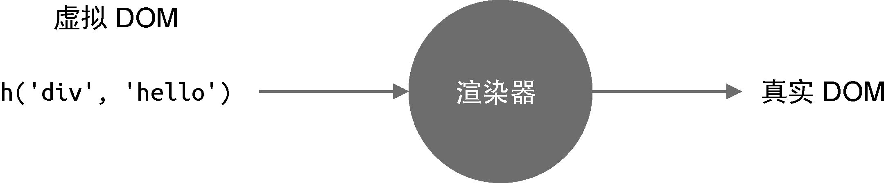
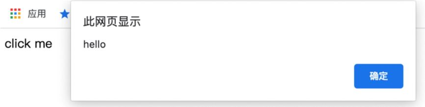

现在我们已经了解了**什么是虚拟 DOM，它其实就是用 JS 对象来描述真实的 DOM 结构**。
那么，虚拟 DOM 是如何变成真实 DOM 并渲染到浏览器页面中的呢？这就用到了我们接下来要介绍的：渲染器。

**渲染器的作用就是把虚拟 DOM 渲染为真实 DOM**，如图 3-1 所示。


> 图3-1　渲染器的作用

渲染器是非常重要的角色，大家平时编写的 Vue.js 组件都是依赖渲染器来工作的，因此后面我们会专门讲解渲染器。
不过这里有必要先初步认识渲染器，以便更好地理解 Vue.js 的工作原理。

假设我们有如下虚拟 DOM：

```js
const vnode = {
  tag: 'div',
  props: {
    onClick: () => alert('hello')
  },
  children: 'click me'
}
```

首先简单解释一下上面这段代码。

- tag 用来描述标签名称，所以 tag: 'div' 描述的就是一个 `<div>` 标签。
- props 是一个对象，用来描述 `<div>` 标签的属性、事件等内容。可以看到，我们希望给 div 绑定一个点击事件。

实际上，你完全可以自己设计虚拟 DOM 的结构，例如可以使用 tagName 代替 tag，因为它本身就是一个 JS 对象，并没有特殊含义。

接下来，我们需要编写一个渲染器，把上面这段虚拟 DOM 渲染为真实 DOM：

```js
function renderer(vnode, container) {
  // 使用 vnode.tag 作为标签名称创建 DOM 元素
  const el = document.createElement(vnode.tag)
  // 遍历 vnode.props，将属性、事件添加到 DOM 元素
  for (const key in vnode.props) {
    if (/^on/.test(key)) {
        // 如果 key 以 on 开头，说明它是事件
        el.addEventListener(
          key.substr(2).toLowerCase(), // 事件名称 onClick ---> click
          vnode.props[key] // 事件处理函数
        )
    }
  }
  
  // 处理 children
  if (typeof vnode.children === 'string') {
    // 如果 children 是字符串，说明它是元素的文本子节点
    el.appendChild(document.createTextNode(vnode.children))
  } else if (Array.isArray(vnode.children)) {
    // 递归地调用 renderer 函数渲染子节点，使用当前元素 el 作为挂载点
    vnode.children.forEach(child => renderer(child, el))
  }
  
  // 将元素添加到挂载点下
  container.appendChild(el)
}
```

这里的 renderer 函数接收如下两个参数。

- vnode：虚拟 DOM 对象
- container：一个真实 DOM 元素，作为挂载点，渲染器会把虚拟 DOM 渲染到该挂载点下。

接下来，我们可以调用 renderer 函数：

```js
renderer(vnode, document.body) // body 作为挂载点
```

在浏览器中运行这段代码，会渲染出“click me”文本，点击该文本，会弹出alert('hello')，如图 3-2 所示。


> 图3-2　运行结果

现在我们回过头来分析渲染器 renderer 的实现思路，总体来说分为三步。

1. **创建元素**：把 vnode.tag 作为标签名称来创建 DOM 元素。
2. **为元素添加属性和事件**：遍历 vnode.props 对象，如果 key 以 on 字符开头，说明它是一个事件，
把字符 on 截取掉后再调用 toLowerCase 函数将事件名称小写化，最终得到合法的事件名称，例如 onClick 会变成 click，最后调用 addEventListener 绑定事件处理函数。
3. **处理 children**：如果 children 是一个数组，就递归地调用 renderer 继续渲染，注意，此时我们要把刚刚创建的元素作为挂载点（父节点）；
如果children 是字符串，则使用 createTextNode 函数创建一个文本节点，并将其添加到新创建的元素内。

怎么样，是不是感觉渲染器并没有想象得那么神秘？其实不然，别忘了我们**现在所做的还仅仅是创建节点，渲染器的精髓都在更新节点的阶段**。
假设我们对 vnode 做一些小小的修改：

```js
const vnode = {
  tag: 'div',
  props: {
    onClick: () => alert('hello')
  },
  children: 'click again' // 从 click me 改成 click again
}
```

对于渲染器来说，它**需要精确地找到 vnode 对象的变更点并且只更新变更的内容**。就上例来说，渲染器应该只更新元素的文本内容，
**而不需要再走一遍完整的创建元素的流程**。这些内容后文会重点讲解，但无论如何，希望大家明白，渲染器的工作原理其实很简单，
归根结底，都是使用一些我们熟悉的 DOM 操作 API 来完成渲染工作。
