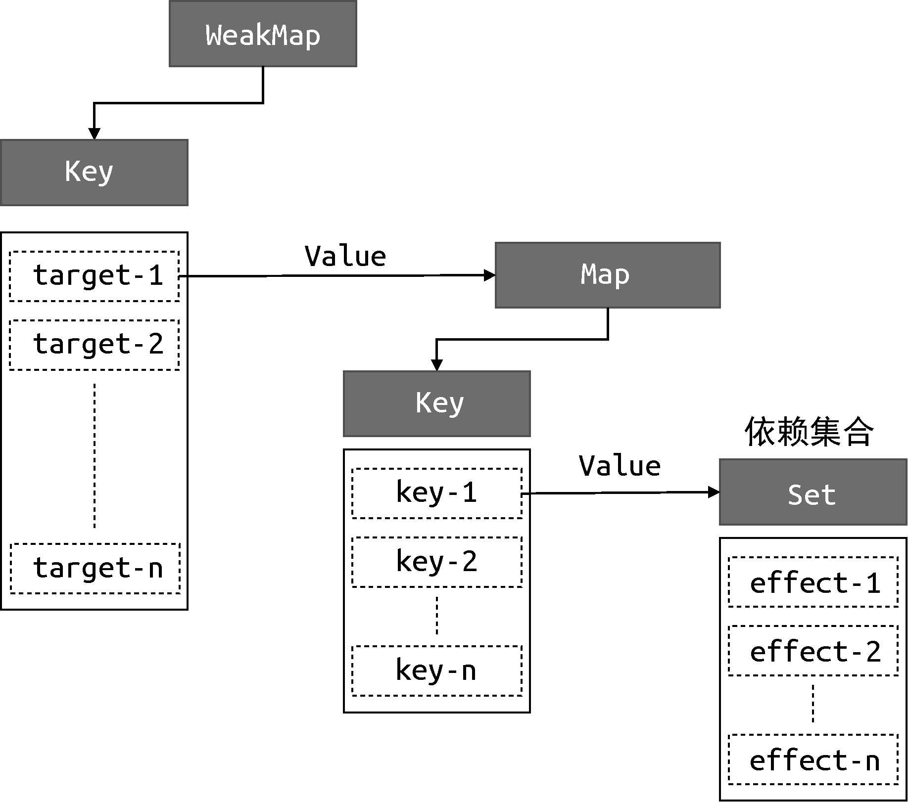

在上一节中，我们了解了如何实现响应式数据。但其实在这个过程中我们已经实现了一个微型响应系统，
之所以说“微型”，是因为它还不完善，本节我们将尝试构造一个更加完善的响应系统。

从上一节的例子中不难看出，一个响应系统的工作流程如下：

- 当读取操作发生时，将副作用函数收集到“桶”中；

- 当设置操作发生时，从“桶”中取出副作用函数并执行。

看上去很简单，但需要处理的细节还真不少。例如在上一节的实现中，我们硬编码了副作用函数的名字（effect），
导致一旦副作用函数的名字不叫 effect，那么这段代码就不能正确地工作了。而我们希望的是，哪怕副作用函数是一个匿名函数，也能够被正确地收集到“桶”中。
为了实现这一点，我们**需要提供一个用来注册副作用函数的机制**，如以下代码所示：

```js
// 用一个全局变量存储被注册的副作用函数
let activeEffect

// 用于注册副作用函数的工具函数 effect
function effect(fn) {
  // 当调用 effect 注册副作用函数时，将副作用函数 fn 赋值 activeEffect
  activeEffect = fn
  // 执行副作用函数
  fn()
}
```

如上面的代码所示，由于副作用函数已经存储到了 activeEffect 中，所以在 get 拦截函数内应该把 activeEffect 收集到“桶”中，这样响应系统就不依赖副作用函数的名字了。

但如果我们再对这个系统稍加测试，例如在响应式数据 obj 上设置一个不存在的属性时：

```js
effect(
  // 匿名副作用函数
  () => {
    console.log('effect run') // 会打印两次
    document.body.innerText = obj.text
  }
)

setTimeout(() => {
  // 副作用函数并没有读取 noExist 属性的值
  obj.notExist = 'hello vue3'
})
```

可以看到，匿名副作用函数内部读取了字段 obj.text 的值，于是匿名副作用函数与字段 obj.text 之间会建立响应联系。
接着，我们开启了一个定时器，一秒钟后为对象 obj 添加新的 notExist 属性。我们知道，在匿名副作用函数内并没有读取 obj.notExist 属性的值，
所以理论上，字段 obj.notExist 并没有与副作用建立响应联系，因此，**定时器内语句的执行不应该触发匿名副作用函数重新执行**。
但如果我们执行上述这段代码就会发现，定时器到时后，匿名副作用函数却重新执行了，这是不正确的。为了解决这个问题，我们需要重新设计“桶”的数据结构。

在上一节的例子中，我们使用一个 Set 数据结构作为存储副作用函数的“桶”。导致该问题的根本原因是，
我们没有在副作用函数与被操作的目标字段之间建立明确的联系。**当读取任意属性时，都会把副作用函数收集到“桶”里；
当设置任意属性时，也都会把“桶”里的副作用函数取出并执行**。副作用函数与被操作的字段之间没有明确的联系。

解决方法很简单，**只需要在副作用函数与被操作的字段之间建立联系即可，这就需要我们重新设计“桶”的数据结构**，而不能简单地使用一个 Set 类型的数据作为“桶”了。

那应该设计怎样的数据结构呢？在回答这个问题之前，我们需要先仔细观察下面的代码：

```js
effect(function effectFn() {
  document.body.innerText = obj.text
})
```

在这段代码中存在三个角色：

> - 被操作（读取）的代理对象 obj；
> - 被操作（读取）的字段名 text；
> - 使用 effect 函数注册的副作用函数 effectFn。

如果用 target 来表示一个代理对象所代理的原始对象，用 key 来表示被操作的字段名，用 effectFn 来表示被注册的副作用函数，那么可以为这三个角色建立如下关系：

```md
target
    └── key
        └── effectFn
```

这是一种树型结构，下面举几个例子来对其进行补充说明。

如果有两个副作用函数同时读取同一个对象的属性值：

```js
effect(function effectFn1() {
  document.body.innerText = obj.text
})

effect(function effectFn2() {
  document.body.innerText = obj.text
})
```

那么关系如下：

```md
target
    └── text
           └── effectFn1
           └── effectFn2
```

如果一个副作用函数中读取了同一个对象的两个不同属性：

```js
effect(function effectFn() {
  document.body.innerText = obj.text1 + obj.text2
})
```

那么关系如下：

```md
target
     └── text1
        └── effectFn
     └── text2
        └── effectFn
```

如果在不同的副作用函数中读取了两个不同对象的不同属性：

```js
effect(function effectFn1() {
  document.body.innerText = obj.text1
})

effect(function effectFn2() {
  document.body.innerText = obj.text2
})
```

那么关系如下：

```md
target1
    └── text1
        └── effectFn1
target2
    └── text2
        └── effectFn2
```

总之，这其实就是一个树型数据结构。这个联系建立起来之后，就可以解决前文提到的问题了。拿上面的例子来说，
如果我们设置了 obj2.text2 的值，就只会导致 effectFn2 函数重新执行，并不会导致 effectFn1 函数重新执行。

接下来我们尝试用代码来实现这个新的“桶”。首先，需要使用 WeakMap 代替 Set 作为桶的数据结构：

```js
// 存储副作用函数的桶
const bucket = new WeakMap()
```

然后修改 get/set 拦截器代码：

```js
const obj = new Proxy(data, {
  // 拦截读取操作
  get(target, key) {
    // 没有副作用函数，直接返回属性值
    if (!activeEffect) return target[key]
    // 根据 target 从桶中取得 depsMap，它也是一个 Map 类型：key ==> effects
    let  depsMap = bucket.get(target)
    // 如果不存在 depsMap，则新建一个 Map 并与 target 关联
    if (!depsMap) {
      bucket.set(target, (depsMap = new Map()))
    }
    // 再根据 key 从 depsMap 中取得 deps，它是一个 Set 类型，
    // 里面存储着所有与当前 key 所关联的副作用函数：effects
    let deps = depsMap.get(key)
    // 如果 deps 不存在，则新建一个 Set 并与 key 关联
    if (!deps) {
      depsMap.set(key, (deps = new Set()))
    }
    // 最好讲当前激活的副作用函数添加到桶里
    deps.add(activeEffect)
    // 返回属性值
    return target[key]
  },
  // 拦截设置操作
  set(target,key, newVal) {
    // 设置属性值
    target[key] = newVal
    // 根据 target 从桶中取得 depsMap，它是 key ==>  effects
    const depsMap = bucket.get(target)
    if (!depsMap) return
    // 根据 key 从 depsMap 中取得 deps，它是一个 Set 类型
    const deps = depsMap.get(key)
    // 遍历 deps，并执行里面的每个副作用函数
    effects && effects.forEach(fn => fn())
  }
})
```

从这段代码可以看出构建数据结构的方式，我们分别使用了 WeakMap、Map 和 Set：

> - WeakMap 由 target --> Map 构成；
> - Map 由 key --> Set 构成。

**其中 WeakMap 的键是原始对象 target，WeakMap 的值是一个 Map 实例，而 Map 的键是原始对象 target 的 key，
Map 的值是一个由副作用函数组成的 Set**。 它们的关系如图 4-3 所示。


> 图4-3　WeakMap、Map 和 Set 之间的关系

为了方便描述，我们把图 4-3 中的 **Set 数据结构所存储的副作用函数集合称为 key 的依赖集合**。

搞清了它们之间的关系，我们有必要解释一下这里为什么要使用 WeakMap，这其实涉及 WeakMap 和 Map 的区别，我们用一段代码来讲解：

```js
const map = new Map()
const weakMap = new WeakMap()

(function() {
  const foo = {foo: 1}
  const bar = {bar: 2}
  
  map.set(foo,1)
  weakmap.set(bar,2)
})()
```

首先，我们定义了 map 和 weakmap 常量，分别对应 Map 和 WeakMap 的实例。接着定义了一个立即执行的函数表达式（IIFE），
在函数表达式内部定义了两个对象：foo 和 bar，这两个对象分别作为 map 和 weakmap 的 key。当该函数表达式执行完毕后，
对于对象 foo 来说，它仍然作为 map 的 key 被引用着，因此垃圾回收器（grabage collector）不会把它从内存中移除，
我们仍然可以通过 map.keys 打印出对象 foo。然而对于对象 bar 来说，由于 WeakMap 的 key 是弱引用，它不影响垃圾回收器的工作，
所以一旦表达式执行完毕，垃圾回收器就会把对象 bar 从内存中移除，并且我们无法获取 weakmap 的 key 值，也就无法通过 weakmap 取得对象 bar。
