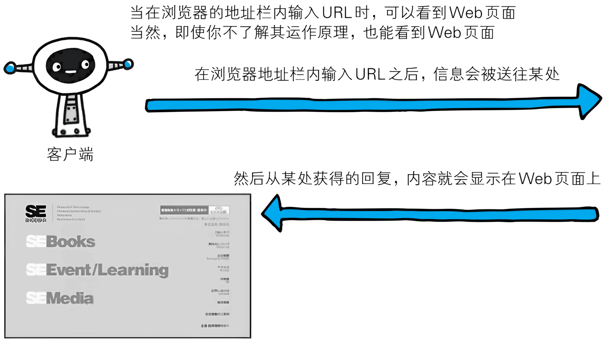
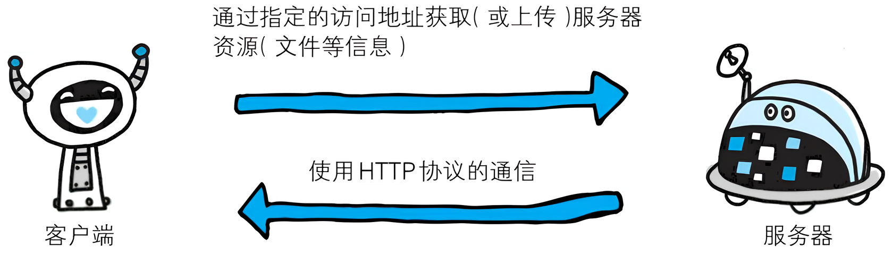

你知道当我们在网页浏览器（Web browser）的地址栏中输入 URL 时，Web 页面是如何呈现的吗？

Web 页面当然不能凭空显示出来。根据 Web 浏览器地址栏中指定的 URL，Web 浏览器从 Web 服务器端获取文件资源（resource）等信息，从而显示出 Web 页面。

像这种通过发送请求获取服务器资源的 Web 浏览器等，都可称为客户端（client）。

Web 使用一种名为 `HTTP`（`HyperText Transfer Protocol`，**超文本传输协议**）的协议作为规范，完成从客户端到服务器端等一系列运作流程。而协议是指规则的约定。可以说，Web 是建立在 HTTP 协议上通信的。

::: tip
HTTP 通常被译为超文本传输协议，但这种译法并不严谨。严谨的译名应该为“**超文本转移协议**”。但是前一译法已约定俗成，本书将会沿用。有兴趣的读者可参考图灵社区的[相关讨论](http://www.ituring.com.cn/article/1817)
:::
