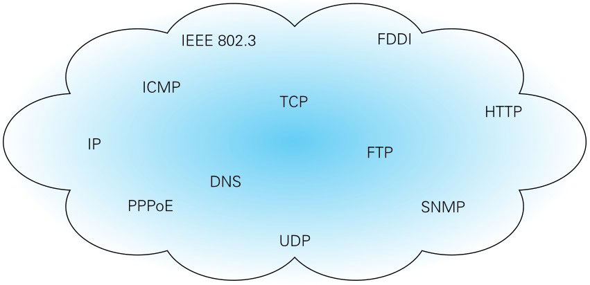
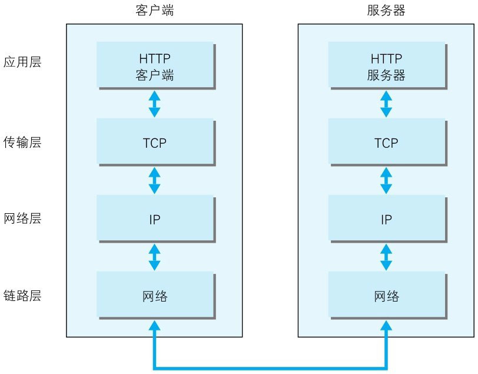
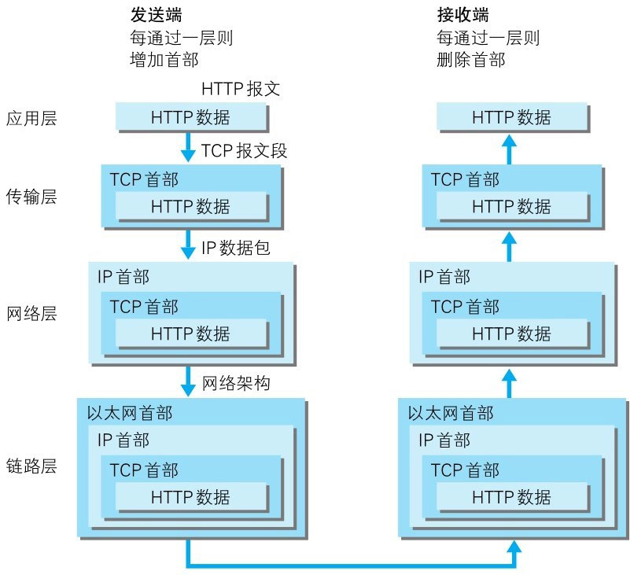

::: info
为了理解 HTTP，我们有必要事先了解一下 TCP/IP 协议族。

通常使用的网络（包括互联网）是在 TCP/IP 协议族的基础上运作的，而 HTTP 属于它内部的一个子集。

接下来，我们仅介绍理解 HTTP 所需掌握的 TCP/IP 协议族的概要。若想进一步学习有关 TCP/IP 的知识，请参考其他讲解 TCP/IP 的专业书籍。
:::

# TCP/IP 协议族
计算机与网络设备要相互通信，双方就必须基于相同的方法。比如，如何探测到通信目标、由哪一边先发起通信、使用哪种语言进行通信、怎样结束通信等规则都需要事先确定。
不同的硬件、操作系统之间的通信，所有的这一切都需要一种规则。而我们就把这种规则称为**协议**（`protocol`）。

图：**TCP/IP 是互联网相关的各类协议族的总称**

协议中存在各式各样的内容。从电缆的规格到 IP 地址的选定方法、寻找异地用户的方法、双方建立通信的顺序，以及 Web 页面显示需要处理的步骤等等。

像这样把与互联网相关联的协议集合起来总称为 TCP/IP。也有说法认为，TCP/IP 是指 TCP 和 IP 这两种协议。还有一种说法认为，TCP/IP 是在 IP 协议的通信过程中，使用到的协议族的统称。

# TCP/IP 的分层管理
- **TCP/IP 协议族里重要的一点就是分层**：
TCP/IP 协议族按层次分别分为以下4层：**应用层、传输层、网络层和数据链路层**。

- **把 TCP/IP 层次化是有好处的**：
比如，如果互联网只由一个协议统筹，某个地方需要改变设计时，就必须把所有部分整体替换掉。而分层之后只需把变动的层替换掉即可。把各层之间的接口部分规划好之后，每个层次内部的设计就能够自由改动了。

- **值得一提的是，层次化之后，设计也变得相对简单了**：处于应用层上的应用可以只考虑分派给自己的任务，而不需要弄清对方在地球上哪个地方、对方的传输路线是怎样的、是否能确保传输送达等问题。

TCP/IP 协议族各层的作用如下：

- **应用层**

  > 应用层决定了向用户提供应用服务时通信的活动。

  TCP/IP 协议族内预存了各类通用的应用服务。比如，FTP 和 DNS 服务就是其中两类，HTTP协议也处于该层。
  
  ::: tip 名词解释
  **FTP**（File Transfer Protocol）：文件传输协议。
  
  **DNS**（Domain Name System）：域名系统。
  :::

- **传输层**

  > 传输层对上层应用层，提供处于网络连接中的两台计算机之间的数据传输。

  在传输层有两个性质不同的协议：TCP 和UDP。

  ::: tip 名词解释
  **TCP**（Transmission Control Protocol）：传输控制协议。

  **UDP**（User Datagram Protocol）：用户数据报协议。
  :::

- **网络层（又名网络互连层）**

  > 网络层用来处理在网络上流动的数据包。**数据包是网络传输的最小数据单位**。该层规定了通过怎样的路径（所谓的传输路线）到达对方计算机，并把数据包传送给对方。

  与对方计算机之间通过多台计算机或网络设备进行传输时，网络层所起的作用就是在众多的选项内选择一条传输路线。

- **链路层（又名数据链路层，网络接口层）**

  > 用来处理连接网络的硬件部分。

  包括控制操作系统、硬件的设备驱动、NIC，及光纤等物理可见部分（还包括连接器等一切传输媒介），硬件上的范畴均在链路层的作用范围之内。

  ::: tip 名词解释
  **NIC**（Network Interface Card）：网卡（网络适配器）。
  :::

# TCP/IP 通信传输流

利用 TCP/IP 协议族进行网络通信时，会通过分层顺序与对方进行通信。**发送端从应用层往下走，接收端则从链路层往上走。**

> 我们用 HTTP 举例来说明，首先作为发送端的客户端在应用层（HTTP 协议）发出一个想看某个 Web 页面的 HTTP 请求。

> 接着，为了传输方便，在传输层（TCP 协议）把从应用层处收到的数据（HTTP 请求报文）进行分割，并在各个报文上打上标记序号及端口号后转发给网络层。

> 在网络层（IP 协议）将数据包交给链路层后，链路层会根据目标 IP 地址查找并添加对应的目标 MAC 地址，并封装成帧，准备发送。这样一来，发送到网络的数据就准备就绪了。

> 接收端的服务器在链路层接收到数据，按序往上层发送，一直到应用层。当传输到应用层，才能算真正接收到由客户端发送过来的 HTTP 请求。

> 发送端在层与层之间传输数据时，每经过一层时必定会被打上一个该层所属的首部信息。反之，接收端在层与层传输数据时，每经过一层时会把对应的首部消去。

这种把数据信息包装起来的做法称为封装(encapsulate)，封装是 TCP/IP 协议族最基本的一种数据处理方式。

::: warning
MAC 地址属于链路层范畴，IP 地址属于网络层，链路层需要根据目标 IP 地址通过 ARP 协议获取 MAC 地址。
:::

::: tip 名词解释
**MAC 地址**（Media Access Control Address）：媒体访问控制位址。也称为局域网地址（LAN Address），MAC位址，以太网地址（Ethernet Address），硬件地址（Hardware Address）或物理地址（Physical Address）。

每个网络设备的 MAC 地址都是全球独一无二的，这是由IEEE（电气电子工程师协会）统一分配的，MAC地址在设备出产时就被网络设备制造商生产时烧录在网卡的 EPROM（一种闪存芯片，通常可以通过程序擦写）。

主要作用是在网络通信中标识和定位网络设备。当数据需要在网络上传输时，发送方会将目标设备的 MAC 地址封装在数据帧的头部，以便网络设备根据 MAC 地址进行寻址和转发。MAC 地址确保了数据能够准确地被传送到目标设备，而不是被广播到整个网络。
:::
