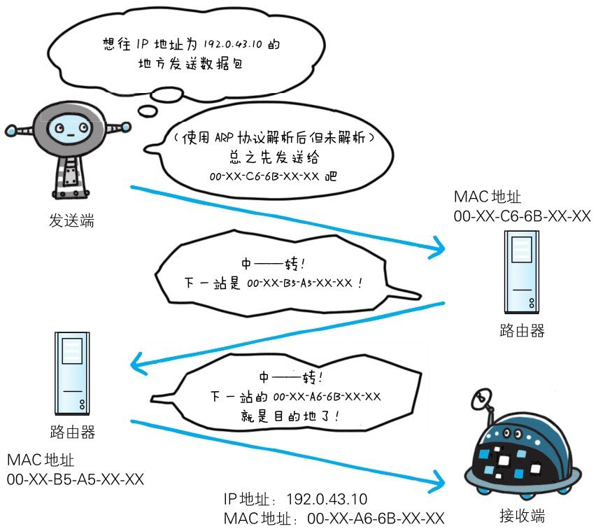
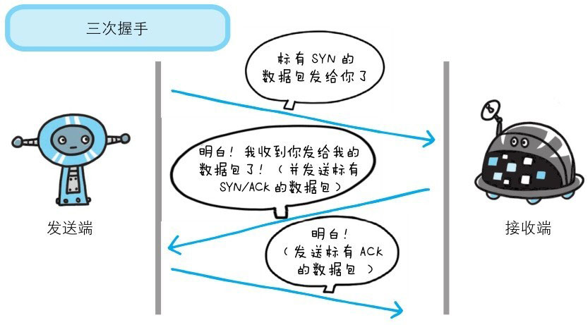

# 负责传输的 IP 协议
按层次分，**IP 网际协议位于网络层**。几乎所有使用网络的系统都会用到 IP 协议。TCP/IP 协议族中的 IP 指的就是网际协议，协议名称中占据了一半位置，其重要性可见一斑。可能有人会把“IP”和“IP地址”搞混，“IP”其实是一种协议的名称。

IP 协议的作用是把各种数据包传送给对方。而要保证确实传送到对方那里，则需要满足各类条件。其中两个重要的条件是 **IP 地址** 和 **MAC 地址**。

IP 地址指明了**节点被分配到的地址**，MAC 地址是指**网卡所属的固定地址**。IP 地址可以和 MAC 地址进行配对。IP 地址**可变换**，但 MAC 地址**基本上不会更改**。

::: tip 名词解释
**IP**（Internet Protocol）：互联网协议 / 网际协议。
:::

**使用ARP协议凭借MAC地址进行通信**

IP 间的通信依赖 MAC 地址。在网络上，通信的双方在同一局域网内的情况是很少的，通常是经过多台计算机和网络设备中转才能连接到对方。
而在进行中转时，会利用下一站中转设备的 MAC 地址来搜索下一个中转目标。
这时，会采用 ARP 协议。ARP 是一种用以解析地址的协议，根据通信方的 IP 地址就可以反查出对应的 MAC 地址。

::: tip 名词解释
**ARP**（Address Resolution Protocol）：地址解析协议。
:::

**没有人能够全面掌握互联网中的传输状况**

在到达通信目标前的中转过程中，那些计算机和路由器等网络设备只能获悉很粗略的传输路线。

这种机制称为路由选择（routing），有点像快递公司的送货过程。想要寄快递的人，只要将自己的货物送到集散中心，就可以知道快递公司是否肯收件发货，该快递公司的集散中心检查货物的送达地址，明确下站该送往哪个区域的集散中心。接着，那个区域的集散中心自会判断是否能送到对方的家中。

我们是想通过这个比喻说明，无论哪台计算机、哪台网络设备，它们都无法全面掌握互联网中的细节。

# 确保可靠性的 TCP 协议
按层次分，TCP 位于传输层，提供可靠的字节流服务。

所谓的字节流服务（Byte Stream Service）是指，为了方便传输，将大块数据分割成以报文段（segment）为单位的数据包进行管理。
而可靠的传输服务是指，能够把数据准确可靠地传给对方。一言以蔽之，TCP 协议为了更容易传送大数据才把数据分割，而且 TCP 协议能够确认数据最终是否送达到对方。

**确保数据能到达目标**

为了准确无误地将数据送达目标处，TCP 协议采用了三次握手（three-way handshaking）策略。用 TCP 协议把数据包送出去后，TCP 不会对传送后的情况置之不理，
它一定会向对方确认是否成功送达。握手过程中使用了 TCP 的标志（flag）—— SYN和 ACK。

发送端首先发送一个带 SYN 标志的数据包给对方。接收端收到后，回传一个带有 SYN/ACK 标志的数据包以示传达确认信息。
最后，发送端再回传一个带 ACK 标志的数据包，代表“握手”结束。

若在握手过程中某个阶段莫名中断，TCP 协议会再次以相同的顺序发送相同的数据包。

除了上述三次握手，TCP 协议还有其他各种手段来保证通信的可靠性。

::: tip 名词解释
**SYN**（Synchronize Sequence Numbers）：**同步序列编号**，是 TCP/IP 建立连接时使用的握手信号。

**ACK**（Acknowledge character）：**确认字符**，在数据通信中，接收方 发给 发送方的一种传输类控制字符，表示发来的数据已确认接收无误。
:::
