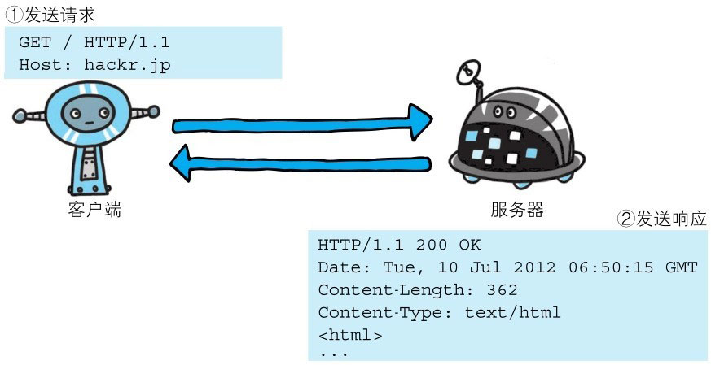
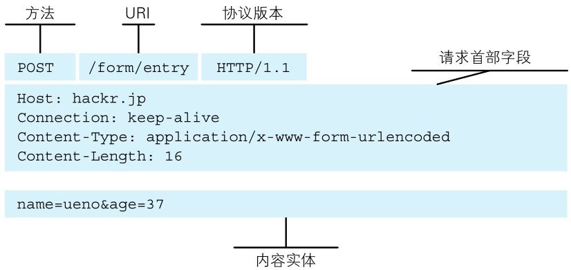
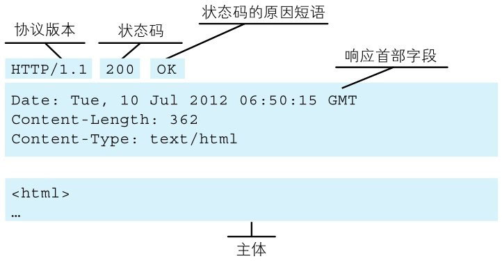

> 图：请求必定由客户端发出，而服务器端回复响应


HTTP 协议规定，请求从客户端发出，最后服务器端响应该请求并返回。换句话说，肯定是先从客户端开始建立通信的，服务器端在没有接收到请求之前不会发送响应。

> 下面，我们来看一个具体的示例。



下面则是从客户端发送给某个 HTTP 服务器端的请求报文中的内容。

```http
GET /index.htm HTTP/1.1
Host:hackr.jp
```

> 起始行开头的 GET 表示请求访问服务器的类型，称为方法（method）。随后的字符串 /index.htm 指明了请求访问的资源对象，也叫做请求 URI。
最后的 HTTP/1.1，即 HTTP 的版本号，用来提示客户端使用的 HTTP 协议功能。

综合来看，这段请求内容的意思是：请求访问某台 HTTP 服务器上的 /index.htm 页面资源。

请求报文是由请求方法、请求 URI、协议版本、可选的请求首部字段和内容实体构成的。


> 图：请求报文的构成

请求首部字段及内容实体稍后会作详细说明。接下来，我们继续讲解。接收到请求的服务器，会将请求内容的处理结果以响应的形式返回。

```http
HTTP/1.1 200 OK
Date:Tue,10 Jul 2012 06:50:15 GMT
Content-Length:362
Content-Type:text/html
<html>
……
```

> 在起始行开头的 HTTP/1.1 表示服务器对应的 HTTP 版本。紧挨着的 200 OK 表示请求的处理结果的状态码（status code）和原因短语（reason-phrase）。
> 下一行显示了创建响应的日期时间，是首部字段（header field）内的一个属性。
 
> 接着以一空行分隔，之后的内容称为资源实体的主体（entity body）。

> 响应报文基本上由协议版本、状态码（表示请求成功或失败的数字代码）​、用以解释状态码的原因短语、可选的响应首部字段以及实体主体构成。稍后我们会对这些内容进行详细说明。


> 图：响应报文的构成
