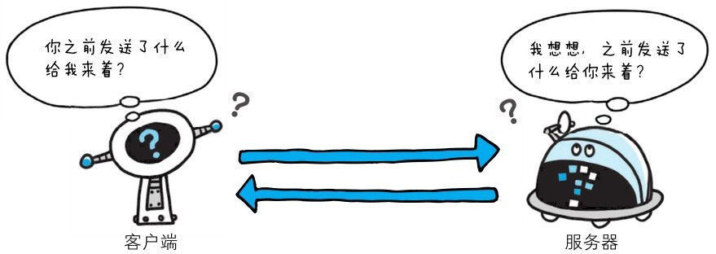

**HTTP 是一种不保存状态，即无状态协议**（stateless protocol）。HTTP 协议自身不对请求和响应之间的通信状态进行保存。
也就是说在 HTTP 这个级别，协议对于发送过的请求或响应都不做持久化处理。

> 图：HTTP 协议自身不具备保存之前发送过的请求或响应的功能

使用 HTTP 协议，每当有新的请求发送时，就会有对应的新响应产生。协议本身并不保留之前一切的请求或响应报文的信息。
这是为了更快地处理大量事务，确保协议的可伸缩性，而特意把 HTTP 协议设计成如此简单的。

可是，随着 Web 的不断发展，因无状态而导致业务处理变得棘手的情况增多了。比如，用户登录到一家购物网站，即使他跳转到该站的其他页面后，也需要能继续保持登录状态。
针对这个场景，网站为了能够掌握是谁送出的请求，需要保存用户的状态。

HTTP/1.1 虽然是无状态协议，但为了实现期望的保持状态功能，于是引入了 Cookie 技术。有了 Cookie 再用 HTTP 协议通信，就可以管理状态了。有关 Cookie 的详细内容稍后讲解。
