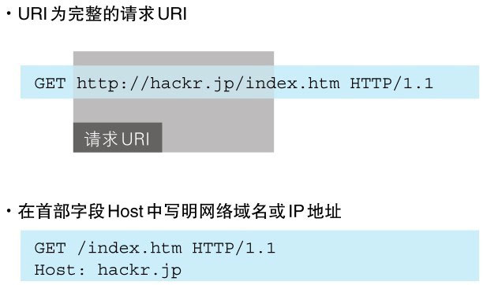

HTTP 协议使用 URI 定位互联网上的资源。正是因为 URI 的特定功能，在互联网上任意位置的资源都能访问到。


> 图：HTTP 协议使用 URI 让客户端定位到资源

当客户端请求访问资源而发送请求时，URI 需要将作为请求报文中的请求 URI 包含在内。指定请求 URI 的方式有很多。


> 图：以 http://hackr.jp/index.htm 作为请求的例子

除此之外，如果不是访问特定资源而是对服务器本身发起请求，可以用一个 `*` 来代替请求 `URI`。下面这个例子是**查询 HTTP 服务器端支持的 HTTP 方法种类**：

```http
OPTIONS ＊ HTTP/1.1
```
