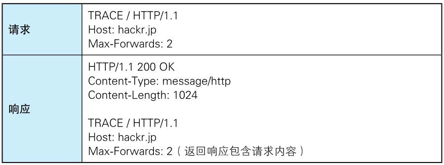
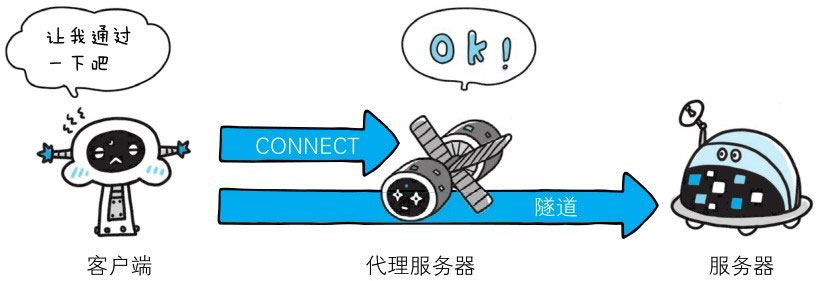
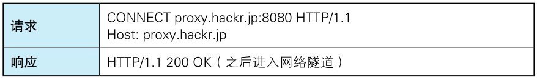

> 下面，我们介绍 HTTP/1.1 中可使用的方法。

# GET：获取资源
GET 方法用来请求访问已被 URI 识别的资源。指定的资源经服务器端解析后返回响应内容。也就是说，如果请求的资源是文本，那就保持原样返回；如果是像 CGI 那样的程序，则返回经过执行后的输出结果。

::: tip 名词解释
**CGI**（CommonGateway Interface，**通用网关接口**）是为提供网络服务而执行控制台应用 (或称命令行界面）的程序，
提供于服务器上实现动态网页的通用协议。通常情况下，一次请求对应一个 CGI 脚本的执行，生成一个 HTML。

CGI 的工作方式，从 Web 服务器的角度看，CGI 程序通常被放置在服务器配置的特定目录（如 /cgi-bin）或匹配特定路径规则。当收到匹配路径的请求时，服务器会将请求的相关数据（如查询字符串、请求体等）通过环境变量和标准输入的方式传递给 CGI 程序。CGI 程序运行后，将包含 HTTP 响应头和内容的输出返回，服务器再将这些内容原样发送给客户端。
:::


**使用 GET 方法的请求·响应的例子**


# POST：传输实体的主体
POST 方法用来传输实体的主体。

虽然用 GET 方法也可以传输实体的主体，但一般不用 GET 方法进行传输，而是用 POST 方法。
虽说 POST 的功能与 GET 很相似，但 POST 的主要目的并不是获取响应的主体内容。


**使用 POST 方法的请求·响应的例子**


::: info 扩展阅读
1. **什么是实体？**

   在 HTTP 协议中，一个请求或响应报文的结构一般是：
   ```http
   <起始行> (请求行/状态行)
   <首部字段>
   <空行>
   <消息主体> (Message Body)
   ```
   实体 (Entity) 是 **HTTP 传输的核心内容**，包括：
     - 实体首部（Entity Header）：描述实体的元信息（如 Content-Type、Content-Length）。
     - 实体主体（Entity Body）：具体的数据内容（比如 JSON、HTML 文本、文件内容等）。
   
   换句话说，**实体就是 HTTP 中实际要传输的数据单元**，包含数据本身和与其相关的描述信息。

2. **实体的主体（Entity Body）是什么？**

   实体主体 就是 **要传输的真正内容部分**，也就是 Content-Type 对应的数据。
   - 如果是表单提交，Entity Body 可能是：
   ```ini
   username=abc&password=123
   ```
   - 如果是上传文件，Entity Body 可能是二进制文件内容。
   - 如果是提交 JSON，Entity Body 可能是：
   ```json
   {"id":1, "name":"张三"}
   ```
   
3. **为什么 POST 常用于传输实体主体，而 GET 不常用？**

   - GET 方法的**语义是获取资源，设计上不强调传输数据主体**。
     虽然 HTTP/1.1 规范并未禁止 GET 请求携带实体主体，但大多数服务器、代理和框架都不支持或会忽略它。
   - POST 方法的**语义是向服务器提交数据**，因此天然适合传输 Entity Body。
     POST 请求常用来提交表单、JSON、文件等数据。

:::


# PUT：传输文件
PUT 方法用来传输文件。就像 FTP 协议的文件上传一样，要求在请求报文的主体中包含文件内容，然后保存到请求 URI 指定的位置。

但是，鉴于 HTTP/1.1 的 PUT 方法自身不带验证机制，任何人都可以上传文件，存在安全性问题，因此一般的 Web 网站不使用该方法。
若配合 Web 应用程序的验证机制，或架构设计采用 REST 标准的同类 Web 网站，就可能会开放使用 PUT 方法。

::: tip 名词解释
**REST**（Representational State Transfer，**表述性状态转移**）是Roy Fielding博士在2000年他的博士论文中提出来的**一种软件架构风格**。它是一种针对网络应用的设计和开发方式，可以降低开发的复杂性，提高系统的可伸缩性。
:::


**使用 PUT 方法的请求·响应的例子**


响应的意思其实是请求执行成功了，但无数据返回。


# HEAD：获得报文首部
HEAD 方法和 GET 方法一样，只是不返回报文主体部分。用于确认 URI 的有效性及资源更新的日期时间等。


> 图：和 GET 一样，但不返回报文主体

**使用 HEAD 方法的请求·响应的例子**


# DELETE：删除文件
DELETE 方法用来删除文件，是与 PUT 相反的方法。DELETE 方法按请求 URI 删除指定的资源。

但是，HTTP/1.1 的 DELETE 方法本身和 PUT 方法一样不带验证机制，所以一般的 Web 网站也不使用 DELETE 方法。当配合 Web 应用程序的验证机制，或遵守 REST 标准时还是有可能会开放使用的。


**使用 DELETE 方法的请求·响应的例子**


# OPTIONS：询问支持的方法
OPTIONS 方法用来查询针对请求 URI 指定的资源支持的方法。


**使用 OPTIONS 方法的请求·响应的例子**


# TRACE：追踪路径
TRACE 方法是让 Web 服务器端将之前的请求通信环回给客户端的方法。

发送请求时，在 Max-Forwards 首部字段中填入数值，每经过一个服务器端就将该数字减1，当数值刚好减到0时，就停止继续传输，最后接收到请求的服务器端则返回状态码 200 OK 的响应。
  
客户端通过 TRACE 方法可以查询发送出去的请求是怎样被加工修改/篡改的。这是因为，请求想要连接到源目标服务器可能会通过代理中转，TRACE 方法就是用来确认连接过程中发生的一系列操作。

但是，TRACE 方法本来就不怎么常用，再加上它容易引发 XST（Cross-Site Tracing，跨站追踪）攻击，通常就更不会用到了。


**使用 TRACE 方法的请求·响应的例子**




# CONNECT：要求用隧道协议连接代理

CONNECT 方法要求在与代理服务器通信时建立隧道，实现用隧道协议进行 TCP 通信。主要使用 SSL（SecureSockets Layer，安全套接层）和 TLS（TransportLayer Security，传输层安全）协议把通信内容加密后经网络隧道传输。

CONNECT 方法的格式如下所示。
```http
CONNECT 代理服务器名：端口号 HTTP 版本
```



**使用 CONNECT 方法的请求·响应的例子**


