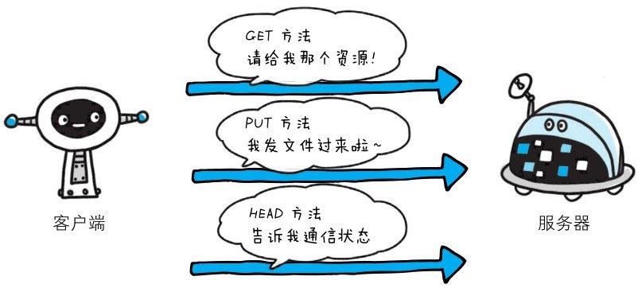
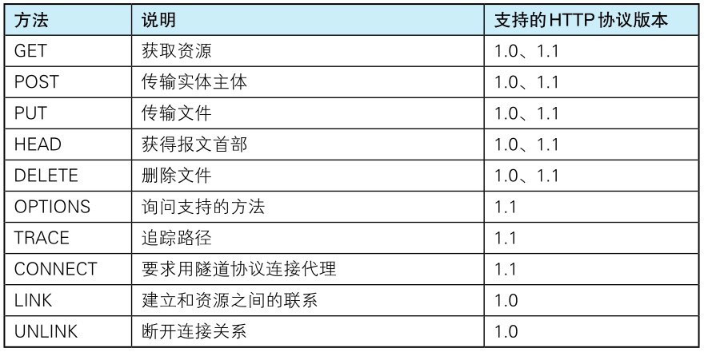

向请求 URI 指定的资源发送请求报文时，采用称为方法的命令。

方法的作用在于，可以指定请求的资源按期望产生某种行为。方法中有 GET、POST 和 HEAD 等。

> 图：使用方法给服务器下达命令

下表列出了 HTTP/1.0 和 HTTP/1.1 支持的方法。另外，方法名区分大小写，注意要用大写字母。

> 图：HTTP/1.0 和 HTTP/1.1 支持的方法

在这里列举的众多方法中，LINK 和 UNLINK 已被 HTTP/1.1 废弃，不再支持。
