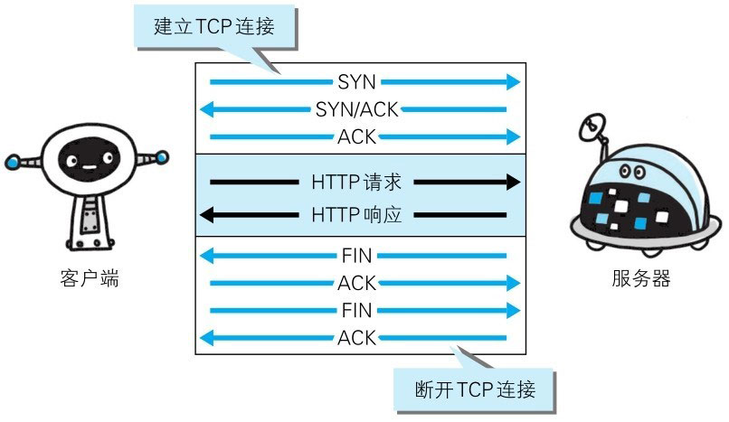
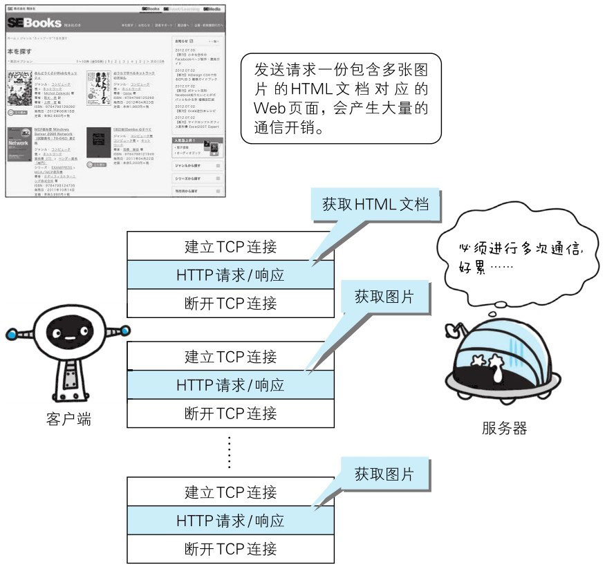
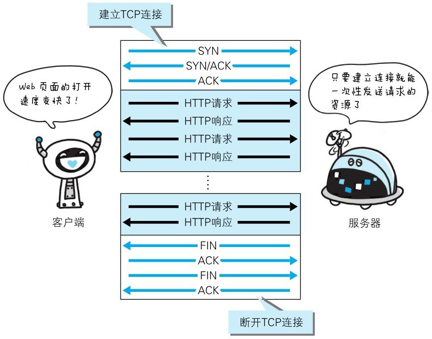
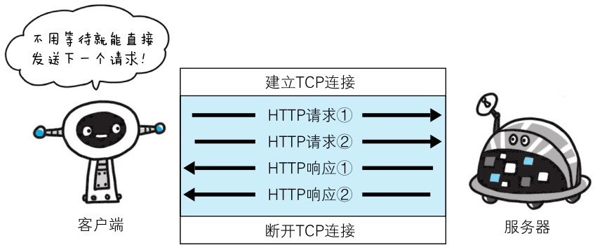

HTTP 协议的初始版本中，每进行一次 HTTP 通信就要断开一次 TCP 连接。

以当年的通信情况来说，因为都是些容量很小的文本传输，所以即使这样也没有多大问题。可随着 HTTP 的普及，文档中包含大量图片的情况多了起来。

比如，使用浏览器浏览一个包含多张图片的 HTML 页面时，在发送请求访问 HTML 页面资源的同时，也会请求该 HTML 页面里包含的其他资源。因此，每次的请求都会造成无谓的 TCP 连接建立和断开，增加通信量的开销。

# 持久连接

为解决上述 TCP 连接的问题，HTTP/1.1 和一部分的 HTTP/1.0 想出了持久连接（HTTP Persistent Connections，也称为 HTTP keep-alive 或 HTTP connection reuse）的方法。

**持久连接的特点**：只要任意一端没有明确提出断开连接，则保持 TCP 连接状态。

> 图：持久连接旨在建立1次 TCP 连接后进行多次请求和响应的交互

持久连接的好处在于**减少了 TCP 连接的重复建立和断开所造成的额外开销，减轻了服务器端的负载**。另外，减少开销的那部分时间，使 HTTP 请求和响应能够更早地结束，这样 Web 页面的显示速度也就相应提高了。

**在 HTTP/1.1 中，所有的连接默认都是持久连接，但在 HTTP/1.0 内并未标准化**。虽然有一部分服务器通过非标准的手段实现了持久连接，但服务器端不一定能够支持持久连接。毫无疑问，除了服务器端，客户端也需要支持持久连接。

# HTTP 管线化

持久连接使得多数请求以管线化（pipelining）方式发送成为可能。从前发送请求后需等待并收到响应，才能发送下一个请求。管线化技术出现后，不用等待响应亦可直接发送下一个请求。

这样就能够做到同时并行发送多个请求，而不需要一接一个地等待响应了。

> 图：不等待响应，直接发送下一个请求

比如，当请求一个包含 10 张图片的 HTML Web 页面，与挨个连接相比，用持久连接可以让请求更快结束。而管线化技术则比持久连接还要快。请求数越多，时间差就越明显。

::: tip 名词解释
**HTTP 管线化**（英译：HTTP pipelining）：**是将多个 HTTP 请求整批提交的技术，而在发送过程中不需先等待服务端的回应**。

请求流水线化显著缩短了 HTML 页面的加载时间，尤其是在卫星互联网等高延迟连接下。但在宽带连接上，加速效果并不明显，因为 HTTP 1.1 的限制仍然存在：服务器必须按照接收请求的顺序发送响应——因此整个连接仍然是先进先出，并且可能会发生 HOL 阻塞 。

**队头阻塞**（HOL blocking）：计算机网络中的队头阻塞**是一种性能限制现象，当数据包队列被队列中的第一个数据包阻塞时就会发生**。例如，这种情况发生在输入缓冲网络交换机 、 乱序传输以及 HTTP 流水线中的多个请求中。
:::
