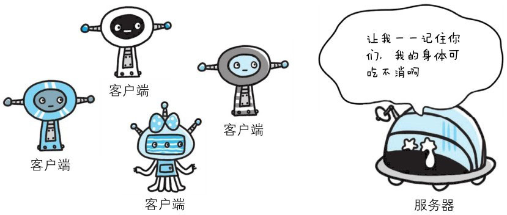
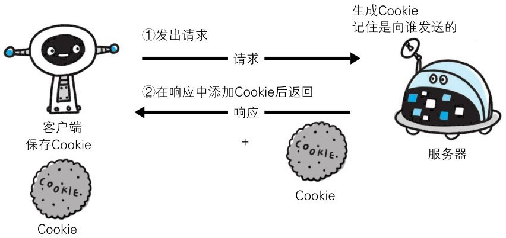
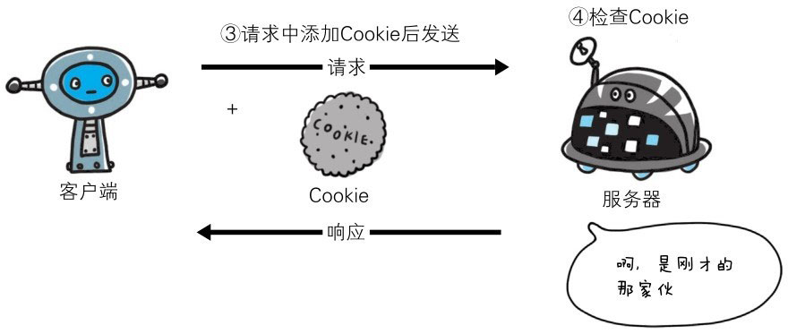

HTTP 是无状态协议，它不对之前发生过的请求和响应的状态进行管理。也就是说，无法根据之前的状态进行本次的请求处理。

假设要求登录认证的 Web 页面本身无法进行状态的管理（不记录已登录的状态），那么每次跳转新页面就要再次登录，或者要在每次请求报文中附加参数来管理登录状态。

不可否认，无状态协议当然也有它的优点。由于不必保存状态，自然可减少服务器的 CPU 及内存资源的消耗。从另一侧面来说，也正是因为 HTTP 协议本身是非常简单的，所以才会被应用在各种场景里。


> 图：如果让服务器管理全部客户端状态则会成为负担

保留无状态协议这个特征的同时又要解决类似的矛盾问题，于是引入了 Cookie 技术。Cookie 技术通过在请求和响应报文中写入 Cookie 信息来控制客户端的状态。

Cookie 会根据从服务器端发送的响应报文内的一个叫做 Set-Cookie 的首部字段信息，通知客户端保存Cookie。当下次客户端再往该服务器发送请求时，客户端会自动在请求报文中加入 Cookie 值后发送出去。

服务器端发现客户端发送过来的 Cookie 后，会去检查究竟是从哪一个客户端发来的连接请求，然后对比服务器上的记录，最后得到之前的状态信息。

**没有 Cookie 信息状态下的请求**



**第 2 次以后（存有 Cookie 信息状态）的请求**



上图展示了发生 Cookie 交互的情景，HTTP 请求报文和响应报文的内容如下。

**① 请求报文（没有 Cookie 信息的状态）**

```http
GET /reader/ HTTP/1.1
Host:hackr.jp
＊首部字段内没有 Cookie 的相关信息
```

**② 响应报文（服务器端生成 Cookie 信息）**

```http
HTTP/1.1 200 OK
Date:Thu,12 Jul 2012 07:12:20 GMT
Server:Apache
＜Set-Cookie:sid=1342077140226724;path=/;expires=Wed,10-Oct-12 07:12:20 GMT＞
Content-Type:text/plain;charset=UTF-8
```

**③ 请求报文（自动发送保存着的 Cookie 信息）**

```http
GET /image/ HTTP/1.1
Host:hackr.jp
Cookie:sid=1342077140226724
```

有关请求报文和响应报文内 Cookie 对应的首部字段，请参考之后的章节。
