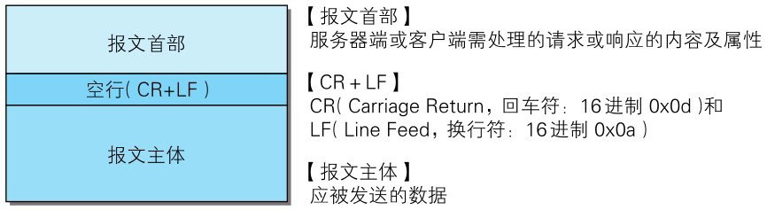

**用于 HTTP 协议交互的信息被称为 HTTP 报文**。请求端（客户端）的 HTTP 报文叫做请求报文，响应端（服务器端）的叫做响应报文。

HTTP 报文本身是由多行（用 CR + LF 作换行符）数据构成的字符串文本。

**HTTP 报文大致可分为报文首部和报文主体两块**。两者由最初出现的空行（CR + LF）来划分。通常，并不一定要有报文主体。

> 图：HTTP报文的结构

::: tip
- 实体首部 ≈ 报文首部的一部分（描述内容的元信息）。

- 实体主体 = 报文主体的解码后内容（大多数情况下相同）。
:::
