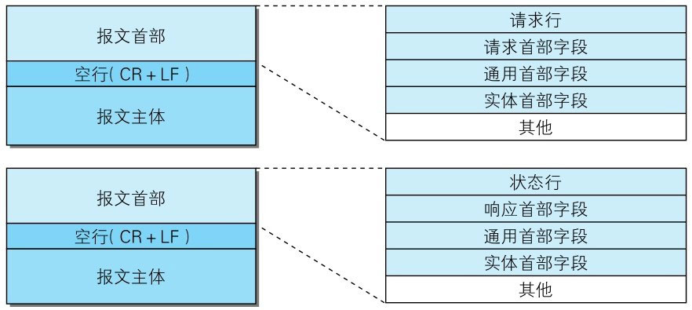
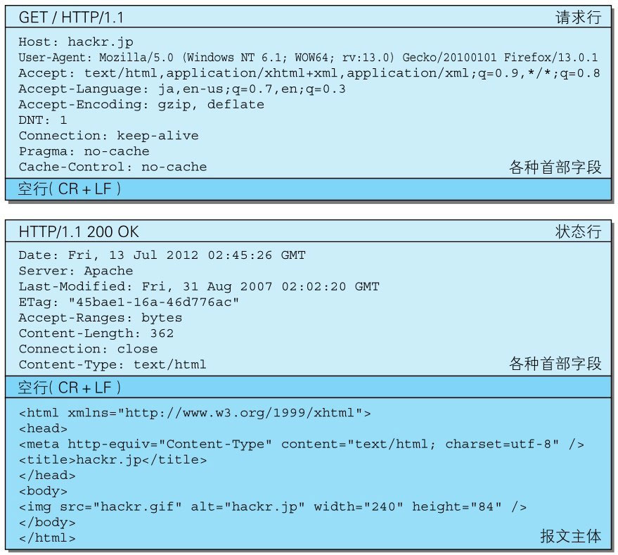

我们来看一下请求报文和响应报文的结构。

> 图：请求报文（上）和响应报文（下）的结构

> 图：请求报文（上）和响应报文（下）的实例

请求报文和响应报文的首部内容由以下数据组成。现在出现的各种首部字段及状态码稍后会进行阐述。

- **请求行**：包含用于请求的方法，请求 URI 和 HTTP 版本。

- **状态行**：包含表明响应结果的状态码，原因短语和 HTTP 版本。

- **首部字段**：包含表示请求和响应的各种条件和属性的各类首部。一般有4种首部，分别是：通用首部、请求首部、响应首部和实体首部。

- **其他**：可能包含 HTTP 的 RFC 里未定义的首部（Cookie 等）。
