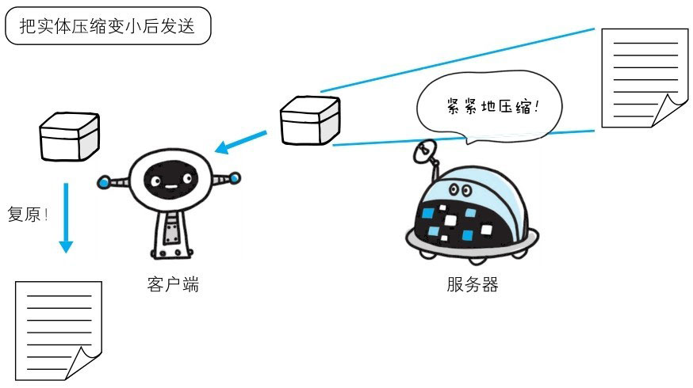
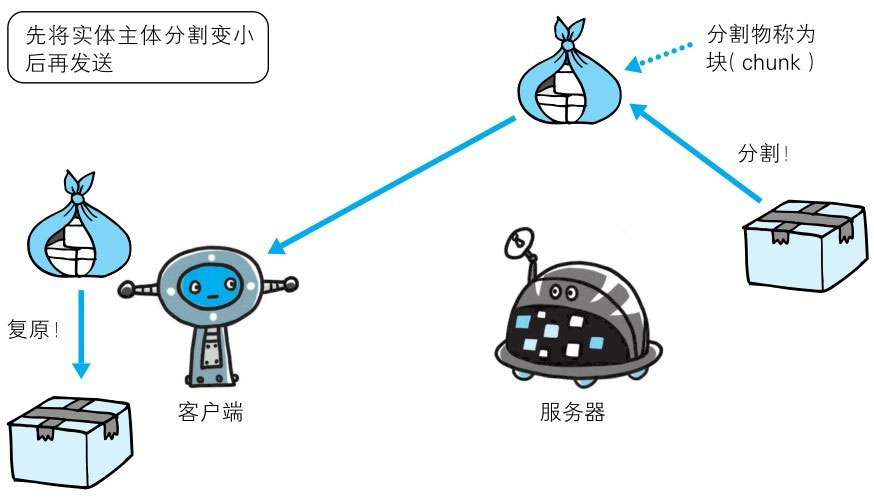

::: info
HTTP 在传输数据时可以按照数据原貌直接传输，但也可以在传输过程中通过编码提升传输速率。通过在传输时编码，能有效地处理大量的访问请求。但是，编码的操作需要计算机来完成，因此会消耗更多的 CPU 等资源。
:::

# 报文主体和实体主体的差异

- **报文（message）**

  是 HTTP 通信中的基本单位，由 8 位组字节流（octetsequence，其中 octet 为 8 个比特）组成，通过 HTTP 通信传输。

- **实体（entity）**

  作为请求或响应的有效载荷数据（补充项）被传输，其内容由实体首部和实体主体组成。

  HTTP 报文的主体用于传输请求或响应的实体主体。

  通常，报文主体等于实体主体。只有当传输中进行编码操作时，实体主体的内容发生变化，才导致它和报文主体产生差异。

  报文和实体这两个术语在之后会经常出现，请事先理解两者的差异。

# 压缩传输的内容编码

向待发送邮件内增加附件时，为了使邮件容量变小，我们会先用 ZIP 压缩文件之后再添加附件发送。HTTP 协议中有一种被称为内容编码的功能也能进行类似的操作。

内容编码指明应用在实体内容上的编码格式，并保持实体信息原样压缩。内容编码后的实体由客户端接收并负责解码。

> 图：内容编码

常用的内容编码有以下几种：
- **gzip（GNU zip）**
- **compress（UNIX 系统的标准压缩）**
- **deflate（zlib）**
- **identity（不进行编码）**

# 分割发送的分块传输编码

在 HTTP 通信过程中，请求的编码实体资源尚未全部传输完成之前，浏览器无法显示请求页面。在传输大容量数据时，通过把数据分割成多块，能够让浏览器逐步显示页面。

这种把实体主体分块的功能称为分块传输编码（Chunked Transfer Coding）。

> 图：分块传输编码

分块传输编码会将实体主体分成多个部分（块）。每一块都会用十六进制来标记块的大小，而实体主体的最后一块会使用“0(CR+LF)”来标记。

使用分块传输编码的实体主体会由接收的客户端负责解码，恢复到编码前的实体主体。

HTTP/1.1 中存在一种称为传输编码（Transfer Coding）的机制，它可以在通信时按某种编码方式传输，但只定义作用于分块传输编码中。
