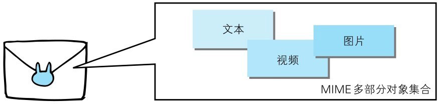

发送邮件时，我们可以在邮件里写入文字并添加多份附件。这是因为采用了 MIME（Multipurpose InternetMail Extensions，多用途因特网邮件扩展）机制，它允许邮件处理文本、图片、视频等多个不同类型的数据。
例如，图片等二进制数据以 ASCII 码字符串编码的方式指明，就是利用 MIME 来描述标记数据类型。而在 MIME 扩展中会使用一种称为多部分对象集合（Multipart）的方法，来容纳多份不同类型的数据。

相应地，HTTP 协议中也采纳了多部分对象集合，发送的一份报文主体内可含有多类型实体。通常是在图片或文本文件等上传时使用。

多部分对象集合包含的对象如下：
- **multipart/form-data**：在 Web 表单文件上传时使用。

```http request
Content-Type:multipart/form-data;boundary=AaB03x
--AaB03x
Content-Disposition:form-data;name="field1"
Joe Blow
--AaB03x
Content-Disposition:form-data;name="pics";filename="file1.txt"
Content-Type:text/plain
...（file1.txt的数据）...
--AaB03x--
```

- **multipart/byteranges**：状态码 206（Partial Content，部分内容）响应报文包含了多个范围的内容时使用。

```http
HTTP/1.1 206 Partial Content
Date:Fri,13 Jul 2012 02:45:26 GMT
Last-Modified:Fri,31 Aug 2007 02:02:20 GMT
Content-Type:multipart/byteranges;boundary=THIS_STRING_SEPARATES
--THIS_STRING_SEPARATES
Content-Type:application/pdf
Content-Range:bytes 500-999/8000
...（范围指定的数据）...
--THIS_STRING_SEPARATES
Content-Type:application/pdf
Content-Range:bytes 7000-7999/8000
...（范围指定的数据）...
--THIS_STRING_SEPARATES--
```

在 HTTP 报文中使用多部分对象集合时，需要在首部字段里加上 Content-type。有关这个首部字段，我们稍后讲解。

使用 boundary 字符串来划分多部分对象集合指明的各类实体。在 boundary 字符串指定的各个实体的起始行之前插入“--”标记（例如：--AaB03x、--THIS_STRING_SEPARATES），
而在多部分对象集合对应的字符串的最后插入“--”标记（例如：--AaB03x--、--THIS_STRING_SEPARATES--）作为结束。

多部分对象集合的每个部分类型中，都可以含有首部字段。另外，可以在某个部分中嵌套使用多部分对象集合。有关多部分对象集合更详细的解释，请参考 RFC2046。
