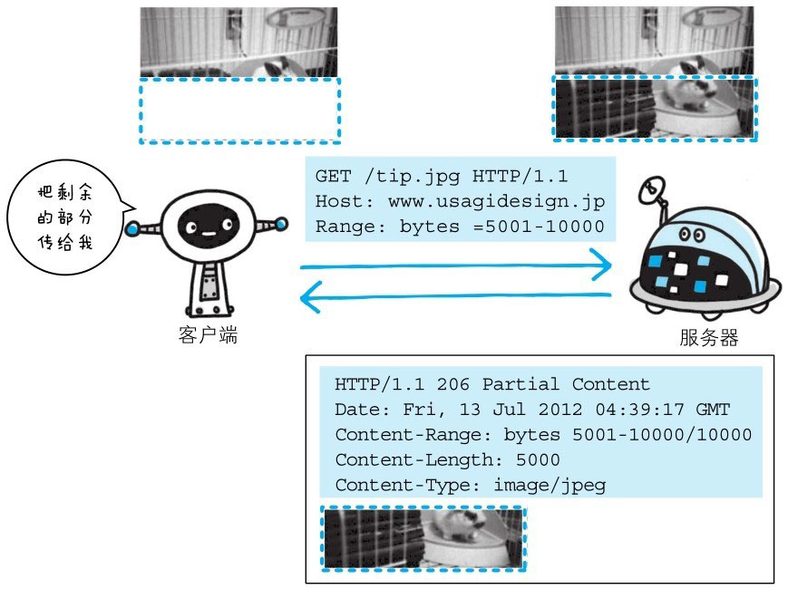

以前，用户不能使用现在这种高速的带宽访问互联网，当时，下载一个尺寸稍大的图片或文件就已经很吃力了。
如果下载过程中遇到网络中断的情况，那就必须重头开始。为了解决上述问题，需要一种可恢复的机制。所谓恢复是指能从之前下载中断处恢复下载。

要实现该功能需要指定下载的实体范围。像这样，**指定范围发送的请求叫做范围请求**（Range Request）。

对一份 10000 字节大小的资源，如果使用范围请求，可以只请求 5001～10000 字节内的资源。



**执行范围请求时，会用到首部字段 Range 来指定资源的 byte 范围。**

byte 范围的指定形式如下：

> 5001 ~ 10000 字节
```http
Range:bytes=5001~10000
```

> 从 5001 字节开始到资源末尾
```http
Range:bytes=5001-
```

> 从资源末尾向前取 3000 字节和 5000 ~ 7000 字节的多重范围
```http
Range:bytes=-3000,5000-7000
```

针对范围请求，响应会返回状态码为 206 Partial Content 的响应报文。另外，对于多重范围的范围请求，响应会在首部字段 Content-Type 标明 multipart/byteranges 后返回响应报文。

如果服务器端无法响应范围请求，则会返回状态码200 OK和完整的实体内容。
