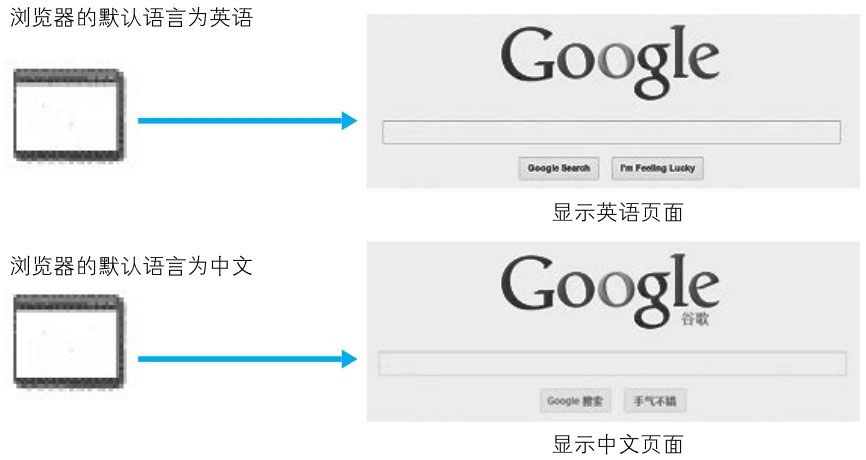

# 内容协商机制

同一个 Web 网站有可能存在着多份相同内容的页面。比如英语版和中文版的 Web 页面，它们内容上虽相同，但使用的语言却不同。

当浏览器的默认语言为英语或中文，访问相同 URI 的 Web 页面时，则会显示对应的英语版或中文版的 Web 页面。这样的机制称为内容协商（Content Negotiation）。

> 图：访问 http://www.google.com/

**内容协商机制是指客户端和服务器端就响应的资源内容进行交涉，然后提供给客户端最为适合的资源。内容协商会以响应资源的语言、字符集、编码方式等作为判断的基准。**

包含在请求报文中的某些首部字段（如下）就是判断的基准。这些首部字段的详细说明请参考下一章。

| 字段 | 说明 |
| --- | --- |
| Accept | 请求的资源内容类型 |
| Accept-Charset | 请求的资源字符集 |
| Accept-Encoding | 请求的资源编码方式 |
| Accept-Language | 请求的资源语言 |
| Content-Language | 响应的资源语言 |

# 内容协商技术类型划分

内容协商技术有以下 3 种类型：

- **服务器驱动协商（Server-driven Negotiation）**：
  由服务器端进行内容协商。以请求的首部字段为参考，在服务器端自动处理。但对用户来说，以浏览器发送的信息作为判定的依据，并不一定能筛选出最优内容。

- **客户端驱动协商（Agent-driven Negotiation）**：
  由客户端进行内容协商的方式。用户从浏览器显示的可选项列表中手动选择。还可以利用 JavaScript 脚本在 Web 页面上自动进行上述选择。比如按 OS 的类型或浏览器类型，自行切换成 PC 版页面或手机版页面。

- **透明协商（Transparent Negotiation）**：
  是服务器驱动和客户端驱动的结合体，是由服务器端和客户端各自进行内容协商的一种方法。
