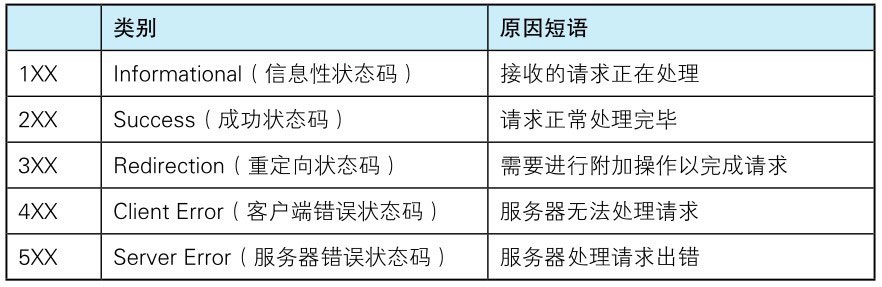

状态码的职责是当客户端向服务器端发送请求时，描述返回的请求结果。借助状态码，用户可以知道服务器端是正常处理了请求，还是出现了错误。

> 图：响应的状态码可描述请求的处理结果

状态码如 200 OK，以 3 位数字和原因短语组成。

数字中的第一位指定了响应类别，后两位无分类。响应类别有以下5种。

> 表：状态码的类别

只要遵守状态码类别的定义，即使改变 RFC2616 中定义的状态码，或服务器端自行创建状态码都没问题。

仅记录在 RFC2616 上的 HTTP 状态码就达 40 种，若再加上 WebDAV（Web-based Distributed Authoring and Versioning，基于万维网的分布式创作和版本控制）(RFC4918、5842）和附加 HTTP 状态码（RFC6585）等扩展，
数量就达 60 余种。别看种类繁多，实际上经常使用的大概只有 14 种。接下来，我们就介绍一下这些具有代表性的 14 个状态码。
