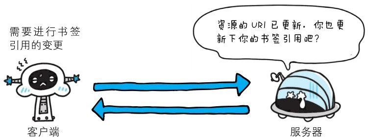
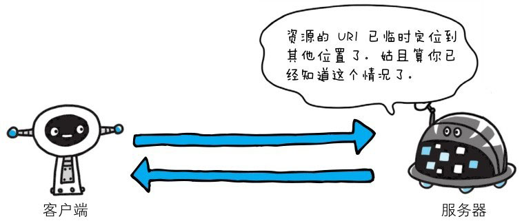
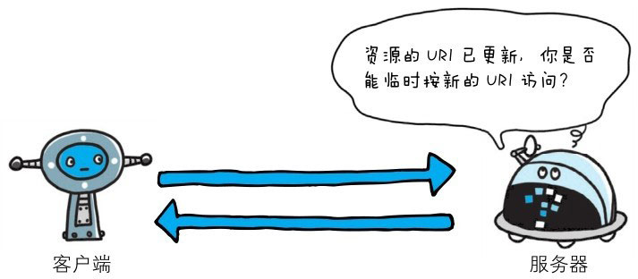

::: info
3XX 响应结果表明浏览器需要执行某些特殊的处理以正确处理请求。
:::


# 301 Moved Permanently


> 该状态码表示请求的资源已被永久移动到新位置。

**永久性重定向**。该状态码表示请求的资源已被分配了新的 URI，以后应使用资源现在所指的 URI。也就是说，如果已经把资源对应的 URI 保存为书签了，这时应该按 Location 首部字段提示的 URI 重新保存。

像下方给出的请求 URI，当指定资源路径的最后忘记添加斜杠“/”，就会产生 301 状态码。

```http
http://example.com/sample
```


# 302 Found


> **临时性重定向**。该状态码表示请求的资源已被分配了新的 URI，希望用户（本次）能使用新的 URI 访问。

和 301 Moved Permanently 状态码相似，但 302 状态码代表的资源不是被永久移动，只是临时性质的。
换句话说，已移动的资源对应的 URI 将来还有可能发生改变。比如，用户把 URI 保存成书签，但不会像 301 状态码出现时那样去更新书签，而是仍旧保留返回 302 状态码的页面对应的 URI。


# 303 See Other


> 该状态码表示由于请求对应的资源存在着另一个 URI，应使用 GET 方法定向获取请求的资源。

303 状态码和 302 Found 状态码有着相同的功能，但 303 状态码明确表示客户端应当采用 GET 方法获取资源，这点与 302 状态码有区别。

比如，当使用 POST 方法访问 CGI 程序，其执行后的处理结果是希望客户端能以 GET 方法重定向到另一个 URI 上去时，返回 303 状态码。
虽然 302 Found 状态码也可以实现相同的功能，但这里使用 303 状态码是最理想的。

::: tip
本书采用的是 HTTP/1.1，而许多 HTTP/1.1 版以前的浏览器不能正确理解 303 状态码。
虽然 RFC1945 和 RFC2068 规范不允许客户端在至定向时改变请求的方法，但是很多现存的浏览器将 302 响应视为 303 响应，
并且使用 GET 方式访问在 Location 中规定的 URI，而无视原先请求的方法。所以作者说这里使用 303 是最理想的。- 译者注
:::

当 301、302、303 响应状态码返回时，几乎所有的浏览器都会把 POST 改成 GET，并删除请求报文内的主体，之后请求会自动再次发送。
301、302 标准是禁止将 POST 方法改变成 GET 方法的，但实际使用时大家都会这么做。


# 304 Not Modified


该状态码表示客户端发送附带条件的请求时，服务器端允许请求访问资源，但因发生请求未满足条件的情况后，直接返回 304 Not Modified（服务器端资源未改变，可直接使用客户端未过期的缓存）。
304 状态码返回时，不包含任何响应的主体部分。304 虽然被划分在 3XX 类别中，但是和重定向没有关系。

::: tip
附带条件的请求是指采用 GET 方法的请求报文中包含 If-Match,If-Modified-Since,f-None-Match,If-Range,If-Unmodified-Since 中任一首部。
:::


# 307 Temporary Redirect

**临时重定向**。该状态码与 302 Found 有着相同的含义。尽管 302 标准禁止 POST 变换成 GET，但实际使用时大家并不遵守。

307 会遵照浏览器标准，不会从 POST 变成 GET。但是，对于处理响应时的行为，每种浏览器有可能出现不同的情况。
