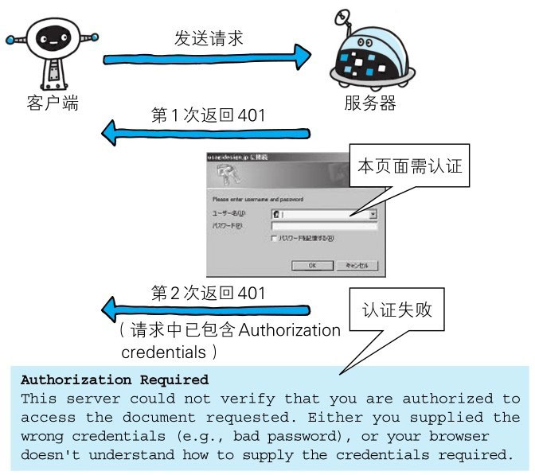

::: info
4XX 的响应结果表明客户端是发生错误的原因所在。
:::

# 400 Bad Request

该状态码表示请求报文中存在语法错误。当错误发生时，需修改请求的内容后再次发送请求。另外，浏览器会像 200 OK 一样对待该状态码。

# 401 Unauthorized

该状态码表示发送的请求需要有通过 HTTP 认证（BASIC 认证、DIGEST 认证）的认证信息。另外若之前已进行过 1 次请求，则表示用户认证失败。

返回含有 401 的响应必须包含一个适用于被请求资源的 WWW-Authenticate 首部用以质询（challenge）用户信息。当浏览器初次接收到 401 响应，会弹出认证用的对话窗口。

# 403 Forbidden

该状态码表明对请求资源的访问被服务器拒绝了。服务器端没有必要给出拒绝的详细理由，但如果想作说明的话，可以在实体的主体部分对原因进行描述，这样就能让用户看到了。

未获得文件系统的访问授权，访问权限出现某些问题（从未授权的发送源 IP 地址试图访问）等列举的情况都可能是发生 403 的原因。

# 404 Not Found

该状态码表明服务器上无法找到请求的资源。除此之外，也可以在服务器端拒绝请求且不想说明理由时使用。
