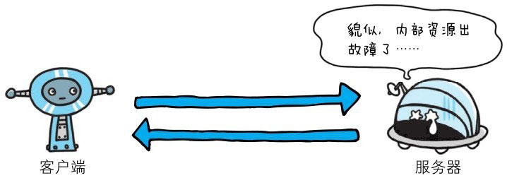

::: info
5XX 的响应结果表明服务器本身发生错误。
:::

# 500 Internet Server Error

> 该状态码表明服务器端在执行请求时发生了错误。也有可能是 Web 应用存在的 bug 或某些临时的故障。

**含义**：服务器在处理请求时遇到不可预期的错误，无法完成请求。

**常见原因**：
- 服务器端代码出现 bug（如空指针、异常未捕获）。 
- 配置错误（如 PHP、Java 等运行环境报错）。 
- 依赖服务异常（如数据库连接失败）。

**注意**：500 表示一个通用错误状态码，除非确定具体原因，否则服务器返回该状态码意味着“内部逻辑出错”。

# 502 Bad Gateway
**含义**：作为网关或代理的服务器（如 Nginx、CDN、API Gateway）从上游服务器接收到**无效响应**。

**常见原因**：
- 上游服务宕机或无响应。
- 上游服务返回了非 HTTP 协议格式的数据（如超时或 TCP 连接失败）。
- 代理服务器的配置错误（反向代理目标地址写错）。

# 503 Service Unavailable

> 该状态码表明服务器暂时处于超负载或正在进行停机维护，现在无法处理请求。如果事先得知解除以上状况需要的时间，最好写入 Retry-After 首部字段再返回给客户端。

**含义**：服务器 暂时超负载 或 正在停机维护，无法处理请求。

**常见原因**：
- 流量过大导致服务压力过高（如秒杀、热点流量）。
- 服务器正在更新或重启。
- 后端依赖服务不可用（数据库、缓存等）。

**建议**：如果预计恢复时间，可以通过 Retry-After 首部字段告诉客户端多久后可重试。

# 504 Gateway Timeout

**含义**：作为网关或代理的服务器（如 Nginx、CDN、API Gateway），在等待上游服务器响应时超时。

**常见原因**：
- 上游服务处理请求耗时过长（超出 Nginx 或 CDN 等网关的 timeout 配置）。
- 上游服务器宕机或网络延迟。

**区别**：
- 502 是收到无效响应（如报错、数据格式不对）。
- 504 是根本没有响应（超时）。

# 状态码和状况的不一致
不少返回的状态码响应都是错误的，但是用户可能察觉不到这点。比如 Web 应用程序内部发生错误，状态码依然返回 200 OK，这种情况也经常遇到。

