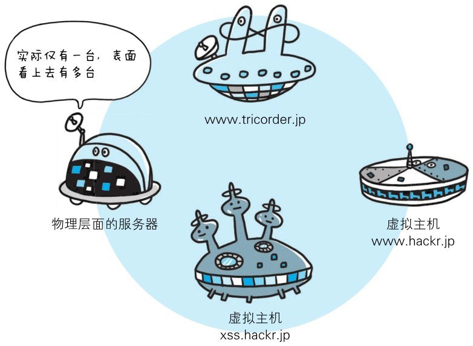
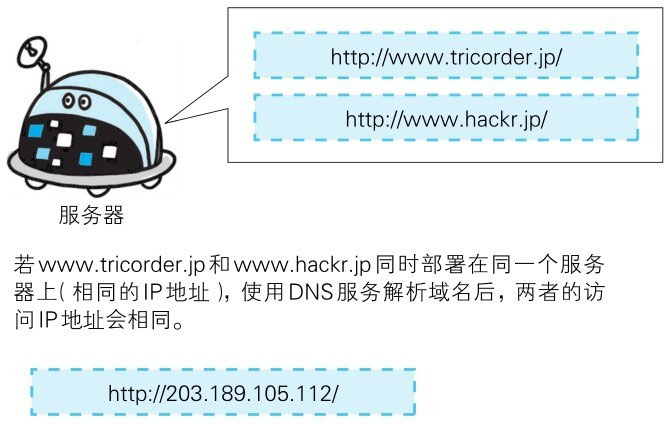

# 什么是虚拟主机

::: tip 名词解释
**虚拟主机**（Virtual Hosting）：是一种在同一台物理服务器上，通过软件技术将其资源（如CPU、内存、磁盘空间、网络带宽等）分割成多个相互独立的小型“虚拟服务器”的服务方式。每个虚拟主机都可以运行独立的网站或应用，拥有自己的域名、文件系统和配置，就像一台独立的服务器一样。
:::

HTTP/1.1 规范允许一台 HTTP 服务器搭建多个 Web 站点。比如，提供 Web 托管服务（Web Hosting Service）的供应商，
可以用一台服务器为多位客户服务，也可以以每位客户持有的域名运行各自不同的网站。这是因为利用了虚拟主机（Virtual Host，又称虚拟服务器）的功能。

即使物理层面只有一台服务器，但只要使用虚拟主机的功能，则可以假想已具有多台服务器。



客户端使用 HTTP 协议访问服务器时，会经常采用类似 www.hackr.jp 这样的主机名和域名。

在互联网上，域名通过 DNS 服务映射到 IP 地址（域名解析）之后访问目标网站。可见，当请求发送到服务器时，已经是以 IP 地址形式访问了。

所以，如果一台服务器内托管了 www.tricorder.jp 和 www.hackr.jp 这两个域名，当收到请求时就需要弄清楚究竟要访问哪个域名。



在相同的 IP 地址下，由于虚拟主机可以寄存多个不同主机名和域名的 Web 网站，因此在发送 HTTP 请求时，必须在 Host 首部内完整指定主机名或域名的 URI。


# 虚拟主机的特点
 
- **资源共享**：一台物理服务器上可以运行多个虚拟主机，这些虚拟主机会共享硬件资源。
- **独立性**：每个虚拟主机都有自己的目录、配置文件和访问权限，相互之间不会影响。
- **成本低廉**：比独立服务器便宜，因为多个用户共用同一台物理服务器。
- **灵活性高**：可以根据需求快速分配存储空间、带宽、邮箱数量等资源。


# 虚拟主机的分类

1. **基于域名的虚拟主机**：
多个不同的域名指向同一 IP 地址，通过 HTTP 请求头中的 Host 字段区分请求，服务器返回对应的网站内容。
> 例子：www.siteA.com 和 www.siteB.com 共用同一个服务器 IP。

2. **基于 IP 的虚拟主机**：
为每个虚拟主机分配一个独立的 IP 地址，不同 IP 对应不同的网站。
> 例子 1：多个独立网站需要 SSL（HTTPS）支持

> 早期的 HTTPS 协议不支持 SNI（Server Name Indication），同一 IP 只能部署一个 SSL 证书。
> - 网站A：IP 192.168.1.10 → https://www.siteA.com
> - 网站B：IP 192.168.1.11 → https://www.siteB.com
> - 这样每个站点都绑定独立 IP 和证书。

> 例子 2：同一公司不同业务线

> 有些业务需要独立公网 IP 来实现安全隔离和日志追踪：
> - 业务A（API服务）：203.0.113.10 
> - 业务B（Web前端）：203.0.113.11 
> - 虽然共用一台服务器，但通过不同 IP 实现逻辑分离。

3. **基于端口的虚拟主机**：
同一个 IP 上通过不同端口号来区分网站。
> 例子：http://example.com:8080 与 http://example.com:9090


# 虚拟主机 VS 独立服务器

| 维度   | 虚拟主机          | 独立服务器         |
| ---- | ------------- | ------------- |
| 成本   | 较低            | 较高            |
| 性能   | 共享服务器资源，有一定限制 | 独享所有资源，性能更高   |
| 灵活性  | 不可随意配置系统环境    | 可自由安装、配置系统和软件 |
| 适用场景 | 中小型网站、博客、企业官网 | 高流量网站、大型应用    |


# 应用场景


## 适用的场景

- **中小型企业官网**：访问量较低，对 CPU、内存要求不高，虚拟主机可用较低成本快速上线。

- **个人博客**、作品集网站：站点简单，对独立资源、灵活配置要求低，用虚拟主机可避免高昂运维成本。

- **测试/开发环境**：需要快速部署测试版本，不追求高性能、可扩展性，用虚拟主机可减少维护工作量。

- **静态网站**：资源占用极低，虚拟主机足够支撑，并且无需复杂的服务器配置。


## 不适用的场景

- **高并发、高流量网站（如大型电商、新闻门户）**：虚拟主机的资源共享机制会导致 CPU、带宽争用，影响稳定性。

- **需要自定义服务器环境或底层服务的项目**：虚拟主机往往只允许有限的配置（如 PHP 版本、扩展），无法自由安装软件。

- **涉及敏感数据的业务**：多租户环境下隔离不如独立服务器安全，存在潜在的安全隐患。

- **实时计算、大型后台任务（如视频转码、AI推理）**：这些任务需要大量计算资源，虚拟主机无法提供充足的 CPU/GPU 支持。


# 虚拟主机的原理

::: info 虚拟主机的本质
是通过服务器软件（如 Apache、Nginx、IIS 等）对请求进行区分和路由，将同一台物理服务器的资源逻辑上划分为多个独立的网站运行空间。
:::


## 请求区分机制

虚拟主机的核心问题是：如何让一台服务器同时服务多个网站，并且知道用户访问的是哪一个？

> 主要有三种方式：

- 1. **基于域名**（Name-based Virtual Hosting）
  
  > HTTP/1.1 协议中引入了 Host 请求头，浏览器会在请求中携带访问的域名。例如：

  ```http
  GET /index.html HTTP/1.1
  Host: www.example.com
  ```

  > Web 服务器根据 Host 字段区分不同的站点配置，返回对应的网站内容。

- 2. **基于 IP**（IP-based Virtual Hosting）

  > - 通过为同一台服务器绑定多个 IP，每个 IP 对应一个网站。
  > - 服务器根据请求到达的目标 IP 来确定要返回的站点资源。
  > - 常用于需要独立 SSL 证书或网络隔离的情况。

- 3. **基于端口**（Port-based Virtual Hosting）
 
  > - 在同一 IP 上监听不同端口（如 80、8080），不同端口对应不同网站。
  > - 用户通过 URL 指定端口访问：http://example.com:8080/


## 资源隔离

虚拟主机依靠服务器软件或轻量虚拟化手段，将一台物理主机的资源划分为多个逻辑空间：

- **文件目录隔离**：

  > 每个虚拟主机对应不同的根目录，例如：
  
  ```md
  /var/www/siteA/
  /var/www/siteB/
  ```
  
  > 请求不会访问其他网站的文件，避免相互影响。

- **配置隔离**：不同虚拟主机可以有不同的配置（如 PHP 版本、日志路径、访问控制）。
  
- **权限隔离**：虚拟主机运行在不同的用户权限下，限制一个网站访问另一个网站的数据。


## 域名解析和访问流程

当用户访问一个域名时：

1. **DNS解析**：域名 www.example.com 解析到某个服务器的 IP（比如 203.0.113.10）。
2. **TCP连接**：浏览器与该 IP 服务器的 80（或 443）端口建立连接。
3. **HTTP 请求**：浏览器发送带有 Host 的请求头。
4. **虚拟主机匹配**：Web 服务器（如 Nginx）根据 Host 或 IP/端口匹配对应的虚拟主机配置：
```nginx
server {
    server_name www.example.com;
    root /var/www/siteA;
}
server {
    server_name www.other.com;
    root /var/www/siteB;
}
```
最终返回对应站点内容。


## 与容器/云服务的区别

- **虚拟主机**：依赖 Web 服务器软件的逻辑划分，本质是“同进程内的站点隔离”，资源是共享的。

- **VPS/容器**：通过虚拟化或容器技术（如 Docker）创建独立的操作系统环境，隔离性和灵活性更高，但成本也更高。

- **云服务器**：直接提供独立的虚拟机实例，相当于用户拥有“完整的一台虚拟服务器”。


## 原理总结

虚拟主机主要依靠 HTTP 请求头、IP/端口路由和文件权限隔离 来实现“一机多站”。它的设计重点是 低成本、多租户、快速上线，
因此在共享资源和安全性上不如 VPS 或独立服务器，但非常适合小型网站。


