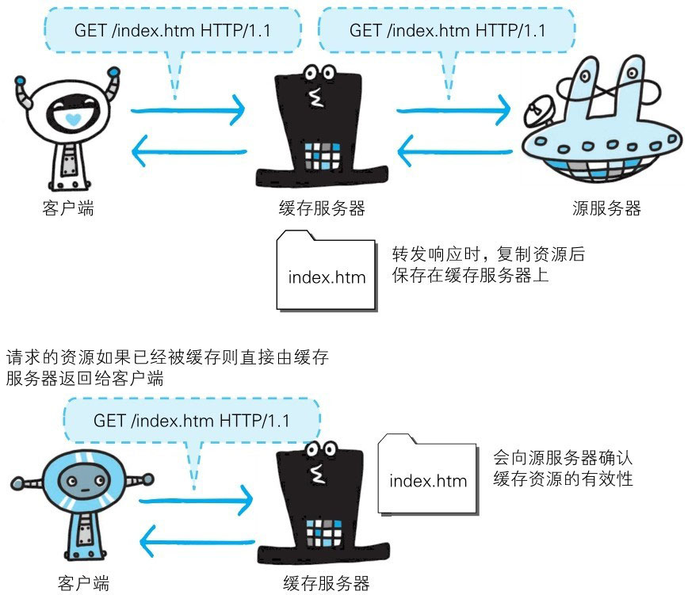
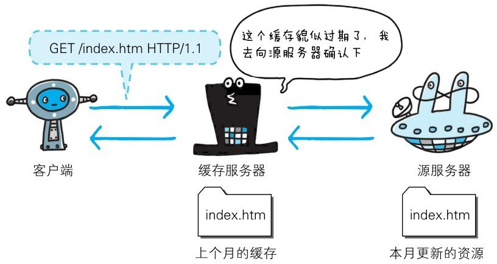
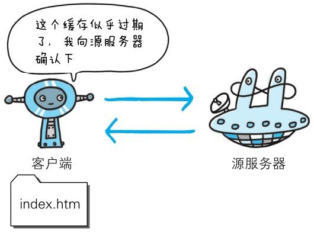

缓存是指代理服务器或客户端本地磁盘内保存的资源副本。利用缓存可减少对源服务器的访问，因此也就节省了通信流量和通信时间。

缓存服务器是代理服务器的一种，并归类在缓存代理类型中。换句话说，当代理转发从服务器返回的响应时，代理服务器将会保存一份资源的副本。

缓存服务器的优势在于利用缓存可避免多次从源服务器转发资源。因此客户端可就近从缓存服务器上获取资源，而源服务器也不必多次处理相同的请求了。

# 缓存的有效期

即便缓存服务器内有缓存，也不能保证每次都会返回对同资源的请求。因为这关系到被缓存资源的有效性问题。

当遇上源服务器上的资源更新时，如果还是使用不变的缓存，那就会演变成返回更新前的“旧”资源了。

即使存在缓存，也会因为客户端的要求、缓存的有效期等因素，向源服务器确认资源的有效性。若判断缓存失效，缓存服务器将会再次从源服务器上获取“新”资源。

# 客户端的缓存

缓存不仅可以存在于缓存服务器内，还可以存在客户端浏览器中。以 Internet Explorer 为例，该程序为例，把客户端缓存称为临时网络文件（Temporary Internet File）。

浏览器缓存如果有效，就不必再向服务器请求相同的资源了，可以直接从本地磁盘内读取。

另外，和缓存服务器相同的一点是，当判定缓存过期后，会向源服务器确认资源的有效性。若判断浏览器缓存失效，浏览器会再次请求新资源。

# 在 HTTP 出现之前的协议

在 HTTP 普及之前，也就是从互联网的诞生期至今，曾出现过各式各样的协议。在 HTTP 规范确立之际，制定者们参考了那些协议的功能。也有某些协议现在已经彻底退出了人们的视线。接下来，我们会简单介绍一下这些协议。

- **FTP**（File Transfer Protocol）：传输文件时使用的协议。该协议历史久远，可追溯到 1973 年前后，比 TCP/IP 协议族的出现还要早。虽然它在 1995 年被 HTTP 的流量超越，但时至今日，仍被广泛沿用。

- **NNTP**（Network News Transfer Protocol）：用于 NetNews 电子会议室内传送消息的协议。在 1986 年前后出现，属于比较古老的一类协议。现在，利用 Web 交换信息已成主流，所以该协议已经不怎么使用了。

- **Archie**：搜索 anonymous FTP 公开的文件信息的协议。1990 年前后出现，现在已经不常使用。

- **WAIS**（Wide Area Information Servers）：以关键词检索多个数据库使用的协议。1991 年前后出现。由于现在已经被 HTTP 协议替代，也已经不怎么使用了。

- **Gopher**：查找与互联网连接的计算机内信息的协议。1991 年前后出现，由于现在已经被 HTTP 协议替代，也已经不怎么使用了。
