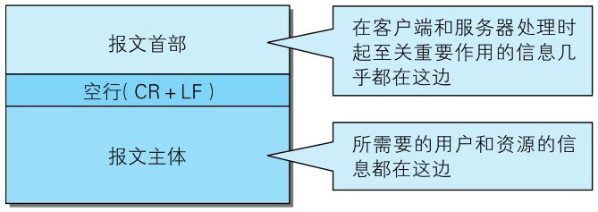
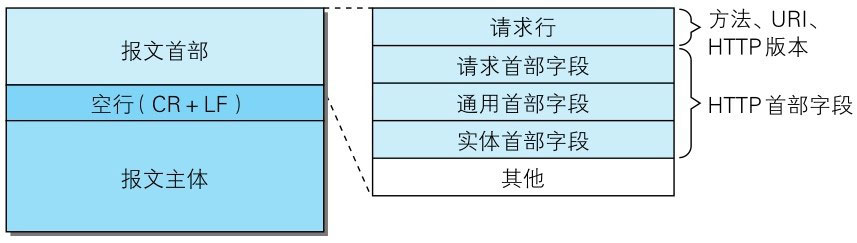
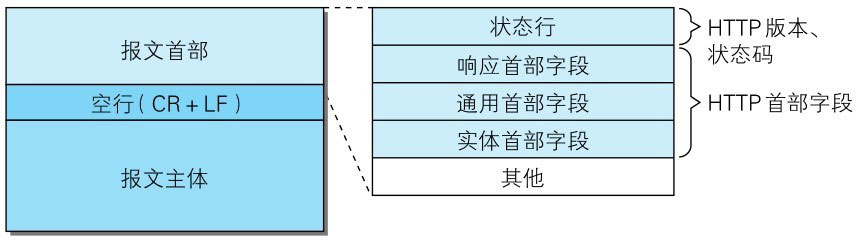

> 图：HTTP 报文的结构

HTTP 协议的请求和响应报文中必定包含 HTTP 首部。首部内容为客户端和服务器分别处理请求和响应提供所需要的信息。对于客户端用户来说，这些信息中的大部分内容都无须亲自查看。

报文首部由几个字段构成。


# HTTP 请求报文

在请求中，HTTP 报文由方法、URI、HTTP 版本、HTTP 首部字段等部分构成。


> 图：HTTP 请求报文结构

> 下面的示例是访问 http://hackr.jp 时，请求报文的首部信息。

```http
GET / HTTP/1.1
Host:hackr.jp
User-Agent:Mozilla/5.0 (Windows NT 6.1;WOW64;rv:13.0) Gecko/20100101 Firefox/13.0
Accept:text/html,application/xhtml+xml,application/xml;q=0.9,＊/＊;q=0.8
Accept-Language:ja,en-us;q=0.7,en;q=0.3
Accept-Encoding:gzip,deflate
DNT:1
Connection:keep-alive
If-Modified-Since:Fri,31 Aug 2007 02:02:20 GMT
If-None-Match:"45bae1-16a-46d776ac"
Cache-Control:max-age=0
```


# HTTP 响应报文

在响应中，HTTP 报文由 HTTP 版本、状态码（数字和原因短语）、HTTP首部字段 3 部分构成。


> 图：HTTP 响应报文结构

以下示例是之前请求访问 http://hackr.jp/ 时，返回的响应报文的首部信息。

```http
HTTP/1.1304 Not Modified
Date:Thu,07 Jun 2012 07:21:36 GMT
Server:Apache
Connection:close
Etag:"45bae1-16a-46d776ac"
```

在报文众多的字段当中，HTTP 首部字段包含的信息最为丰富。首部字段同时存在于请求和响应报文内，并涵盖HTTP报文相关的内容信息。

因 HTTP 版本或扩展规范的变化，首部字段可支持的字段内容略有不同。本书主要涉及 HTTP/1.1 及常用的首部字段。
