::: info
**通用首部字段**：指的是**请求报文和响应报文双方都会使用的首部**。
:::


# Cache-Control

通过指定首部字段 Cache-Control 的指令，就能操作缓存的工作机制。

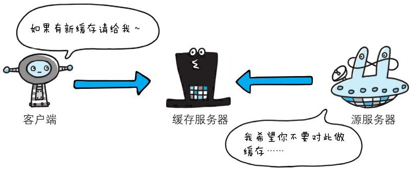
> 图：首部字段 Cache-Control 能够控制缓存的行为

指令的参数是可选的，多个指令之间通过 `,` 分隔。首部字段 Cache-Control 的指令可用于请求及响应时。


## Cache-Control 指令一览

可用的指令按请求和响应分类如下所示：

> 表：缓存请求指令

| 指令           | 有无参数 | 说明                   | 举例（含义）                                                     |
|----------------|------|------------------------|------------------------------------------------------------------|
| no-cache       | 无    | 强制向源服务器再次验证 | `Cache-Control: no-cache` (客户端每次请求都必须向源服务器验证缓存的有效性) |
| no-store       | 无    | 不缓存请求或响应的任何内容 | `Cache-Control: no-store` (代理或浏览器不得缓存请求或响应的任何部分，常用于敏感数据) |
| max-age = [ 秒 ] | 必需   | 响应的最大 Age 值      | `Cache-Control: max-age=3600` (缓存的响应在 3600 秒（1小时）内是新鲜的) |
| max-stale (= [ 秒 ]) | 可省略  | 接收已过期的响应       | `Cache-Control: max-stale=60` (客户端愿意接受一个过期不超过 60 秒的缓存响应) |
| min-fresh = [ 秒 ] | 必需   | 期望在指定时间内的响应仍有效 | `Cache-Control: min-fresh=300` (客户端期望收到的响应在未来至少 300 秒内仍然是新鲜的) |
| no-transform   | 无    | 代理不可更改媒体类型   | `Cache-Control: no-transform` (指示代理服务器不得修改响应中的媒体类型，如不得压缩或转换格式) |
| only-if-cached | 无    | 从缓存获取资源         | `Cache-Control: only-if-cached` (客户端只希望从缓存中获取资源，如果缓存中没有则不向源服务器发起请求) |
| cache-extension | -    | 新指令标记 ( token )   | `Cache-Control: private, my-custom-extension` (用于引入自定义的缓存扩展指令，例如 CDN 服务的 `s-maxage`) |

> 表：缓存响应指令

| 指令               | 参数   | 说明                           | 举例（含义）                                                     |
|--------------------|--------|--------------------------------|------------------------------------------------------------------|
| public             | 无     | 可向任意方提供响应的缓存       | `Cache-Control: public` (表明响应可以被任何缓存（包括共享缓存）存储) |
| private            | 可省略 | 仅向特定用户返回响应           | `Cache-Control: private` (表明响应只能被客户端私有缓存（如浏览器缓存）存储，不能被共享缓存存储) |
| no-cache           | 可省略 | 缓存前必须先确认其有效性       | `Cache-Control: no-cache` (在每次使用缓存副本前，都必须向源服务器验证其有效性) |
| no-store           | 无     | 不缓存请求或响应的任何内容     | `Cache-Control: no-store` (指示缓存不得存储关于请求或响应的任何部分，确保敏感信息不被持久化) |
| no-transform       | 无     | 代理不可更改媒体类型           | `Cache-Control: no-transform` (指示中间代理不得改变响应的媒体类型或编码) |
| must-revalidate    | 无     | 可缓存但必须再向源服务器进行确认 | `Cache-Control: must-revalidate` (一旦缓存副本过期，客户端必须向源服务器重新验证，不能使用过期副本) |
| proxy-revalidate   | 无     | 要求中间缓存服务器对缓存的响应有效性进行确认 | `Cache-Control: proxy-revalidate` (与 `must-revalidate` 类似，但主要针对共享缓存，要求它们在过期后必须验证) |
| max-age = [ 秒 ]   | 必需   | 响应的最大 Age 值              | `Cache-Control: max-age=600` (缓存的响应在 600 秒（10分钟）内是新鲜的) |
| s-maxage = [ 秒 ]  | 必需   | 公共缓存服务器响应的最大 Age 值 | `Cache-Control: s-maxage=3600` (指示共享缓存（如 CDN）在 3600 秒（1小时）内将响应视为新鲜的，优先级高于 `max-age` 对于共享缓存而言) |
| cache-extension    | -      | 新指令标记 ( token )           | `Cache-Control: public, x-my-feature=1` (允许定义非标准的缓存指令，通常用于特定应用或 CDN 的私有扩展) |


## 表示是否能缓存的指令

- **public 指令**
> 当指定使用 public 指令时，则明确表明其他用户也可利用缓存。
```http
Cache-Control: public
```

- **private 指令**
> 当指定 private 指令后，响应只以特定的用户作为对象，这与 public 指令的行为相反。
```http
Cache-Control: private
```
> 缓存服务器会对该特定用户提供资源缓存的服务，对于其他用户发送过来的请求，代理服务器则不会返回缓存。

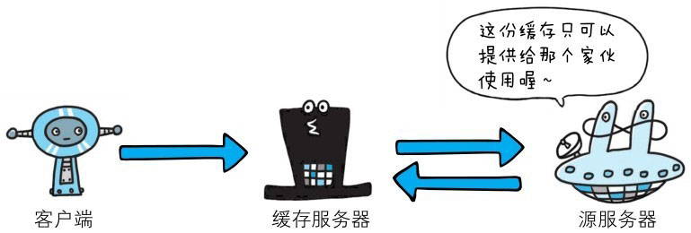

- **no-cache 指令**
> 使用 no-cache 指令的目的是为了防止从缓存中返回过期的资源。

```http
Cache-Control: no-cache
```

> 客户端发送的请求中如果包含 no-cache 指令，则表示客户端将不会接收缓存过的响应。于是，“中间”的缓存服务器必须把客户端请求转发给源服务器。

> 如果服务器返回的响应中包含 no-cache 指令，表示响应可以存储在缓存中，但每次重用之前都必须与原始服务器验证响应，即使缓存与原始服务器断开连接也是如此。

> 如果您希望缓存在重用存储内容时始终检查内容更新，则可以使用 no-cache 指令。它通过要求缓存向源服务器重新验证每个请求来实现这一点。

::: warning
**no-cache 并不意味着“不缓存”**。no-cache 允许缓存存储响应，但要求它们在重用之前重新验证响应。如果您想要的“不缓存”实际上是“不存储”，那么 no-store 指令是您应该使用的。
:::

```http
Cache-Control: no-cache=Location
```

由服务器返回的响应中，若报文首部字段 Cache-Control 中对 no-cache 字段名具体指定参数值，那么客户端在接收到这个被指定参数值的首部字段对应的响应报文后，就不能使用缓存。换言之，无参数值的首部字段可以使用缓存。只能在响应指令中指定该参数。

::: warning
从字面意思上很容易把 no-cache 误解成为不缓存，但事实上 no-cache 代表不缓存过期的资源，
缓存会向源服务器进行有效期确认后处理资源，也许称为 do-not-serve-from-cache-without-revalidation更合适。
**no-store 才是真正地不进行缓存**。
:::


## 控制可执行缓存的对象的指令

- **no-store 指令**

> 当使用 no-store 指令时，暗示请求（和对应的响应）或响应中包含机密信息。

```http
Cache-Control: no-store
```

> 因此，该指令规定缓存不能在本地存储请求或响应的任一部分。


## 指定缓存期限和认证的指令

- **s-maxage 指令**

```http
Cache-Control: s-maxage=604800（单位：秒）
```

> s-maxage 指令的功能和 max-age 指令的相同，它们的不同点是 s-maxage 指令只适用于供多位用户使用的公共缓存服务器（这里一般指代理）。
也就是说，对于向同一用户重复返回响应的服务器来说，这个指令没有任何作用。

> 另外，当使用 s-maxage 指令后，则直接忽略对 Expires 首部字段及 max-age 指令的处理。

- **max-age 指令**

```http
Cache-Control: max-age=604800（单位：秒）
```

> 当客户端发送的请求中包含 max-age 指令时，如果判定缓存资源的缓存时间数值比指定时间的数值更小，那么客户端就接收缓存的资源。
另外，当指定 max-age 值为 0，那么缓存服务器通常需要将请求转发给源服务器。

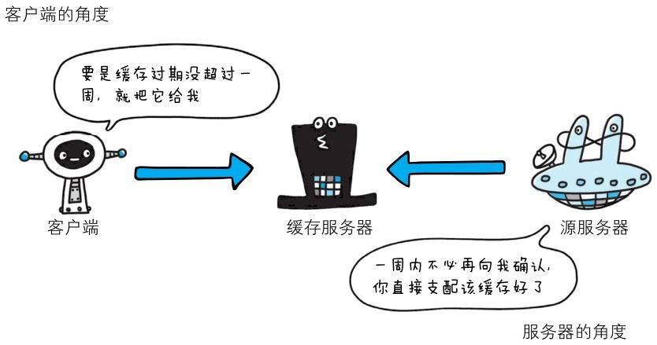

> 当服务器返回的响应中包含 max-age 指令时，缓存服务器将不对资源的有效性再作确认，而 max-age 数值代表资源保存为缓存的最长时间。

> 应用 HTTP/1.1 版本的缓存服务器遇到同时存在 Expires 首部字段的情况时，会优先处理 max-age 指令，而忽略掉 Expires 首部字段。
而 HTTP/1.0 版本的缓存服务器的情况却相反，max-age 指令会被忽略掉。

- **min-fresh 指令**

```http
Cache-Control: min-fresh=604800（单位：秒）
```

> min-fresh 指令要求缓存服务器返回至少还未过指定时间的缓存资源。

> 比如，当指定 min-fresh 为 60 秒后，在这 60 秒以内如果有超过有效期限的资源都无法作为响应返回了。

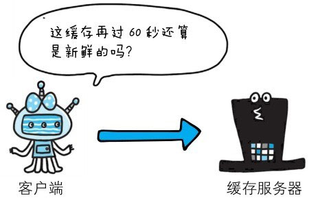

- **max-stale 指令**

```http
Cache-Control: max-stale=604800（单位：秒）
```

> 使用 max-stale 可指示缓存资源，即使过期也照常接收。

> 如果指令未指定参数值，那么无论经过多久，客户端都会接收响应；如果指令中指定了具体数值，那么即使过期，只要仍处于 max-stale 指定的时间内，仍旧会被客户端接收。

- **only-if-cached 指令**

```http
Cache-Control: only-if-cached
```

> 使用 only-if-cached 指令表示客户端仅在缓存服务器本地缓存目标资源的情况下才会要求其返回。

> 换言之，该指令要求缓存服务器不重新加载响应，也不会再次确认资源有效性。若发生请求缓存服务器的本地缓存无响应，则返回状态码 504 Gateway Timeout。

- **must-revalidate 指令**

```http
Cache-Control: must-revalidate
```

> 使用 must-revalidate 指令，代理会向源服务器再次验证即将返回的响应缓存目前是否仍然有效。

> 若代理无法连通源服务器再次获取有效资源的话，缓存必须给客户端一条 504（Gateway Timeout）状态码。

> 另外，使用 must-revalidate 指令会忽略请求的 max-stale 指令（即使已经在首部使用了max-stale，也不会再有效果）。

- **proxy-revalidate 指令**

```http
Cache-Control: proxy-revalidate
```

> proxy-revalidate 指令要求所有的缓存服务器在接收到客户端带有该指令的请求返回响应之前，必须再次验证缓存的有效性。

- **no-transform 指令**

```http
Cache-Control: no-transform
```

> 使用 no-transform 指令规定无论是在请求还是响应中，缓存都不能改变实体主体的媒体类型。

> 这样做可防止缓存或代理压缩图片等类似操作。


## Cache-Control 扩展

- **cache-extension token**

```http
Cache-Control: private,community="UCI"
```

> 通过 cache-extension 标记，可以扩展 Cache-Control 首部字段内的指令。

> 如上例，Cache-Control 首部字段本身没有 community 这个指令。借助 extension tokens 实现了该指令的添加。
> 如果缓存服务器不能理解 community 这个新指令，就会直接忽略。因此，extension tokens 仅对能理解它的缓存服务器来说是有意义的。


# Connection

Connection 首部字段具备如下两个作用：

- 控制不再转发给代理的首部字段；
- 管理持久连接。


## 控制不再转发给代理的首部字段

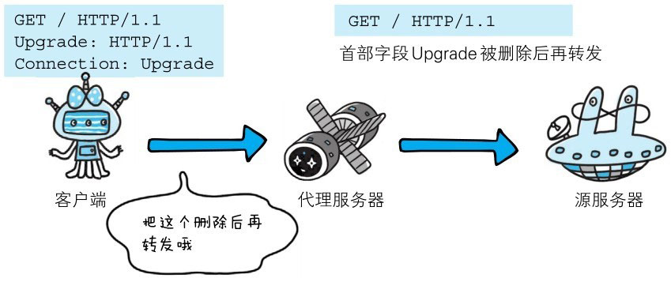

```http
Connection: 不再转发的首部字段名
```

在客户端发送请求和服务器返回响应内，使用 Connection 首部字段，可控制不再转发给代理的首部字段（即 Hop-by-hop首部）。


## 管理持久连接

HTTP/1.1 版本的默认连接都是持久连接。为此，客户端会在持久连接上连续发送请求。当服务器端想明确断开连接时，则指定 Connection 首部字段的值为 Close。

```http
Connection: close
```

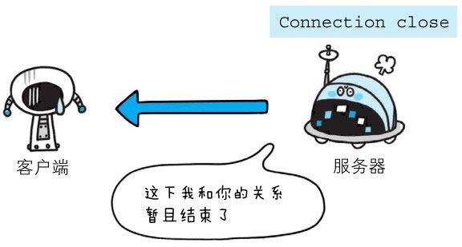

HTTP/1.1 之前的 HTTP 版本的默认连接都是非持久连接。为此，如果想在旧版本的 HTTP 协议上维持持续连接，则需要指定 Connection 首部字段的值为 Keep-Alive。

```http
Connection: Keep-Alive
```

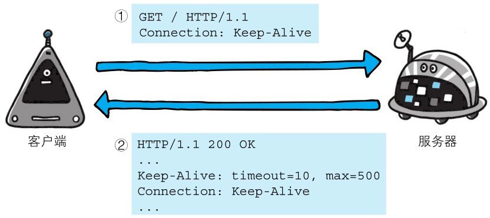

如上图所示，客户端发送请求给服务器时，服务器端会像上图那样加上首部字段 Keep-Alive 及首部字段 Connection 后返回响应。


# Date

首部字段 Date 表明创建 HTTP 报文的日期和时间。


HTTP/1.1 协议使用在 RFC1123 中规定的日期时间的格式，如下示例：

```http
Date: Tue,03 Jul 2012 04:40:59 GMT
```

之前的 HTTP 协议版本中使用在 RFC850 中定义的格式，如下所示：

```http
Date: Tue,03-Jul-12 04:40:59 GMT
```

除此之外，还有一种格式。它与 C 标准库内的 asctime 函数的输出格式一致：

```http
Date: Tue Jul 03 04:40:592012
```


# Pragma

Pragma 是 HTTP/1.1 之前版本的历史遗留字段，仅作为与 HTTP/1.0 的向后兼容而定义。

规范定义的形式唯一，如下所示：

```http
Pragma: no-cache
```

该首部字段属于通用首部字段，但**只用在客户端发送的请求中**。客户端会**要求所有的中间服务器不返回缓存的资**源。

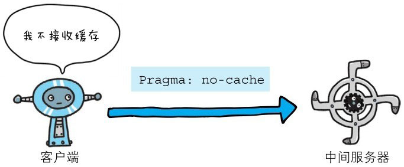

所有的中间服务器如果都能以 HTTP/1.1 为基准，那直接采用 Cache-Control: no-cache 指定缓存的处理方式是最为理想的。
但要整体掌握全部中间服务器使用的 HTTP 协议版本却是不现实的。因此，发送的请求会同时含有下面两个首部字段：

```http
Cache-Control: no-cache
Pragma: no-cache
```


# Trailer

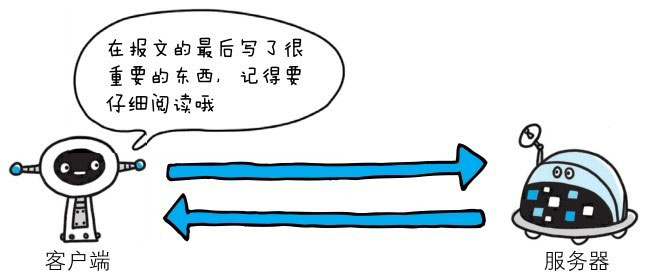

首部字段 Trailer 会事先说明在报文主体后记录了哪些首部字段。该首部字段可应用在 HTTP/1.1 版本分块传输编码时。

```http
HTTP/1.1 200 OK
Date:Tue,03 Jul 2012 04:40:56 GMT
Content-Type: text/html
...
Transfer-Encoding: chunked
Trailer: Expires
...（报文主体）...
0
Expires: Tue,28 Sep 2004 23:59:59 GMT
```

以上用例中，指定首部字段 Trailer 的值为 Expires，在报文主体之后（分块长度0之后）出现了首部字段 Expires。


# Transfer-Encoding

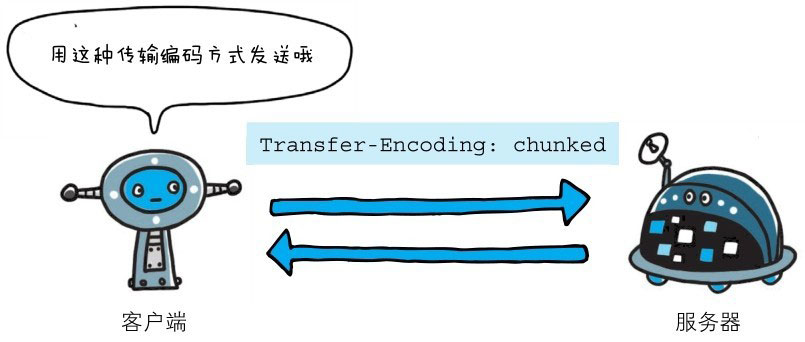

首部字段 Transfer-Encoding **规定了传输报文主体时采用的编码方式**。

HTTP/1.1 的传输编码方式仅对分块传输编码有效。

```http
HTTP/1.1 200 OK
Date: Tue,03 Jul 2012 04:40:56 GMT
Cache-Control: public,max-age=604800
Content-Type: text/javascript;charset=utf-8
Expires: Tue,10 Jul 2012 04:40:56 GMT
X-Frame-Options: DENY
X-XSS-Protection: 1;mode=block
Content-Encoding: gzip
Transfer-Encoding: chunked
Connection: keep-alive
cf0    ←16进制（10进制为3312）
...3312字节分块数据...
392    ←16进制（10进制为914）
...914字节分块数据...
0
```

以上用例中，正如在首部字段 Transfer-Encoding 中指定的那样，有效使用分块传输编码，且分别被分成 3312 字节和 914 字节大小的分块数据。


# Upgrade

首部字段 Upgrade 用于检测 HTTP 协议及其他协议是否可使用更高的版本进行通信，其参数值可以用来指定一个完全不同的通信协议。

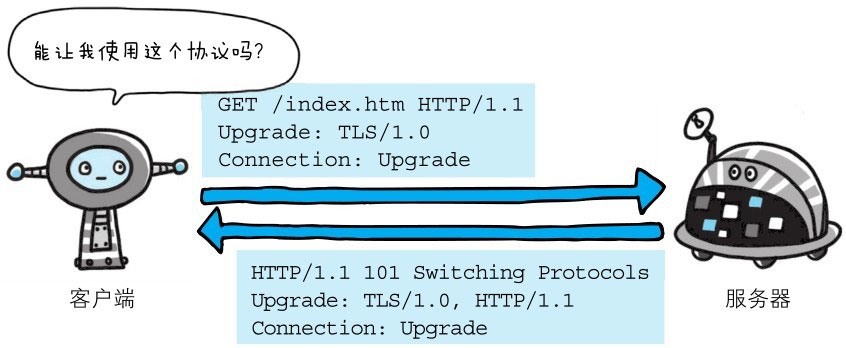

上图用例中，首部字段 Upgrade 指定的值为 TLS/1.0。请注意此处两个字段首部字段的对应关系，Connection 的值被指定为 Upgrade。
Upgrade 首部字段产生作用的 Upgrade 对象仅限于客户端和邻接服务器之间。因此，使用首部字段 Upgrade 时，还需要额外指定 Connection: Upgrade。

对于附有首部字段 Upgrade 的请求，服务器可用 101 Switching Protocols 状态码作为响应返回。


# Via

使用首部字段 Via 是为了**追踪客户端与服务器之间的请求和响应报文的传输路径**。

报文经过代理或网关时，会先在首部字段 Via 中附加该服务器的信息，然后再进行转发。这个做法和 traceroute 及电子邮件的 Received 首部的工作机制很类似。

首部字段 Via 不仅用于追踪报文的转发，还可避免请求回环的发生。所以必须在经过代理时附加该首部字段内容。

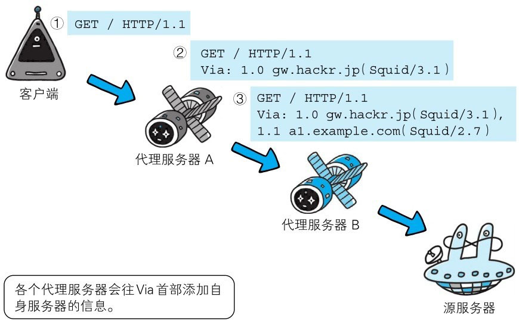

> 上图用例中，在经过代理服务器 A 时，Via 首部附加了“1.0 gw.hackr.jp (Squid/3.1)”这样的字符串值。行头的 1.0 是指接收请求的服务器上应用的 HTTP 协议版本。
> 接下来经过代理服务器 B 时亦是如此，在 Via 首部附加服务器信息，也可增加 1 个新的 Via 首部写入服务器信息。

Via 首部是为了追踪传输路径，所以经常会和 TRACE 方法一起使用。比如，代理服务器接收到由 TRACE 方法发送过来的请求（其中 Max-Forwards: 0）时，
代理服务器就不能再转发该请求了。这种情况下，代理服务器会将自身的信息附加到 Via 首部后，返回该请求的响应。


# Warning

HTTP/1.1 的 Warning 首部是从 HTTP/1.0 的响应首部（Retry-After）演变过来的。该首部通常会告知用户一些与缓存相关的问题的警告。

```http
Warning: 113 gw.hackr.jp:8080 "Heuristic expiration" Tue,03 Jul 2012 05:09:44 GMT
```

Warning 首部的格式如下。最后的日期时间部分可省略。

```http
Warning: ［警告码］［警告的主机：端口号］“［警告内容］”（［日期时间］）
```

HTTP/1.1 中定义了 7 种警告。警告码对应的警告内容仅推荐参考。另外，警告码具备扩展性，今后有可能追加新的警告码。

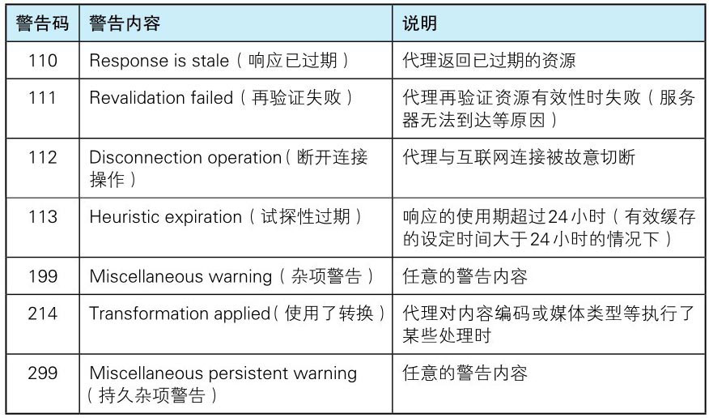
> 表: HTTP/1.1 警告码
