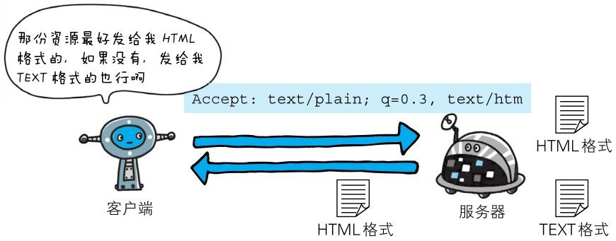

请求首部字段是从客户端往服务器端发送请求报文中所使用的字段，用于补充请求的附加信息、客户端信息、对响应内容相关的优先级等内容。


> 图：HTTP 请求报文中使用的首部字段


# Accept


> 图：HTTP 请求报文中使用的首部字段

```http
Accept: text/html,application/xhtml+xml,application/xml;q=0.9,＊/＊;q=0.8
```

Accept 首部字段可通知服务器，用户代理能够处理的媒体类型及媒体类型的相对优先级。可使用 type/subtype 这种形式，一次指定多种媒体类型。

下面我们试举几个媒体类型的例子：

- **文本文件**

> text/html、text/plain、text/css ...

> application/xhtml+xml、application/xml ...

- **图片文件**

> image/jpeg、image/gif、image/png ...

- **视频文件**

> video/mpeg、video/quicktime ...

- **应用程序使用的二进制文件**

> application/octet-stream、application/zip ...

比如，如果浏览器不支持 PNG 图片的显示，那 Accept 就不指定 image/png，而指定可处理的 image/gif 和 image/jpeg 等图片类型。

若想要给显示的媒体类型增加优先级，则使用q=来额外表示权重值[插图]，用分号(;)进行分隔。权重值q的范围是0～1（可精确到小数点后3位）​，且1为最大值。不指定权重q值时，默认权重为q=1.0。


