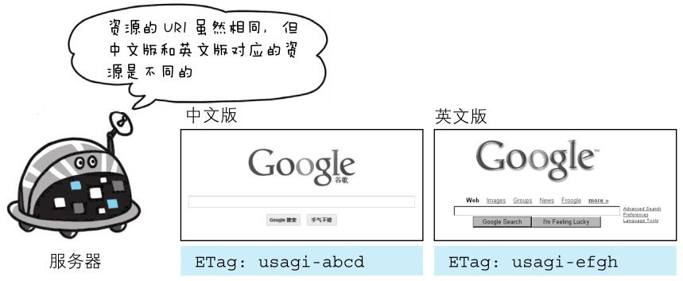

响应首部字段是由服务器端向客户端返回响应报文中所使用的字段，用于补充响应的附加信息、服务器信息，以及对客户端的附加要求等信息。


> 图：HTTP 响应报文中使用的首部字段


# Accept-Ranges

首部字段 Accept-Ranges **用来告知客户端服务器是否能处理范围请求，以指定获取服务器端某个部分的资源**。

可指定的字段值有两种，可处理范围请求时指定其为 bytes，反之则指定其为 none。

```http
Accept-Ranges: bytes
```


> 图：当能处理范围请求时，Accept-Ranges: bytes


# Age

首部字段 Age **用于告知客户端源服务器在多久前创建了响应**。字段值的单位为秒。

若创建该响应的服务器是缓存服务器，Age 值是指缓存后的响应再次发起认证到认证完成的时间值。代理创建响应时必须加上首部字段 Age。

```http
Age: 600
 ```


# ETag

首部字段 ETag **用于标识请求资源的实体**。它是一种可将资源以字符串形式做唯一性标识的方式。服务器会为每份资源分配对应的 ETag 值。

```http
ETag: "82e22293907ce725faf67773957acd12"
```

另外，当资源更新时，ETag 值也需要更新。生成 ETag 值时，并没有统一的算法规则，而仅仅是由服务器来分配。


资源被缓存时，就会被分配唯一性标识。例如，当使用中文版的浏览器访问 http://www.google.com/ 时，就会返回中文版对应的资源，而使用英文版的浏览器访问时，则会返回英文版对应的资源。
两者的 URI 是相同的，所以仅凭 URI 指定缓存的资源是相当困难的。若在下载过程中出现连接中断、再连接的情况，都会依照 ETag 值来指定资源。



ETag 中有强 ETag 值和弱 ETag 值之分：

- **强 ETag 值**
  > 强 ETag 值，不论实体发生多么细微的变化都会改变其值。
  ```http
  ETag: "usagi-1234"
  ```

- **弱 ETag 值**
  > 弱 ETag 值只用于提示资源是否相同。只有资源发生了根本改变，产生差异时才会改变 ETag 值。这时，会在字段值最开始处附加 `W/`。
  ```http
  ETag: W/"usagi-1234"
  ```


# Location

使用首部字段 Location 可以将响应接收方引导至某个与请求 URI 位置不同的资源。

基本上，该字段会配合 3xx:Redirection 的响应，提供重定向的 URI。

几乎所有的浏览器在接收到包含首部字段 Location 的响应后，都会强制性地尝试对已提示的重定向资源的访问。

```http
Location: http://www.usagidesign.jp/sample.html
```


# Proxy-Authenticate

首部字段 Proxy-Authenticate 会把由代理服务器所要求的认证信息发送给客户端。

```http
Proxy-Authenticate: Basic realm="Usagidesign Auth"
```

它与客户端和服务器之间的 HTTP 访问认证的行为相似，不同之处在于其认证行为是在客户端与代理之间进行的。
而客户端与服务器之间进行认证时，首部字段 WWW-Authorization 有着相同的作用。有关 HTTP 访问认证，后面的章节会再进行详尽阐述。


# Retry-After

首部字段 Retry-After **用于告知客户端应该在多久之后再次发送请求**。主要配合状态码 503 Service Unavailable 响应，或 3xx Redirect 响应一起使用。

字段值可以指定为具体的日期时间（Wed,04 Jul 2012 06:34:24GMT等格式），也可以是创建响应后的秒数。

```http
Retry-After: 120
```


# Server

首部字段 Server **用于告知客户端当前服务器上安装的 HTTP 服务器应用程序的信息**。不单单会标出服务器上的软件应用名称，还有可能包括版本号和安装时启用的可选项。

```http
Server: Apache/2.2.17 (Unix)

Server: Apache/2.2.6 (Unix) PHP/5.2.5
```


# Vary

首部字段 Vary 可对缓存进行控制。源服务器会向代理服务器传达关于本地缓存使用方法的命令。

```http
Vary: Accept-Language
```

从代理服务器接收到源服务器返回包含 Vary 指定项的响应之后，若再要进行缓存，仅对请求中含有相同 Vary 指定首部字段的请求返回缓存。
即使对相同资源发起请求，但由于 Vary 指定的首部字段不相同，因此必须要从源服务器重新获取资源。


> 图：当代理服务器接收到带有 Vary 首部字段指定获取资源的请求时，如果使用的 Accept-Language 字段的值相同，那么就直接从缓存返回响应。
反之，则需要先从源服务器端获取资源后才能作为响应返回


# WWW-Authenticate

首部字段 WWW-Authenticate 用于 HTTP 访问认证。用于告知客户端适用于访问请求 URI 所指定资源的认证方案（Basic 或是 Digest）和带参数提示的质询（challenge）。
状态码 401 Unauthorized 响应中，肯定带有首部字段 WWW-Authenticate。

```http
WWW-Authenticate: Basic realm="Usagidesign Auth"
```

上述示例中，realm 字段的字符串是为了辨别请求 URI 指定资源所受到的保护策略。有关该首部，请参阅本章之后的内容。
