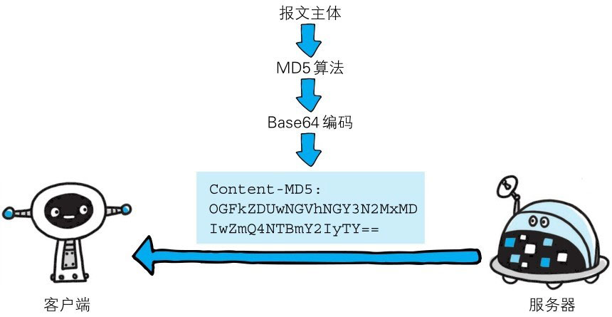

实体首部字段是包含在请求报文和响应报文中的实体部分所使用的首部，用于补充内容的更新时间等与实体相关的信息。


> 图：在请求和响应两方的 HTTP 报文中都含有与实体相关的首部字段


# Allow

首部字段 Allow **用于告知客户端能够支持 Request-URI 指定资源的所有 HTTP 方法**。
当服务器接收到不支持的 HTTP 方法时，会以状态码 405 Method Not Allowed 作为响应返回。与此同时，还会把所有能支持的 HTTP 方法写入首部字段 Allow 后返回。

```http
Allow: GET,HEAD
```


# Content-Encoding

首部字段 Content-Encoding **用于告知客户端服务器对实体的主体部分选用的内容编码方式**。内容编码是指在不丢失实体信息的前提下所进行的压缩。

```http
Content-Encoding: gzip
```


主要采用以下 4 种内容编码的方式：
- gzip、compress、deflate、identity


# Content-Language

首部字段 Content-Language **用于告知客户端实体主体使用的自然语言**（指中文或英文等语言）。

```http
Content-Language: zh-CN
```


# Content-Length

首部字段 Content-Length **表明了实体主体部分的大小**（单位是字节）。对实体主体进行内容编码传输时，不能再使用 Content-Length 首部字段。
由于实体主体大小的计算方法略微复杂，所以在此不再展开。若想一探究竟，可参考 RFC2616 的 4.4。

```http
Content-Length: 15000
```


# Content-Location

首部字段 Content-Location 给出与报文主体部分相对应的 URI。和首部字段 Location 不同，Content-Location **表示的是报文主体返回资源对应的 URI**。

比如，对于使用首部字段 Accept-Language 的服务器驱动型请求，当返回的页面内容与实际请求的对象不同时，首部字段 Content-Location 内会写明 URI。
> 如：访问 http://www.hackr.jp/ 返回的却是 http://www.hackr.jp/index-ja.html 等情况。


# Content-MD5

首部字段 Content-MD5 是**一串由 MD5 算法生成的值**，其**目的在于检查报文主体在传输过程中是否保持完整，以及确认传输到达**。

```http
Content-MD5: OGFkZDUwNGVhNGY3N2MxMDIwZmQ4NTBmY2IyTY==
```


> 图：客户端会对接收的报文主体执行相同的 MD5 算法，然后与首部字段 Content-MD5 的字段值比较

对报文主体执行 MD5 算法获得的 128 位二进制数，再通过 Base64 编码后将结果写入 Content-MD5 字段值。
由于 HTTP 首部无法记录二进制值，所以要通过 Base64 编码处理。为确保报文的有效性，作为接收方的客户端会对报文主体再执行一次相同的MD5算法。计算出的值与字段值作比较后，即可判断出报文主体的准确性。


