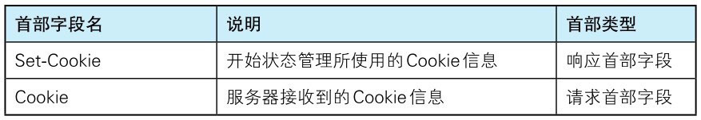
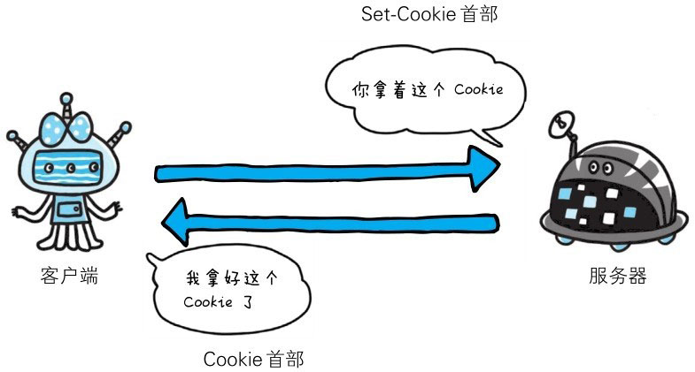
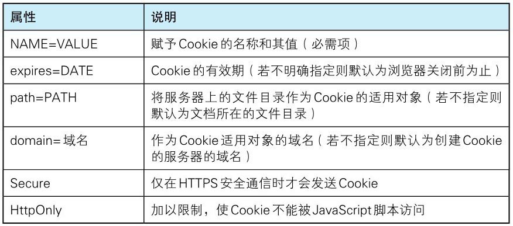

管理服务器与客户端之间状态的 Cookie，虽然没有被编入标准化 HTTP/1.1 的 RFC2616 中，但在 Web 网站方面得到了广泛的应用。

Cookie 的工作机制是用户识别及状态管理。Web 网站为了管理用户的状态会通过 Web 浏览器，把一些数据临时写入用户的计算机内。
接着当用户访问该 Web 网站时，可通过通信方式取回之前存放的 Cookie。

调用 Cookie 时，由于可校验 Cookie 的有效期，以及发送方的域、路径、协议等信息，所以正规发布的 Cookie 内的数据不会因来自其他 Web 站点和攻击者的攻击而泄露。

至 2013 年 5 月，Cookie 的规格标准文档有以下 4 种：

- **由网景公司颁布的规格标准**：网景通信公司设计并开发了 Cookie，并制定相关的规格标准。1994 年前后，Cookie 正式应用在网景浏览器中。目前最为普及的 Cookie 方式也是以此为基准的。
- **RFC2109**：由 IETF（Internet Engineering Task Force）组织所制定，于 1997 年 9 月 11 日发布。原本的意图是想和网景公司制定的标准交互应用，可惜发生了微妙的差异。现在该标准已淡出了人们的视线。
- **RFC2965**：为终结 Internet Explorer 浏览器与 Netscape Navigator 的标准差异而导致的浏览器战争，RFC2965 内定义了新的 HTTP 首部 Set-Cookie2 和 Cookie2。可事实上，它们几乎没怎么投入使用。
- **RFC6265**：将网景公司制定的标准作为业界事实标准（De facto standard），重新定义 Cookie 标准后的产物。

目前使用最广泛的 Cookie 标准却不是 RFC 中定义的任何一个。而是在网景公司制定的标准上进行扩展后的产物。

本节接下来就对目前使用最为广泛普及的标准进行说明。

下面的表格内列举了与 Cookie 有关的首部字段：


> 表6-8：为 Cookie 服务的首部字段




# Set-Cookie

当服务器准备开始管理客户端的状态时，会事先告知各种信息。

```http
Set-Cookie: status=enable;expires=Tue,05 Jul 2011 07:26:31 GMT;path=/;domain=.hackr.jp;
```

下面的表格列举了 Set-Cookie 的字段值。


> 表6-9：Set-Cookie 字段的属性


## expires

Cookie 的 expires 属性**指定浏览器可发送 Cookie 的有效期**。

当省略 expires 属性时，其有效期仅限于维持浏览器会话（Session）时间段内。这通常限于浏览器应用程序被关闭之前。

另外，一旦 Cookie 从服务器端发送至客户端，服务器端就不存在可以显式删除 Cookie 的方法。
但可通过覆盖已过期的 Cookie，实现对客户端 Cookie 的实质性删除操作。


## path

Cookie 的 path 属性用于限制指定 Cookie 的发送范围的文件目录。
不过另有办法可避开这项限制，看来对其作为安全机制的效果不能抱有期待。


## domain

通过 Cookie 的 domain 属性指定的域名可做到与结尾匹配一致。

> 如：当指定 example.com 后，除 example.com 以外，www.example.com 或 www2.example.com 等都可以发送 Cookie。

因此，除了针对具体指定的多个域名发送 Cookie 之外，不指定 domain 属性显得更安全。


## secure

Cookie 的 secure 属性**用于限制 Web 页面仅在 HTTPS 安全连接时，才可以发送 Cookie**。

发送 Cookie 时，指定 secure 属性的方法如下所示：

```http
Set-Cookie: name=value;secure
```

以上例子仅当在 https://www.example.com/ （HTTPS）安全连接的情况下才会进行 Cookie 的回收。
也就是说，即使域名相同，http://www.example.com/ （HTTP）也不会发生 Cookie 回收行为。

当省略 secure 属性时，不论 HTTP 还是 HTTPS，都会对 Cookie 进行回收。


## HttpOnly

Cookie 的 HttpOnly 属性是 Cookie 的扩展功能，它使 JavaScript 脚本无法获得 Cookie。
其主要目的为防止跨站脚本攻击（Cross-site scripting, XSS）对 Cookie 的信息窃取。

发送指定 HttpOnly 属性的 Cookie 的方法如下所示：

```http
Set-Cookie: name=value;HttpOnly
```

通过上述设置，通常从 Web 页面内还可以对 Cookie 进行读取操作。
但使用 JS 的 document.cookie 就无法读取附加 HttpOnly 属性后的 Cookie 的内容了。
因此，也就无法在 XSS 中利用 JS 劫持 Cookie 了。

虽然是独立的扩展功能，但 Internet Explorer 6 SP1 以上版本等当下的主流浏览器都已经支持该扩展了。
另外顺带一提，该扩展并非是为了防止 XSS 而开发的。


# Cookie

首部字段 Cookie 会告知服务器，当客户端想获得 HTTP 状态管理支持时，就会在请求中包含从服务器接收到的 Cookie。
接收到多个 Cookie 时，同样可以以多个 Cookie 形式发送。

```http
Cookie: status=enable
```
