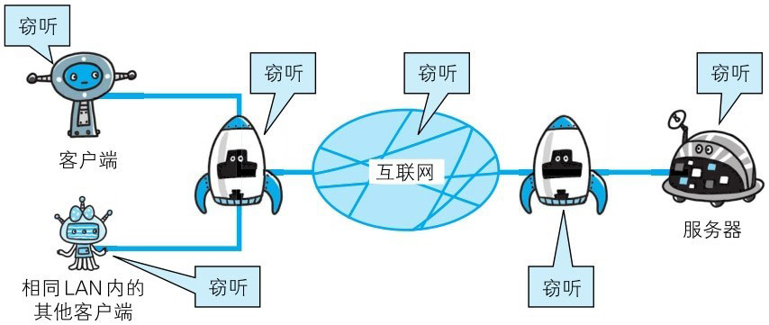
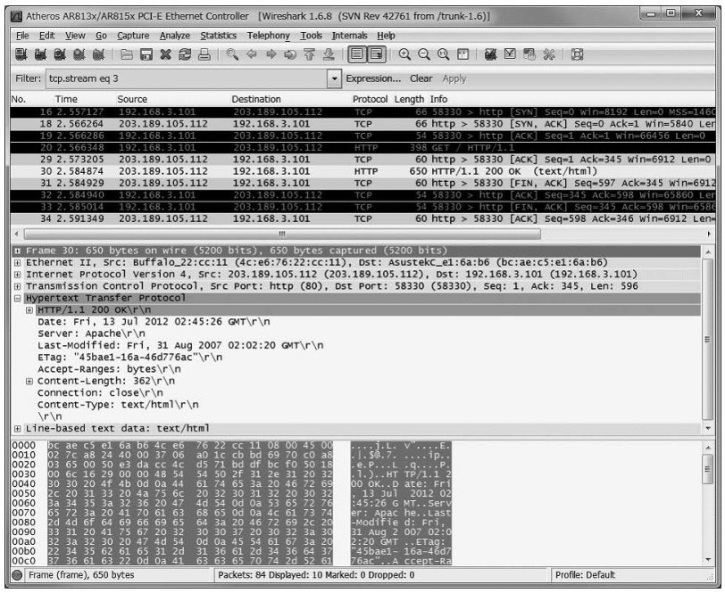
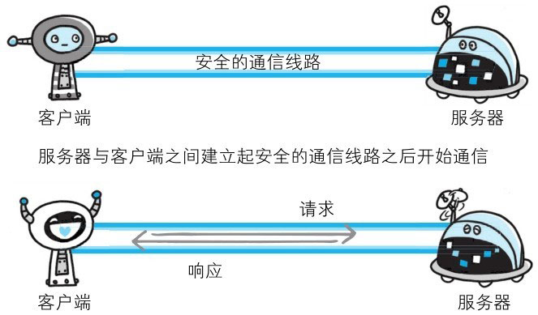
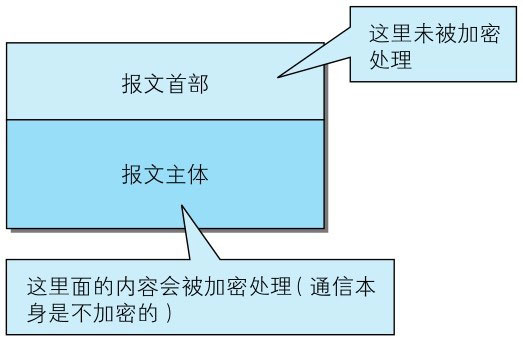
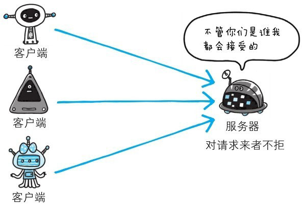
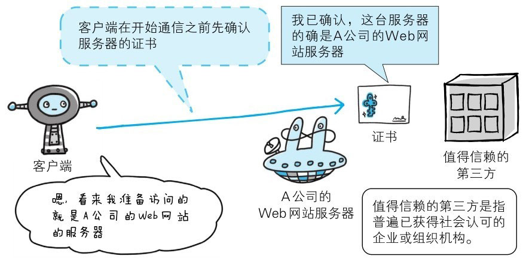

到现在为止，我们已了解到 HTTP 具有相当优秀和方便的一面，然而 HTTP 并非只有好的一面，事物皆具两面性，它也是有不足之处的。

HTTP 主要有这些不足，例举如下：

- 通信使用明文（不加密），内容可能会被窃听
- 不验证通信方的身份，因此有可能遭遇伪装
- 无法证明报文的完整性，所以有可能已遭篡改

这些问题不仅在 HTTP 上出现，其他未加密的协议中也会存在这类问题。

除此之外，HTTP 本身还有很多缺点。而且，
还有像某些特定的 Web 服务器和特定的 Web 浏览器在实际应用中存在的不足（也可以说成是脆弱性或安全漏洞），
另外，用 Java 和 PHP 等编程语言开发的 Web 应用也可能存在安全漏洞。

# 通信使用明文可能会被监听

由于 **HTTP 本身不具备加密的功能**，所以也无法做到对通信整体（使用 HTTP 协议通信的请求和响应的内容）进行加密。
即，**HTTP 报文使用明文（指未经过加密的报文）方式发送**。

## TCP/IP 是可能被窃听的网络

如果要问为什么通信时不加密是一个缺点，这是因为，按 TCP/IP 协议族的工作机制，通信内容在所有的通信线路上都有可能遭到窥视。

所谓互联网，是由能连通到全世界的网络组成的。
无论世界哪个角落的服务器在和客户端通信时，在此通信线路上的某些网络设备、光缆、计算机等都不可能是个人的私有物，所以不排除某个环节中会遭到恶意窥视行为。

即使已经过加密处理的通信，也会被窥视到通信内容，这点和未加密的通信是相同的。只是说如果通信经过加密，就有可能让人无法破解报文信息的含义，但加密处理后的报文信息本身还是会被看到的。

> 图：互联网上的任何角落都存在通信内容被窃听的风险

窃听相同段上的通信并非难事。只需要收集在互联网上流动的数据包（帧）就行了。对于收集来的数据包的解析工作，可交给那些抓包（Packet Capture）或嗅探器（Sniffer）工具。

下面的图片示例就是被广泛使用的抓包工具 Wireshark。它可以获取 HTTP 协议的请求和响应的内容，并对其进行解析。

像使用 GET 方法发送请求、响应返回了 200 OK，查看 HTTP 响应报文的全部内容等一系列的事情都可以做到。

> 图：[Wireshark](http://www.wireshark.org/)

## 加密处理防止被监听

在目前大家正在研究的如何防止窃听保护信息的几种对策中，最为普及的就是加密技术。加密的对象可以有这么几个：

### 通信的加密

一种方式就是将通信加密。HTTP 协议中没有加密机制，但可以通过和 SSL 或 TLS 的组合使用，加密 HTTP 的通信内容。

用 SSL 建立安全通信线路之后，就可以在这条线路上进行 HTTP 通信了。与 SSL 组合使用的 HTTP 被称为 HTTPS 或 HTTP over SSL。

::: tip 名词解释
- **Socket（套接字）**：是对网络中不同主机上的应用进程之间进行双向通信的端点的抽象。一个套接字就是网络上进程通信的一端，提供了应用层进程利用网络协议交换数据的机制。
  从所处的地位来讲，套接字上联应用进程，下联网络协议栈，是应用程序通过网络协议进行通信的接口，是应用程序与网络协议栈进行交互的接口。

- **SSL**（Secure Socket Layer，**安全套接层**）：是 Netscape 公司率先采用的网络安全协议。它是在传输通信协议（TCP/IP）上实现的一种安全协议，采用公开密钥技术。
  SSL 广泛支持各种类型的网络，同时提供三种基本的安全服务，它们都使用公开密钥技术。

- **TLS**（Transport Layer Security，**传输层安全性协议**）：是一种安全协议，前身是 SSL，用于在两个通信应用程序之间提供保密性、数据完整性以及真实性。

- **HTTPS**（Hypertext Transfer Protocol Secure，**超文本传输安全协议**）：通过 SSL/TLS 协议提供的安全连接进行的 HTTP 通信。
  与以纯文本形式发送和接收消息的标准 HTTP 不同，HTTPS 使用 SSL/TLS 等协议对服务器进行身份验证、加密通信内容和检测篡改。 
  这样可以防止欺骗、中间人攻击和窃听等攻击。 HTTPS 使用 443 作为已知端口号。
:::

### 内容的加密

还有一种将参与通信的内容本身加密的方式。由于 HTTP 协议中没有加密机制，那么就对 HTTP 协议传输的内容本身加密。即把 HTTP 报文里所含的内容进行加密处理。

在这种情况下，客户端需要对 HTTP 报文进行加密处理后再发送请求。

诚然，为了做到有效的内容加密，前提是**要求客户端和服务器同时具备加密和解密机制**。主要应用在 Web 服务中。
有一点必须引起注意，由于该方式**不同于 SSL 或 TLS 将整个通信线路加密处理，所以内容仍有被篡改的风险**。稍后我们会加以说明。

# 不验证通信方的身份就可能遭遇伪装

HTTP 协议中的请求和响应不会对通信方进行确认。也就是说存在“服务器是否就是发送请求中 URI 真正指定的主机，返回的响应是否真的返回到实际提出请求的客户端”等类似问题。

## 任何人都可发起请求

在 HTTP 协议通信时，由于不存在确认通信方的处理步骤，任何人都可以发起请求。
另外，服务器只要接收到请求，不管对方是谁都会返回一个响应（但也仅限于发送端的 IP 地址和端口号没有被 Web 服务器设定限制访问的前提下）。

HTTP 协议的实现本身非常简单，不论是谁发送过来的请求都会返回响应，因此不确认通信方，会存在以下各种隐患：

- 无法确定请求发送至目标的 Web 服务器是否是按真实意图返回响应的那台服务器。有可能是已伪装的 Web 服务器。

- 无法确定响应返回到的客户端是否是按真实意图接收响应的那个客户端。有可能是已伪装的客户端。

- 无法确定正在通信的对方是否具备访问权限。因为某些 Web 服务器上保存着重要的信息，只想发给特定用户通信的权限。

- 无法判定请求是来自何方、出自谁手。

- 即使是无意义的请求也会照单全收。无法阻止海量请求下的 DoS 攻击。

::: tip 名词解释
**DoS** （Denial of Service，**拒绝服务**）：拒绝服务攻击是攻击者想办法让目标机器停止提供服务，是黑客常用的攻击手段之一。
其实**对网络带宽进行的消耗性攻击只是拒绝服务攻击的一小部分，只要能够对目标造成麻烦，使某些服务被暂停甚至主机死机，都属于拒绝服务攻击**。
拒绝服务攻击问题也一直得不到合理的解决，究其原因是因为网络协议本身的安全缺陷，从而拒绝服务攻击也成为了攻击者的终极手法。
攻击者进行拒绝服务攻击，实际上让服务器实现两种效果：一是迫使服务器的缓冲区满，不接收新的请求；二是使用 IP 欺骗，迫使服务器把非法用户的连接复位，影响合法用户的连接。
:::

## 查明对手的证书

虽然使用 **HTTP 协议无法确定通信方**，但如果使用 SSL 则可以。**SSL 不仅提供加密处理，而且还使用了一种被称为证书的手段，可用于确定通信方**。

证书由值得信任的第三方机构颁发，用以证明服务器和客户端是实际存在的。另外，伪造证书从技术角度来说是异常困难的一件事。
所以只要能够确认通信方（服务器或客户端）持有的证书，即可判断通信方的真实意图。

通过使用证书，以证明通信方就是意料中的服务器。这对使用者个人来讲，也减少了个人信息泄露的危险性。

另外，客户端持有证书即可完成个人身份的确认，也可用于对 Web 网站的认证环节。

# 无法证明报文完整性，可能已遭篡改

所谓完整性是指信息的准确度。若无法证明其完整性，通常也就意味着无法判断信息是否准确。

## 接收到的内容可能有误

由于 **HTTP 协议无法证明通信的报文完整性**，因此，在请求或响应送出之后直到对方接收之前的这段时间内，即使请求或响应的内容遭到篡改，也没有办法获悉。

换句话说，没有任何办法确认，发出的请求/响应和接收到的请求/响应是前后相同的。

比如，从某个 Web 网站上下载内容，是无法确定客户端下载的文件和服务器上存放的文件是否前后一致的。文件内容在传输途中可能已经被篡改为其他的内容。
即使内容真的已改变，作为接收方的客户端也是觉察不到的。

像这样，请求或响应在传输途中，遭攻击者拦截并篡改内容的攻击称为 MITM 中间人攻击 。

::: tip 名词解释
**MITM**（Man-in-the-MiddleAttack，**中间人攻击**）：是一种“间接”的入侵攻击，这种攻击模式是通过各种技术手段将受入侵者控制的一台计算机虚拟放置在网络连接中的两台通信计算机之间，这台计算机就称为“中间人”。
:::

