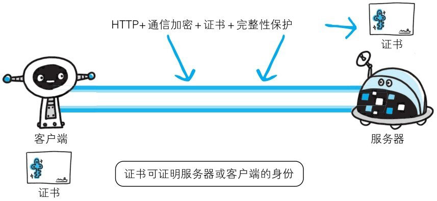
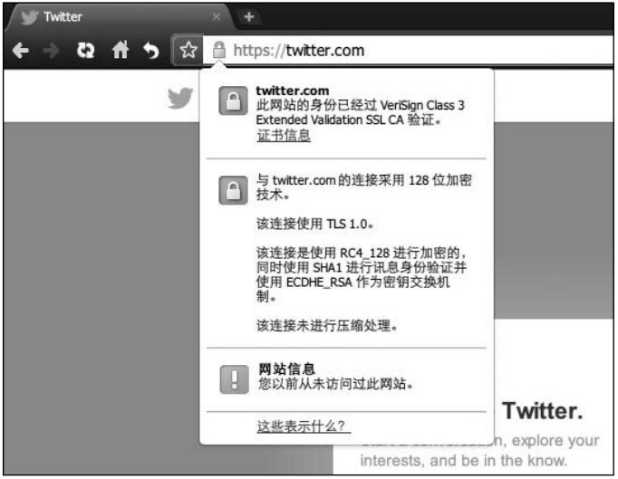
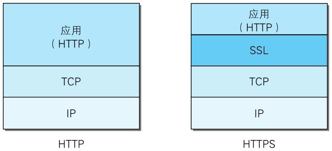
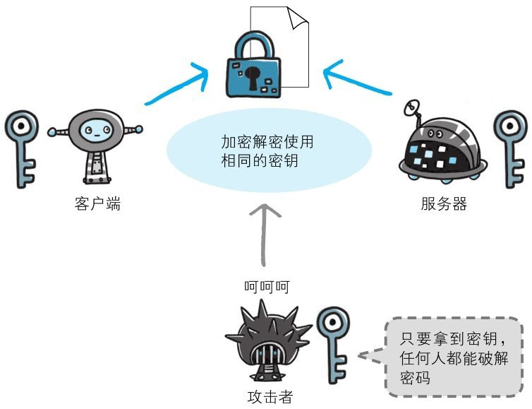
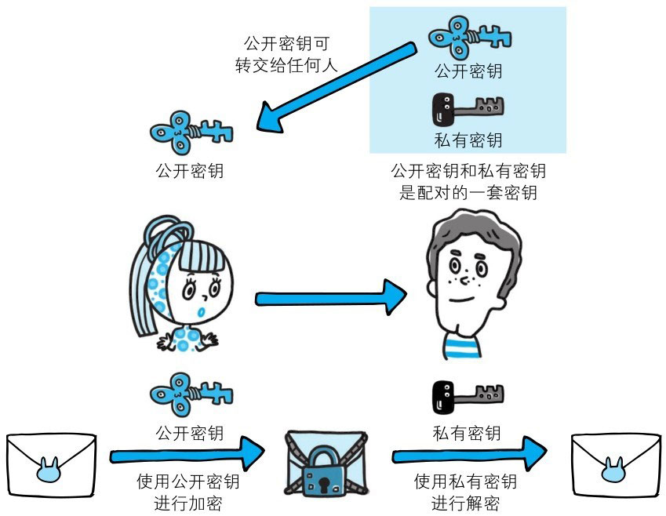
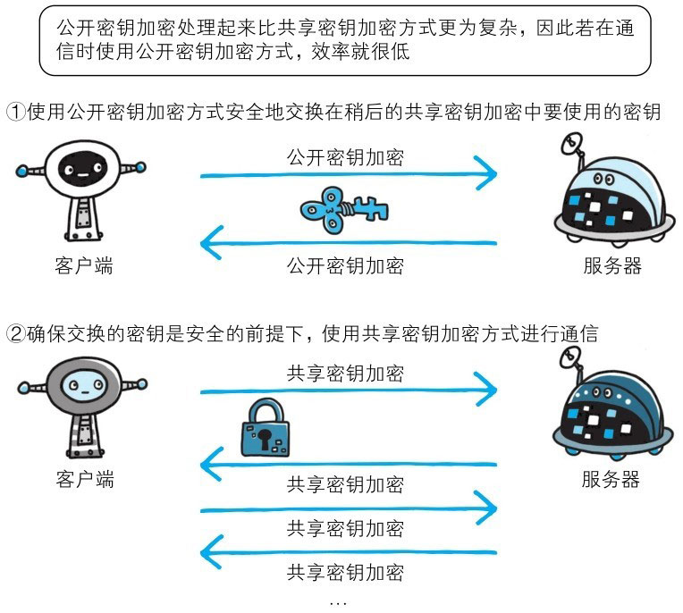
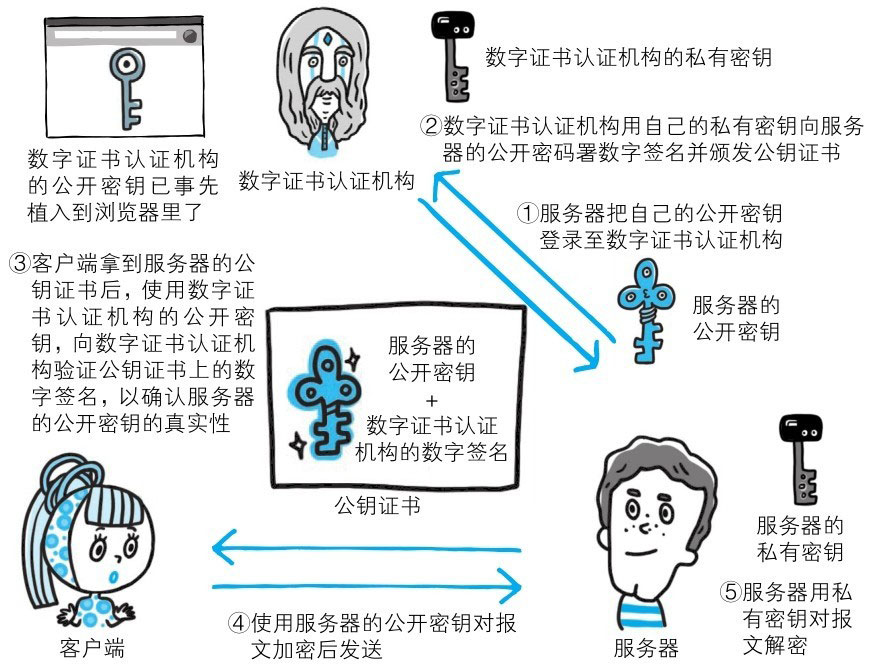
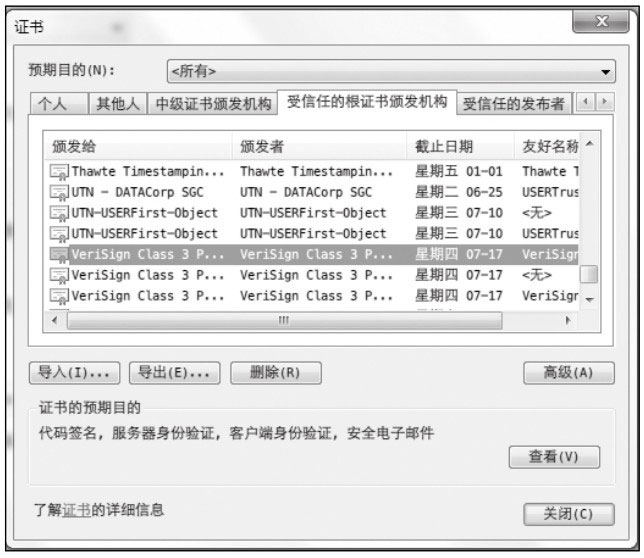

# HTTP 加上加密处理和认证以及完整性保护后即是 HTTPS

如果在 HTTP 协议通信过程中使用未经加密的明文，比如在 Web 页面中输入信用卡号，如果这条通信线路遭到窃听，那么信用卡号就暴露了。

另外，对于HTTP来说，服务器也好，客户端也好，都是没有办法确认通信方的。因为很有可能并不是和原本预想的通信方在实际通信。并且还需要考虑到接收到的报文在通信途中已经遭到篡改这一可能性。

为了统一解决上述这些问题，需要在 HTTP 上再加入加密处理和认证等机制。我们把添加了加密及认证机制的 HTTP 称为 HTTPS（HTTP Secure）。

> 图：使用 HTTPS 通信

经常会在 Web 的登录页面和购物结算界面等使用 HTTPS 通信。使用 HTTPS 通信时，不再用 http://，而是改用 https://。
另外，当浏览器访问 HTTPS 通信有效的 Web 网站时，浏览器的地址栏内会出现一个带锁的标记。对 HTTPS 的显示方式会因浏览器的不同而有所改变。

# HTTPS 是身披 SSL 外壳的 HTTP

HTTPS 并非是应用层的一种新协议。只是 HTTP 通信接口部分用 SSL（Secure Socket Layer）和 TLS（Transport Layer Security）协议代替而已。

通常，HTTP 直接和 TCP 通信。当使用 SSL 时，则演变成先和 SSL 通信，再由 SSL 和 TCP 通信了。简言之，所谓 HTTPS，其实就是身披 SSL 协议这层外壳的 HTTP。

在采用 SSL 后，HTTP 就拥有了 HTTPS 的加密、证书和完整性保护这些功能。

SSL 是独立于 HTTP 的协议，所以不光是 HTTP 协议，其他运行在应用层的 SMTP 和 Telnet 等协议均可配合 SSL 协议使用。可以说 SSL 是当今世界上应用最为广泛的网络安全技术。

# 相互交换密钥的公开密钥加密技术

在对 SSL 进行讲解之前，我们先来了解一下加密方法。SSL 采用一种叫做**公开密钥加密**（Public-key cryptography）的加密处理方式。

近代的加密方法中加密算法是公开的，而密钥却是保密的。通过这种方式得以保持加密方法的安全性。

加密和解密都会用到密钥。没有密钥就无法对密码解密，反过来说，任何人只要持有密钥就能解密了。如果密钥被攻击者获得，那加密也就失去了意义。

## 共享密钥加密的困境

**加密和解密同用一个密钥的方式**称为**共享密钥加密**（Common keycrypto system，别名：**对称密钥加密**）。

以共享密钥方式加密时必须将密钥也发给对方。可究竟怎样才能安全地转交？
在互联网上转发密钥时，如果通信被监听那么密钥就可会落入攻击者之手，同时也就失去了加密的意义。另外还得设法安全地保管接收到的密钥。

> 图：密钥发送问题

## 使用两把密钥的公开密钥加密

公开密钥加密方式很好地解决了共享密钥加密的困难。

**公开密钥加密使用一对非对称的密钥**。一把叫做私有密钥（private key），另一把叫做公开密钥（public key）。
顾名思义，私有密钥不能让其他任何人知道，而公开密钥则可以随意发布，任何人都可以获得。

使用公开密钥加密方式，发送密文的一方使用对方的**公开密钥进行加密处理**，对方收到被加密的信息后，再使用自己的**私有密钥进行解密**。
利用这种方式，不需要发送用来解密的私有密钥，也不必担心密钥被攻击者窃听而盗走。

另外，要想根据密文和公开密钥，恢复到信息原文是异常困难的，因为解密过程就是在对离散对数进行求值，这并非轻而易举就能办到。
退一步讲，如果能对一个非常大的整数做到快速地因式分解，那么密码破解还是存在希望的。但就目前的技术来看是不太现实的。

## HTTPS 采用混合加密机制

HTTPS 采用共享密钥加密和公开密钥加密两者并用的混合加密机制。若密钥能够实现安全交换，那么有可能会考虑仅使用公开密钥加密来通信。但是公开密钥加密与共享密钥加密相比，其处理速度要慢。

所以应充分利用两者各自的优势，将多种方法组合起来用于通信。在交换密钥环节使用公开密钥加密方式，之后的建立通信交换报文阶段则使用共享密钥加密方式。

> 图：混合加密机制

# 证明公开密钥正确性的证书

遗憾的是，公开密钥加密方式还是存在一些问题的。那就是无法证明公开密钥本身就是货真价实的公开密钥。
比如，正准备和某台服务器建立公开密钥加密方式下的通信时，如何证明收到的公开密钥就是原本预想的那台服务器发行的公开密钥。或许在公开密钥传输途中，真正的公开密钥已经被攻击者替换掉了。

为了解决上述问题，可以使用由数字证书认证机构（CA，Certificate Authority）和其相关机关颁发的公开密钥证书。

数字证书认证机构处于客户端与服务器双方都可信赖的第三方机构的立场上。威瑞信（VeriSign）就是其中一家非常有名的数字证书认证机构。
我们来介绍一下数字证书认证机构的业务流程。首先，服务器的运营人员向数字证书认证机构提出公开密钥的申请。
数字证书认证机构在判明提出申请者的身份之后，会对已申请的公开密钥做数字签名，然后分配这个已签名的公开密钥，并将该公开密钥放入公钥证书后绑定在一起。

服务器会将这份由数字证书认证机构颁发的公钥证书发送给客户端， 以进行公开密钥加密方式通信。公钥证书也可叫做数字证书或直接称为证书。

接到证书的客户端可使用数字证书认证机构的公开密钥，对那张证书上的数字签名进行验证，一旦验证通过，客户端便可明确两件事：
一，认证服务器的公开密钥的是真实有效的数字证书认证机构。二，服务器的公开密钥是值得信赖的。

此处认证机关的公开密钥必须安全地转交给客户端。使用通信方式时，如何安全转交是一件很困难的事，因此，多数浏览器开发商发布版本时，会事先在内部植入常用认证机关的公开密钥。

## 可证明组织真实性的 EV SSL 证书

证书的一个作用是用来证明作为通信一方的服务器是否规范，另外一个作用是可确认对方服务器背后运营的企业是否真实存在。
拥有该特性的证书就是 EV SSL 证书（Extended Validation SSL Certificate）。

EV SSL 证书是基于国际标准的认证指导方针颁发的证书。其严格规定了对运营组织是否真实的确认方针，因此，通过认证的 Web 网站能够获得更高的认可度。

持有EV SSL证书的Web网站的浏览器地址栏处的背景色是绿色的，从视觉上就能一眼辨别出。而且在地址栏的左侧显示了SSL证书中记录的组织名称以及颁发证书的认证机构的名称。

