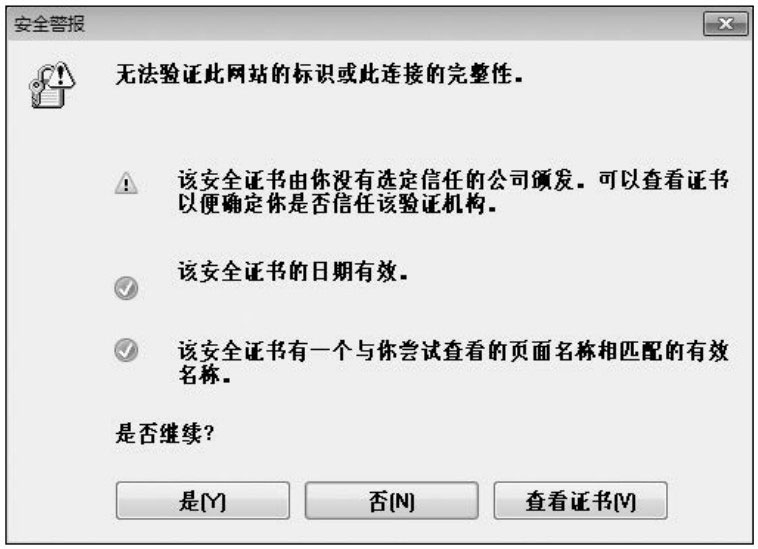
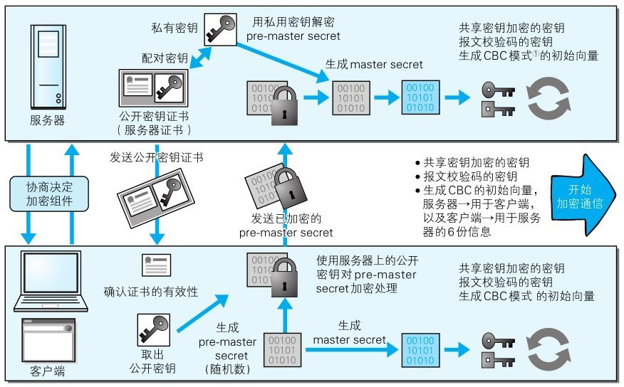
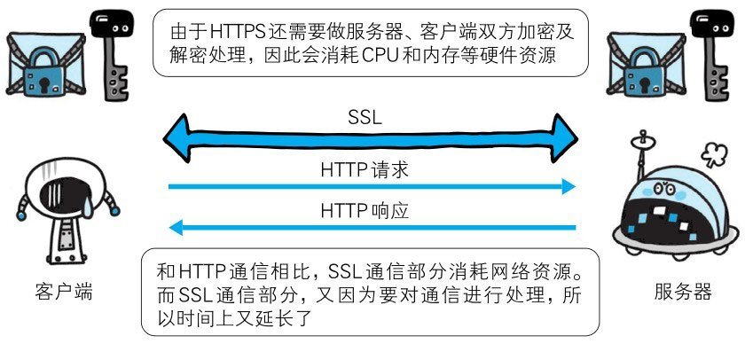

# HTTP 加上加密处理和认证以及完整性保护后即是 HTTPS

如果在 HTTP 协议通信过程中使用未经加密的明文，比如在 Web 页面中输入信用卡号，如果这条通信线路遭到窃听，那么信用卡号就暴露了。

另外，对于HTTP来说，服务器也好，客户端也好，都是没有办法确认通信方的。因为很有可能并不是和原本预想的通信方在实际通信。并且还需要考虑到接收到的报文在通信途中已经遭到篡改这一可能性。

为了统一解决上述这些问题，需要在 HTTP 上再加入加密处理和认证等机制。我们把添加了加密及认证机制的 HTTP 称为 HTTPS（HTTP Secure）。

> 图：使用 HTTPS 通信

经常会在 Web 的登录页面和购物结算界面等使用 HTTPS 通信。使用 HTTPS 通信时，不再用 http://，而是改用 https://。
另外，当浏览器访问 HTTPS 通信有效的 Web 网站时，浏览器的地址栏内会出现一个带锁的标记。对 HTTPS 的显示方式会因浏览器的不同而有所改变。

# HTTPS 是身披 SSL 外壳的 HTTP

HTTPS 并非是应用层的一种新协议。只是 HTTP 通信接口部分用 SSL（Secure Socket Layer）和 TLS（Transport Layer Security）协议代替而已。

通常，HTTP 直接和 TCP 通信。当使用 SSL 时，则演变成先和 SSL 通信，再由 SSL 和 TCP 通信了。简言之，所谓 HTTPS，其实就是身披 SSL 协议这层外壳的 HTTP。

在采用 SSL 后，HTTP 就拥有了 HTTPS 的加密、证书和完整性保护这些功能。

SSL 是独立于 HTTP 的协议，所以不光是 HTTP 协议，其他运行在应用层的 SMTP 和 Telnet 等协议均可配合 SSL 协议使用。可以说 SSL 是当今世界上应用最为广泛的网络安全技术。

# 相互交换密钥的公开密钥加密技术

在对 SSL 进行讲解之前，我们先来了解一下加密方法。SSL 采用一种叫做**公开密钥加密**（Public-key cryptography）的加密处理方式。

近代的加密方法中加密算法是公开的，而密钥却是保密的。通过这种方式得以保持加密方法的安全性。

加密和解密都会用到密钥。没有密钥就无法对密码解密，反过来说，任何人只要持有密钥就能解密了。如果密钥被攻击者获得，那加密也就失去了意义。

## 共享密钥加密的困境

**加密和解密同用一个密钥的方式**称为**共享密钥加密**（Common keycrypto system，别名：**对称密钥加密**）。

以共享密钥方式加密时必须将密钥也发给对方。可究竟怎样才能安全地转交？
在互联网上转发密钥时，如果通信被监听那么密钥就可会落入攻击者之手，同时也就失去了加密的意义。另外还得设法安全地保管接收到的密钥。

> 图：密钥发送问题

## 使用两把密钥的公开密钥加密

公开密钥加密方式很好地解决了共享密钥加密的困难。

**公开密钥加密使用一对非对称的密钥**。一把叫做私有密钥（private key），另一把叫做公开密钥（public key）。
顾名思义，私有密钥不能让其他任何人知道，而公开密钥则可以随意发布，任何人都可以获得。

使用公开密钥加密方式，发送密文的一方使用对方的**公开密钥进行加密处理**，对方收到被加密的信息后，再使用自己的**私有密钥进行解密**。
利用这种方式，不需要发送用来解密的私有密钥，也不必担心密钥被攻击者窃听而盗走。

另外，要想根据密文和公开密钥，恢复到信息原文是异常困难的，因为解密过程就是在对离散对数进行求值，这并非轻而易举就能办到。
退一步讲，如果能对一个非常大的整数做到快速地因式分解，那么密码破解还是存在希望的。但就目前的技术来看是不太现实的。

## HTTPS 采用混合加密机制

HTTPS 采用共享密钥加密和公开密钥加密两者并用的混合加密机制。若密钥能够实现安全交换，那么有可能会考虑仅使用公开密钥加密来通信。但是公开密钥加密与共享密钥加密相比，其处理速度要慢。

所以应充分利用两者各自的优势，将多种方法组合起来用于通信。在交换密钥环节使用公开密钥加密方式，之后的建立通信交换报文阶段则使用共享密钥加密方式。

> 图：混合加密机制

# 证明公开密钥正确性的证书

遗憾的是，公开密钥加密方式还是存在一些问题的。那就是无法证明公开密钥本身就是货真价实的公开密钥。
比如，正准备和某台服务器建立公开密钥加密方式下的通信时，如何证明收到的公开密钥就是原本预想的那台服务器发行的公开密钥。或许在公开密钥传输途中，真正的公开密钥已经被攻击者替换掉了。

为了解决上述问题，可以使用由数字证书认证机构（CA，Certificate Authority）和其相关机关颁发的公开密钥证书。

数字证书认证机构处于客户端与服务器双方都可信赖的第三方机构的立场上。威瑞信（VeriSign）就是其中一家非常有名的数字证书认证机构。
我们来介绍一下数字证书认证机构的业务流程。首先，服务器的运营人员向数字证书认证机构提出公开密钥的申请。
数字证书认证机构在判明提出申请者的身份之后，会对已申请的公开密钥做数字签名，然后分配这个已签名的公开密钥，并将该公开密钥放入公钥证书后绑定在一起。

服务器会将这份由数字证书认证机构颁发的公钥证书发送给客户端， 以进行公开密钥加密方式通信。公钥证书也可叫做数字证书或直接称为证书。

接到证书的客户端可使用数字证书认证机构的公开密钥，对那张证书上的数字签名进行验证，一旦验证通过，客户端便可明确两件事：
一，认证服务器的公开密钥的是真实有效的数字证书认证机构。二，服务器的公开密钥是值得信赖的。

此处认证机关的公开密钥必须安全地转交给客户端。使用通信方式时，如何安全转交是一件很困难的事，因此，多数浏览器开发商发布版本时，会事先在内部植入常用认证机关的公开密钥。

## 可证明组织真实性的 EV SSL 证书

证书的一个作用是用来证明作为通信一方的服务器是否规范，另外一个作用是可确认对方服务器背后运营的企业是否真实存在。
拥有该特性的证书就是 EV SSL 证书（Extended Validation SSL Certificate）。

EV SSL 证书是基于国际标准的认证指导方针颁发的证书。其严格规定了对运营组织是否真实的确认方针，因此，通过认证的 Web 网站能够获得更高的认可度。

持有 EV SSL 证书的 Web 网站的浏览器地址栏处的背景色是绿色的，从视觉上就能一眼辨别出。而且在地址栏的右侧显示了 SSL 证书中记录的组织名称以及颁发证书的认证机构的名称。

上述机制的原意图是为了防止用户被钓鱼攻击（Phishing），但就效果上来讲，还得打一个问号。很多用户可能不了解 EV SSL 证书相关的知识，因此也不太会留意它。

## 用以确认客户端的客户端证书

HTTPS 中还可以使用客户端证书。以客户端证书进行客户端认证，证明服务器正在通信的对方始终是预料之内的客户端，其作用跟服务器证书如出一辙。

但客户端证书仍存在几处问题点。其中的一个问题点是证书的获取及发布。

想获取证书时，用户得自行安装客户端证书。但由于客户端证书是要付费购买的，且每张证书对应到每位用户也就意味着需支付和用户数对等的费用。
另外，要让知识层次不同的用户们自行安装证书，这件事本身也充满了各种挑战。

现状是，安全性极高的认证机构可颁发客户端证书但仅用于特殊用途的业务。比如那些可支撑客户端证书支出费用的业务。

例如，银行的网上银行就采用了客户端证书。在登录网银时不仅要求用户确认输入ID和密码，还会要求用户的客户端证书，以确认用户是否从特定的终端访问网银。

客户端证书存在的另一个问题点是，客户端证书毕竟只能用来证明客户端实际存在，而不能用来证明用户本人的真实有效性。
也就是说，只要获得了安装有客户端证书的计算机的使用权限，也就意味着同时拥有了客户端证书的使用权限。

## 认证机构信誉第一

SSL 机制中介入认证机构之所以可行，是因为建立在其信用绝对可靠这一大前提下的。
然而，2011 年 7 月，荷兰的一家名叫 DigiNotar 的认证机构曾遭黑客不法入侵，颁布了google.com和twitter.com等网站的伪造证书事件。这一事件从根本上撼动了 SSL 的可信度。

因为伪造证书上有正规认证机构的数字签名，所以浏览器会判定该证书是正当的。当伪造的证书被用做服务器伪装之时，用户根本无法察觉到。

虽然存在可将证书无效化的证书吊销列表（Certificate Revocation List，CRL）机制，以及从客户端删除根证书颁发机构（Root Certificate Authority，RCA）的对策，
但是距离生效还需要一段时间，而在这段时间内，到底会有多少用户的利益蒙受损失就不得而知了。

## 由自认证机构颁发的证书称为自签名证书

如果使用 OpenSSL 这套开源程序，每个人都可以构建一套属于自己的认证机构，从而自己给自己颁发服务器证书。但该服务器证书在互联网上不可作为证书使用，似乎没什么帮助。

独立构建的认证机构叫做自认证机构，由自认证机构颁发的“无用”证书也被戏称为自签名证书。

浏览器访问该服务器时，会显示“无法确认连接安全性”或“该网站的安全证书存在问题”等警告消息。

由自认证机构颁发的服务器证书之所以不起作用，是因为它无法消除伪装的可能性。
自认证机构能够产生的作用顶多也就是自己对外宣称“我是○○”的这种程度。
即使采用自签名证书，通过 SSL 加密之后，可能偶尔还会看见通信处在安全状态的提示，可那也是有问题的。
因为就算加密通信，也不能排除正在和已经过伪装的假服务器保持通信。

值得信赖的第三方机构介入认证，才能让已植入在浏览器内的认证机构颁布的公开密钥发挥作用，并借此证明服务器的真实性。

## 中级认证机构的证书可能会变成自认证证书

多数浏览器内预先已植入备受信赖的认证机构的证书，但也有一小部分浏览器会植入中级认证机构的证书。

对于中级认证机构颁发的服务器证书，某些浏览器会以正规的证书来对待，可有的浏览器会当作自签名证书。

# HTTPS 的安全通信机制

为了更好地理解 HTTPS，我们来观察一下 HTTPS 的通信步骤。

> 图：HTTPS 通信

**步骤1**: 客户端通过发送 Client Hello 报文开始 SSL 通信。
报文中包含客户端支持的 SSL 的指定版本、加密组件（Cipher Suite）列表（所使用的加密算法及密钥长度等）。

**步骤2**: 服务器可进行 SSL 通信时，会以 Server Hello 报文作为应答。
和客户端一样，在报文中包含 SSL 版本以及加密组件。服务器的加密组件内容是从接收到的客户端加密组件内筛选出来的。

**步骤3**: 之后服务器发送 Certificate 报文。报文中包含公开密钥证书。

**步骤4**: 最后服务器发送 Server Hello Done 报文通知客户端，最初阶段的 SSL 握手协商部分结束。

**步骤5**: SSL 第一次握手结束之后，客户端以 Client Key Exchange 报文作为回应。
报文中包含通信加密中使用的一种被称为 Pre-mastersecret 的随机密码串。该报文已用步骤3中的公开密钥进行加密。

**步骤6**: 接着客户端继续发送 Change Cipher Spec 报文。该报文会提示服务器，在此报文之后的通信会采用 Pre-master secret 密钥加密。

**步骤7**: 客户端发送 Finished 报文。该报文包含连接至今全部报文的整体校验值。这次握手协商是否能够成功，要以服务器是否能够正确解密该报文作为判定标准。

**步骤8**: 服务器同样发送 Change Cipher Spec 报文。

**步骤9**: 服务器同样发送 Finished 报文。

**步骤10**: 服务器和客户端的 Finished 报文交换完毕之后，SSL 连接就算建立完成。
当然，通信会受到 SSL 的保护。从此处开始进行应用层协议的通信，即发送 HTTP 请求。

**步骤11**: 应用层协议通信，即发送 HTTP 响应。

**步骤12**: 最后由客户端断开连接。断开连接时，发送 close_notify 报文。上图做了一些省略，这步之后再发送 TCP FIN 报文来关闭与 TCP 的通信。

在以上流程中，应用层发送数据时会附加一种叫做 MAC（Message Authentication Code）的报文摘要。MAC 能够查知报文是否遭到篡改，从而保护报文的完整性。

下面是对整个流程的图解。图中说明了从仅使用服务器端的公开密钥证书（服务器证书）建立 HTTPS 通信的整个过程。

::: info 译者注
CBC模式（Cipher Block Chaining）又名密码分组链接模式。在此模式下，将前一个明文块加密处理后和下一个明文块做 XOR 运算，使之重叠，然后再对运算结果做加密处理。
对第一个明文块做加密时，要么使用前一段密文的最后一块，要么利用外部生成的初始向量（initial vector，IV）。
:::

## SSL 和 TLS

HTTPS 使用 SSL（Secure Socket Layer）和 TLS（Transport Layer Security）这两个协议。

SSL 技术最初是由浏览器开发商网景通信公司率先倡导的，开发过 SSL3.0 之前的版本。
目前主导权已转移到 IETF（Internet Engineering Task Force，Internet 工程任务组）的手中。

IETF 以 SSL3.0 为基准，后又制定了 TLS1.0、TLS1.1 和 TLS1.2。
**TSL 是以 SSL 为原型开发的协议，有时会统一称该协议为 SSL。当前主流的版本是 SSL3.0 和 TLS1.0。**

由于 SSL1.0 协议在设计之初被发现出了问题，就没有实际投入使用。
SSL2.0 也被发现存在问题，所以很多浏览器直接废除了该协议版本。

## SSL 速度慢吗

HTTPS 也存在一些问题，那就是当使用 SSL 时，它的处理速度会变慢。

> 图：HTTPS 比 HTTP 要慢 2-100 倍

SSL 的慢分两种。一种是指通信慢。另一种是指由于大量消耗 CPU 及内存等资源，导致处理速度变慢。

和使用 HTTP 相比，网络负载可能会变慢 2-100 倍。除去和 TCP 连接、发送 HTTP 请求·响应以外，还必须进行 SSL 通信，因此整体上处理通信量不可避免会增加。

另一点是 SSL 必须进行加密处理。在服务器和客户端都需要进行加密和解密的运算处理。
因此从结果上讲，比起 HTTP 会更多地消耗服务器和客户端的硬件资源，导致负载增强。

针对速度变慢这一问题，并没有根本性的解决方案，我们会使用 SSL 加速器这种（专用服务器）硬件来改善该问题。
该硬件为 SSL 通信专用硬件，相对软件来讲，能够提高数倍 SSL 的计算速度。仅在 SSL 处理时发挥 SSL 加速器的功效，以分担负载。

## 为什么不一直使用 HTTPS

既然 HTTPS 那么安全可靠，那为何所有的 Web 网站不一直使用 HTTPS？

其中一个原因是，因为与纯文本通信相比，加密通信会消耗更多的 CPU 及内存资源。
如果每次通信都加密，会消耗相当多的资源，平摊到一台计算机上时，能够处理的请求数量必定也会随之减少。

因此，如果是非敏感信息则使用 HTTP 通信，只有在包含个人信息等敏感数据时，才利用 HTTPS 加密通信。

特别是每当那些访问量较多的 Web 网站在进行加密处理时，它们所承担着的负载不容小觑。
在进行加密处理时，并非对所有内容都进行加密处理，而是仅在那些需要信息隐藏时才会加密，以节约资源。

除此之外，想要节约购买证书的开销也是原因之一。

要进行 HTTPS 通信，证书是必不可少的。而使用的证书必须向认证机构（CA）购买。
证书价格可能会根据不同的认证机构略有不同。通常，一年的授权需要数万日元（现在一万日元大约折合 490 左右的人民币，2025 年）。

那些购买证书并不合算的服务以及一些个人网站，可能只会选择采用 HTTP 的通信方式。
