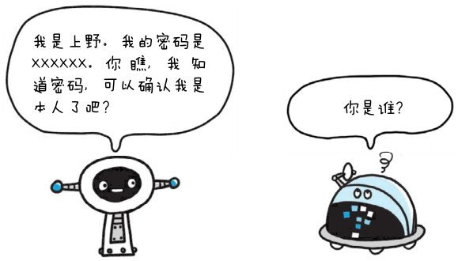

计算机本身无法判断坐在显示器前的使用者的身份。进一步说，也无法确认网络的那头究竟有谁。
可见，为了弄清究竟是谁在访问服务器，就得让对方的客户端自报家门。

可是，就算正在访问服务器的对方声称自己是ueno，身份是否属实这点却也无从谈起。
为确认ueno本人是否真的具有访问系统的权限，就需要核对“登录者本人才知道的信息”、“登录者本人才会有的信息”。

> 核对的信息通常是指以下这些：

- **密码**：只有本人才会知道的字符串信息。
- **动态令牌**：仅限本人持有的设备内显示的一次性密码。
- **数字证书**：仅限本人（终端）持有的信息。
- **生物认证**：指纹和虹膜等本人的生理信息。
- **IC 卡等**：仅限本人持有的信息。

但是，即便对方是假冒的用户，只要能通过用户验证，那么计算机就会默认是出自本人的行为。
因此，掌控机密信息的密码绝不能让他人得到，更不能轻易地就被破解出来。

**HTTP 使用的认证方式**

> HTTP/1.1 使用的认证方式如下所示：
- **BASIC 认证**（基本认证）
- **DIGEST 认证**（摘要认证）
- **SSL 客户端认证**
- **FormBase 认证**（基于表单认证）

此外，还有 Windows 统一认证（Keberos 认证、NTLM 认证），但本书不作讲解。
