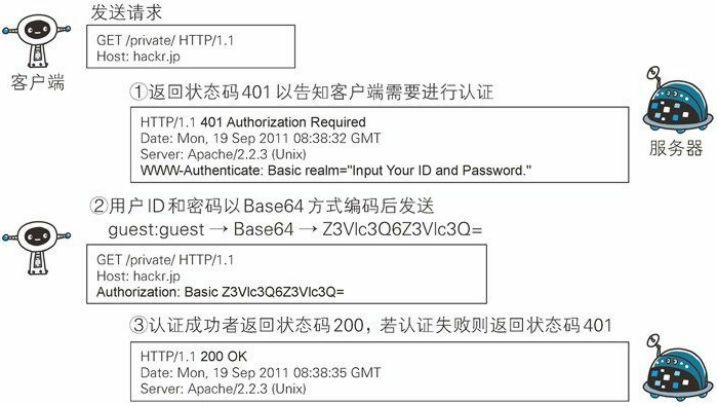
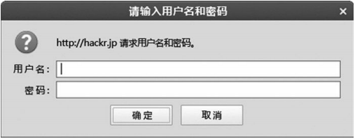

BASIC 认证（基本认证）是从 **HTTP/1.0 就定义的认证方式**。

即便是现在仍有一部分的网站会使用这种认证方式。是 Web 服务器与通信客户端之间进行的认证方式。

**BASIC 认证的认证步骤**

> 图：BASIC 认证概要

- **步骤1**：当请求的资源需要 BASIC 认证时，服务器会随状态码 401 Authorization Required，返回带 WWW-Authenticate 首部字段的响应。
该字段内包含认证的方式（BASIC）及 Request-URI 安全域字符串（realm）。

- **步骤2**：接收到状态码 401 的客户端为了通过 BASIC 认证，需要将用户 ID 及密码发送给服务器。
**发送的字符串内容是由用户 ID 和密码构成，两者中间以冒号（:）连接后，再经过 Base64 编码处理**。

  假设用户 ID 为 guest，密码是 guest，连接起来就会形成 guest:guest 这样的字符串。
  然后经过 Base64 编码，最后的结果即是 Z3Vlc3Q6Z3Vlc3Q=。
  把这串字符串写入首部字段 Authorization 后，发送请求。

  当用户代理为浏览器时，用户仅需输入用户 ID 和密码即可，之后，浏览器会自动完成到 Base64 编码的转换工作。

  

- **步骤3**：接收到包含首部字段 Authorization 请求的服务器，会对认证信息的正确性进行验证。
如验证通过，则返回一条包含 Request-URI 资源的响应。

  BASIC 认证虽然采用 Base64 编码方式，但这不是加密处理。不需要任何附加信息即可对其解码。
  换言之，由于明文解码后就是用户 ID 和密码，在 HTTP 等非加密通信的线路上进行 BASIC 认证的过程中，如果被人窃听，被盗的可能性极高。

另外，除此之外想再进行一次 BASIC 认证时，一般的浏览器却无法实现认证注销操作，这也是问题之一。

BASIC 认证使用上不够便捷灵活，且达不到多数 Web 网站期望的安全性等级，因此它并不常用。
