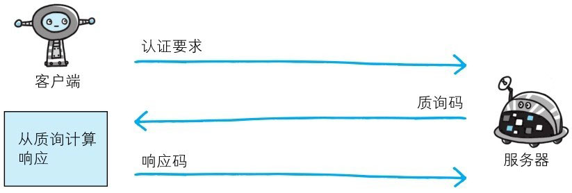
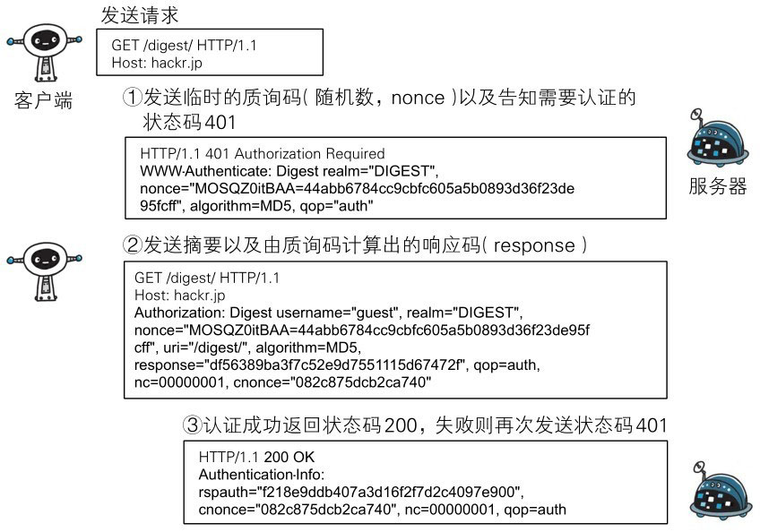

**为弥补 BASIC 认证存在的弱点，从 HTTP/1.1 起就有了 DIGEST 认证**。

DIGEST 认证同样使用质询/响应的方式（challenge/response），但不会像 BASIC 认证那样直接发送明文密码。

所谓质询响应方式是指，一开始一方会先发送认证要求给另一方，接着使用从另一方那接收到的质询码计算生成响应码。最后将响应码返回给对方进行认证的方式。

因为发送给对方的只是响应摘要及由质询码产生的计算结果，所以比起 BASIC 认证，密码泄露的可能性就降低了。

# DIGEST 认证的认证步骤

> 图：DIGEST 认证概要

- **步骤1**：请求需认证的资源时，服务器会随着状态码 401 Authorization Required，返回带 WWW-Authenticate 首部字段的响应。
该字段内包含质问响应方式认证所需的临时质询码（随机数，nonce）。

  首部字段 WWW-Authenticate 内必须包含 realm 和 nonce 这两个字段的信息。客户端就是依靠向服务器回送这两个值进行认证的。

  nonce 是一种每次随返回的 401 响应生成的任意随机字符串。
  该字符串通常推荐由 Base64 编码的十六进制数的组成形式，但实际内容依赖服务器的具体实现。

- **步骤2**：接收到 401 状态码的客户端，返回的响应中包含 DIGEST 认证必须的首部字段 Authorization 信息。

  首部字段 Authorization 内必须包含 username、realm、nonce、uri 和 response 的字段信息。
  其中，realm 和 nonce 就是之前从服务器接收到的响应中的字段。

  username 是 realm 限定范围内可进行认证的用户名。

  uri（digest-uri）即 Request-URI 的值，但考虑到经代理转发后Request-URI 的值可能被修改，因此事先会复制一份副本保存在 uri 内。

  response 也可叫做 Request-Digest，存放经过 MD5 运算后的密码字符串，形成响应码。

  响应中其他的实体请参见第 6 章的请求首部字段 Authorization。另外，有关 Request-Digest 的计算规则较复杂，有兴趣的读者不妨深入学习一下 RFC2617。

- **步骤3**：接收到包含首部字段 Authorization 请求的服务器，会确认认证信息的正确性。认证通过后则返回包含 Request-URI 资源的响应。

  并且这时会在首部字段 Authentication-Info 写入一些认证成功的相关信息。

  DIGEST 认证提供了高于 BASIC 认证的安全等级，但是和 HTTPS 的客户端认证相比仍旧很弱。
  DIGEST 认证提供防止密码被窃听的保护机制，但并不存在防止用户伪装的保护机制。

  DIGEST 认证和 BASIC 认证一样，使用上不那么便捷灵活，且仍达不到多数 Web 网站对高度安全等级的追求标准。因此它的适用范围也有所受限。
