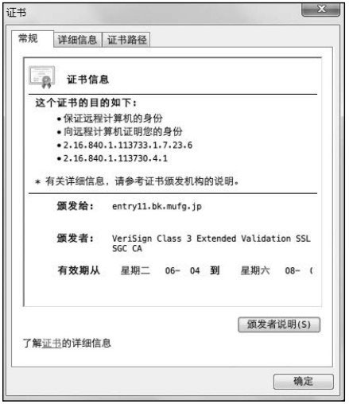

从使用用户 ID 和密码的认证方式方面来讲，只要二者的内容正确，即可认证是本人的行为。但如果用户 ID 和密码被盗，就很有可能被第三者冒充。利用 SSL 客户端认证则可以避免该情况的发生。

SSL 客户端认证是借由 HTTPS 的客户端证书完成认证的方式。凭借客户端证书（在 HTTPS 一章已讲解）认证，服务器可确认访问是否来自已登录的客户端。

# SSL 客户端认证的认证步骤

为达到 SSL 客户端认证的目的，需要事先将客户端证书分发给客户端，且客户端必须安装此证书。

- **步骤1**: 接收到需要认证资源的请求，服务器会发送 Certificate Request 报文，要求客户端提供客户端证书。

- **步骤2**: 用户选择将发送的客户端证书后，客户端会把客户端证书信息以 Client Certificate 报文方式发送给服务器。

> 图：选择客户端证书示例（三菱东京UFJ银行）

- **步骤3**: 服务器验证客户端证书验证通过后方可领取证书内客户端的公开密钥，然后开始 HTTPS 加密通信。

# SSL 客户端认证采用双因素认证

在多数情况下，SSL 客户端认证不会仅依靠证书完成认证，一般会和基于表单认证组合形成一种双因素认证（Two-factor authentication）来使用。
所谓双因素认证就是指，认证过程中不仅需要密码这一个因素，还需要申请认证者提供其他持有信息，从而作为另一个因素，与其组合使用的认证方式。

换言之，第一个认证因素的 SSL 客户端证书用来认证客户端计算机，另一个认证因素的密码则用来确定这是用户本人的行为。

通过双因素认证后，就可以确认是用户本人正在使用匹配正确的计算机访问服务器。

# SSL 客户端认证必要的费用

使用 SSL 客户端认证需要用到客户端证书。而客户端证书需要支付一定费用才能使用。

这里提到的费用是指，从认证机构购买客户端证书的费用，以及服务器运营者为保证自己搭建的认证机构安全运营所产生的费用。

每个认证机构颁发客户端证书的费用不尽相同，平摊到一张证书上，一年费用约几万至十几万日元。服务器运营者也可以自己搭建认证机构，但要维持安全运行就会产生相应的费用。
