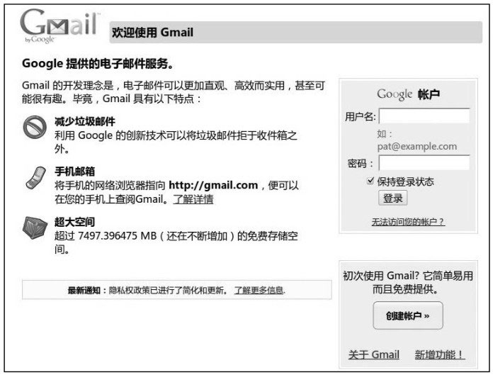
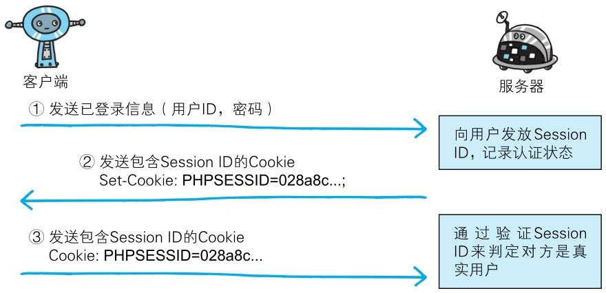

基于表单的认证方法并不是在 HTTP 协议中定义的。客户端会向服务器上的 Web 应用程序发送登录信息（Credential），按登录信息的验证结果认证。

根据 Web 应用程序的实际安装，提供的用户界面及认证方式也各不相同。

> 图：基于表单认证示例（Google）

多数情况下，输入已事先登录的用户 ID（通常是任意字符串或邮件地址）和密码等登录信息后，发送给 Web 应用程序，基于认证结果来决定认证是否成功。

# 认证多半为基于表单认证

由于使用上的便利性及安全性问题，HTTP 协议标准提供的 BASIC 认证和 DIGEST 认证几乎不怎么使用。
另外，SSL 客户端认证虽然具有高度的安全等级，但因为导入及维持费用等问题，还尚未普及。

比如 SSH 和 FTP 协议，服务器与客户端之间的认证是合乎标准规范的，并且满足了最基本的功能需求上的安全使用级别，因此这些协议的认证可以拿来直接使用。
但是对于 Web 网站的认证功能，能够满足其安全使用级别的标准规范并不存在，所以只好使用由 Web 应用程序各自实现基于表单的认证方式。

不具备共同标准规范的表单认证，在每个 Web 网站上都会有各不相同的实现方式。
如果是全面考虑过安全性能而实现的表单认证，那么就能够具备高度的安全等级。但在表单认证的实现中存在问题的 Web 网站也是屡见不鲜。

# Session 管理及 Cookie 应用

基于表单认证的标准规范尚未有定论，一般会使用 Cookie 来管理 Session（会话）。

基于表单认证本身是通过服务器端的 Web 应用，将客户端发送过来的用户ID和密码与之前登录过的信息做匹配来进行认证的。

但鉴于 HTTP 是无状态协议，之前已认证成功的用户状态无法通过协议层面保存下来。
即：无法实现状态管理，因此即使当该用户下一次继续访问，也无法区分他与其他的用户。
于是我们会使用 Cookie 来管理 Session，以弥补 HTTP 协议中不存在的状态管理功能。

> 图：Session 管理及 Cookie 状态管理

- **步骤1**: 客户端把用户 ID 和密码等登录信息放入报文的实体部分，通常是以 POST 方法把请求发送给服务器。
而这时，会使用 HTTPS 通信来进行 HTML 表单画面的显示和用户输入数据的发送。

- **步骤2**: 服务器会发放用以识别用户的 Session ID。通过验证从客户端发送过来的登录信息进行身份认证，然后把用户的认证状态与 Session ID 绑定后记录在服务器端。
  
  向客户端返回响应时，会在首部字段 Set-Cookie 内写入 Session ID（如 PHPSESSID=028a8c…）。

  你可以把 Session ID 想象成一种用以区分不同用户的等位号。然而，如果 Session ID 被第三方盗走，对方就可以伪装成你的身份进行恶意操作了。
  因此必须防止 Session ID 被盗或被猜出。为了做到这点，Session ID 应使用难以推测的字符串，且服务器端也需要进行有效期的管理，保证其安全性。

  另外，为减轻跨站脚本攻击（XSS）造成的损失，建议事先在 Cookie 内加上 httponly 属性。

- **步骤3**: 客户端接收到从服务器端发来的 Session ID 后，会将其作为 Cookie 保存在本地。
下次向服务器发送请求时，浏览器会自动发送 Cookie，所以 Session ID 也随之发送到服务器。服务器端可通过验证接收到的 Session ID 识别用户和其认证状态。

除了以上介绍的应用实例，还有应用其他不同方法的案例。

另外，不仅基于表单认证的登录信息及认证过程都无标准化的方法，服务器端应如何保存用户提交的密码等登录信息等也没有标准化。

通常，一种安全的保存方法是，先利用给密码加盐（salt）的方式增加额外信息，再使用散列（hash）函数计算出散列值后保存。
但是我们也经常看到直接保存明文密码的做法，而这样的做法具有导致密码泄露的风险。

::: info salt
其实就是由服务器随机生成的一个字符串，但是要保证长度足够长，并且是真正随机生成的。然后把它和密码字符串相连接（前后都可以）生成散列值。
当两个用户使用了同一个密码时，由于随机生成的 salt 值不同，对应的散列值也将是不同的。
这样一来，很大程度上减少了密码特征，攻击者也就很难利用自己手中的密码特征库进行破解。——译者注
:::
