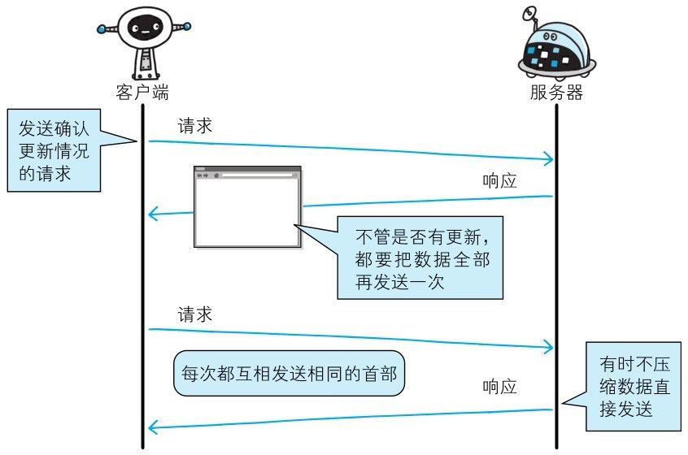
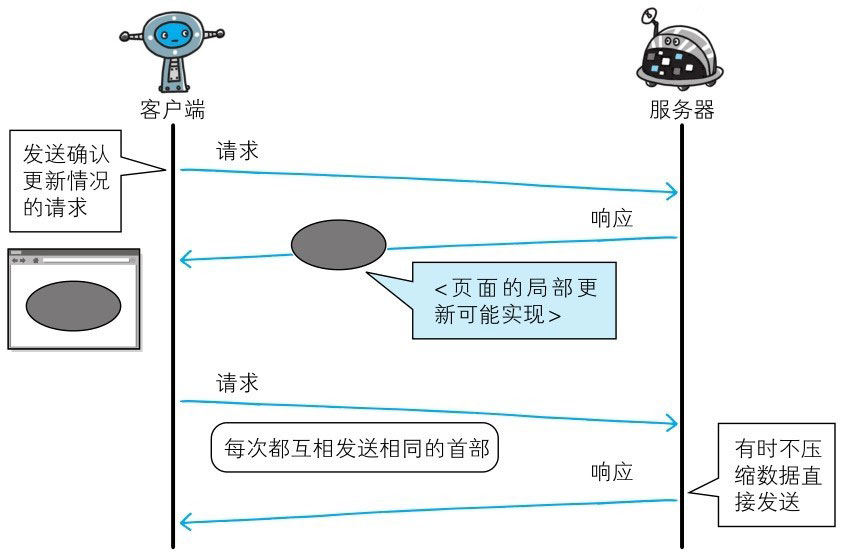
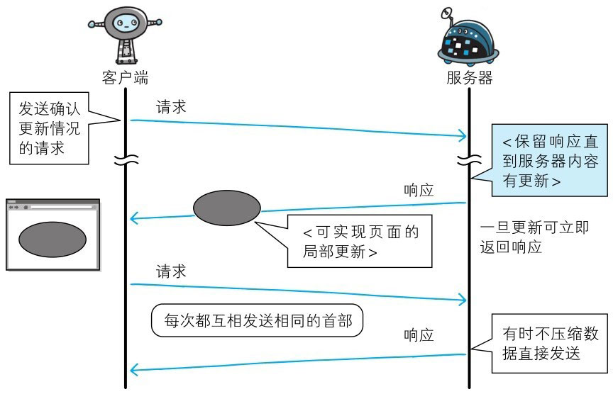
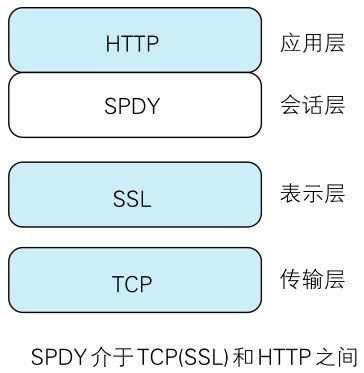

Google 在 2010 年发布了 SPDY（取自 SPeeDY，发音同 speedy），其开发目标旨在解决 HTTP 的性能瓶颈，缩短 Web 页面的加载时间 50%。

[SPDY - The Chromium Projects](http://www.chromium.org/spdy/)

::: tip 名词解释
SPDY（读作“SPeeDY”）是 Google 开发的基于 TCP 的会话层协议，用以最小化网络延迟，提升网络速度，优化用户的网络使用体验。
SPDY 并不是一种用于替代 HTTP 的协议，而是对 HTTP 协议的增强。新协议的功能包括数据流的多路复用、请求优先级以及 HTTP 报头压缩。
谷歌表示，引入 SPDY 协议后，在实验室测试中页面加载速度比原先快 64%。
:::

# HTTP 的瓶颈

在 Facebook 和 Twitter 等 SNS 网站上，几乎能够实时观察到海量用户公开发布的内容，这也是一种乐趣。
当几百、几千万的用户发布内容时，Web 网站为了保存这些新增内容，在很短的时间内就会发生大量的内容更新。

为了尽可能实时地显示这些更新的内容，服务器上一有内容更新，就需要直接把那些内容反馈到客户端的界面上。虽然看起来挺简单的，但 HTTP 却无法妥善地处理好这项任务。

使用 HTTP 协议探知服务器上是否有内容更新，就必须频繁地从客户端到服务器端进行确认。**如果服务器上没有内容更新，那么就会产生徒劳的通信。**

若想在现有 Web 实现所需的功能，以下这些 HTTP 标准就会成为瓶颈：

> - 一条连接上只可发送一个请求。
> - 请求只能从客户端开始。客户端不可以接收除响应以外的指令。
> - 请求/响应首部未经压缩就发送。首部信息越多延迟越大。
> - 发送冗长的首部。每次互相发送相同的首部造成的浪费较多。
> - 可任意选择数据压缩格式。非强制压缩发送。

> 图：以前的 HTTP 通信

## AJAX 的解决方法

Ajax（Asynchronous JavaScript and XML，异步 JavaScript 与 XML 技术）是一种有效利用 JavaScript 和 DOM（Document Object Model，文档对象模型）的操作，
以达到局部 Web 页面替换加载的异步通信手段。和以前的同步通信相比，由于它只更新一部分页面，响应中传输的数据量会因此而减少，这一优点显而易见。

Ajax 的核心技术是名为 XMLHttpRequest 的 API，通过 JavaScript 脚本语言的调用就能和服务器进行 HTTP 通信。
借由这种手段，就能从已加载完毕的 Web 页面上发起请求，只更新局部页面。

而利用 Ajax 实时地从服务器获取内容，有可能会导致大量请求产生。另外，Ajax 仍未解决 HTTP 协议本身存在的问题。

> 图：Ajax 的通信

## Comet 的解决方法

Comet（Composite Event Transfer，组合事件传输）是一种基于 HTTP 的技术，用于实现实时通信。

一旦服务器端有内容更新了，Comet 不会让请求等待，而是直接给客户端返回响应。这是一种通过延迟应答，模拟实现服务器端向客户端推送（Server Push）的功能。

通常，服务器端接收到请求，在处理完毕后就会立即返回响应，但**为了实现推送功能，Comet 会先将响应置于挂起状态，
当服务器端有内容更新时，再返回该响应**。因此，服务器端一旦有更新，就可以立即反馈给客户端。

内容上虽然可以做到实时更新，但为了保留响应，一次连接的持续时间也变长了。
期间，为了维持连接会消耗更多的资源。另外，Comet 也仍未解决 HTTP 协议本身存在的问题。

> 图：Comet 的通信

## SPDY 的目标

陆续出现的 Ajax 和 Comet 等提高易用性的技术，一定程度上使 HTTP 得到了改善，但 HTTP 协议本身的限制也令人有些束手无策。
为了进行根本性的改善，需要有一些协议层面上的改动。处于持续开发状态中的 SPDY 协议，正是为了在协议级别消除 HTTP 所遭遇的瓶颈。

# SPDY 的设计与功能

SPDY 没有完全改写 HTTP 协议，而是**在 TCP/IP 的应用层与传输层之间通过新加会话层的形式运作**。
同时，考虑到安全性问题，SPDY 规定通信中使用 SSL。

SPDY 以会话层的形式加入，控制对数据的流动，但还是采用 HTTP 建立通信连接。
因此，可照常使用 HTTP 的 GET 和 POST 等方法、Cookie 以及 HTTP 报文等。

> 图：SPDY 的设计

使用 SPDY 后，HTTP 协议额外获得以下功能：

- **多路复用流**：通过单一的 TCP 连接，可以无限制处理多个 HTTP 请求。所有请求的处理都在一条 TCP 连接上完成，因此 TCP 的处理效率得到提高。

- **赋予请求优先级**：SPDY 不仅可以无限制地并发处理请求，还可以给请求逐个分配优先级顺序。这样主要是为了在发送多个请求时，解决因带宽低而导致响应变慢的问题。

- **压缩 HTTP 首部**：压缩 HTTP 请求和响应的首部。这样一来，通信产生的数据包数量和发送的字节数就更少了。

- **推送功能**：支持服务器主动向客户端推送数据的功能。这样，服务器可直接发送数据，而不必等待客户端的请求。

- **服务器提示功能**：服务器可以主动提示客户端请求所需的资源。由于在客户端发现资源之前就可以获知资源的存在，因此在资源已缓存等情况下，可以避免发送不必要的请求。

# SPDY 消除 Web 瓶颈了吗

希望使用 SPDY 时，Web 的内容端不必做什么特别改动，而 Web 浏览器及 Web 服务器都要为对应 SPDY 做出一定程度上的改动。
有好几家 Web 浏览器已经针对 SPDY 做出了相应的调整。另外，Web 服务器也进行了实验性质的应用，但把该技术导入实际的 Web 网站却进展不佳。

**因为 SPDY 基本上只是将单个域名（IP 地址）的通信多路复用，所以当一个 Web 网站上使用多个域名下的资源，改善效果就会受到限制。**

SPDY 的确是一种可有效消除 HTTP 瓶颈的技术，但很多 Web 网站存在的问题并非仅仅是由 HTTP 瓶颈所导致。
对 Web 本身的速度提升，还应该从其他可细致钻研的地方入手，比如改善 Web 内容的编写方式等。
