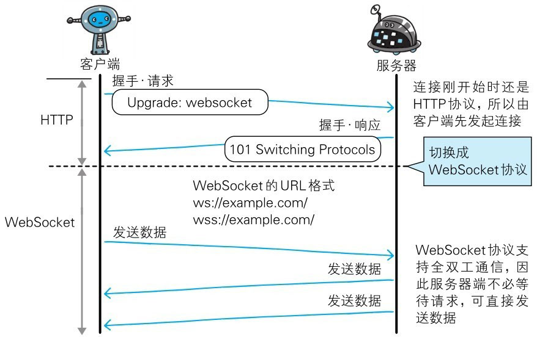

利用 Ajax 和 Comet 技术进行通信可以提升 Web 的浏览速度。但问题在于通信若使用 HTTP 协议，就无法彻底解决瓶颈问题。
WebSocket 网络技术正是为解决这些问题而实现的一套新协议及 API。

当时筹划将 WebSocket 作为 HTML5 标准的一部分，而现在它却逐渐变成了**独立的协议标准**。WebSocket 通信协议**在 2011 年 12 月，被 RFC 6455- The WebSocket Protocol 定为标准**。


# WebSocket 的设计与功能

WebSocket，即 **Web 浏览器与 Web 服务器之间全双工通信标准**。

其中，WebSocket 协议由 IETF 定为标准，WebSocket API 由 W3C 定为标准。
仍在开发中的 WebSocket 技术主要是为了解决 Ajax 和 Comet 里 XMLHttpRequest 附带的缺陷所引起的问题。


# WebSocket 协议

一旦 Web 服务器与客户端之间建立起 WebSocket 协议的通信连接，之后所有的通信都依靠这个专用协议进行。
通信过程中可互相发送 JSON、XML、HTML 或图片等任意格式的数据。

由于是建立在 HTTP 基础上的协议，因此连接的发起方仍是客户端，而一旦确立 WebSocket 通信连接，不论服务器还是客户端，任意一方都可直接向对方发送报文。

下面我们列举一下 WebSocket 协议的主要特点。

- **推送功能**：支持由服务器向客户端推送数据的推送功能。这样服务器可直接发送数据，而不必等待客户端的请求。

- **减少通信量**：只要建立起 WebSocket 连接，就希望一直保持连接状态。和 HTTP 相比，不但每次连接时的总开销减少，而且由于 WebSocket 的首部信息很小，通信量也相应减少了。

  为了实现 WebSocket 通信，在 HTTP 连接建立之后，需要完成一次“握手”（Handshaking）的步骤。

- **握手·请求**：为了实现 WebSocket 通信，需要用到 HTTP 的 Upgrade 首部字段，告知服务器通信协议发生改变，以达到握手的目的。

  ```http
  GET /chat HTTP/1.1
  Host: server.example.com
  Upgrade: websocket
  Connection: Upgrade
  Sec-WebSocket-Key: dGhlIHNhbXBsZSBub25jZQ==
  Origin: http://example.com
  Sec-WebSocket-Protocol: chat,superchat
  Sec-WebSocket-Version: 13
  ```

  Sec-WebSocket-Key 字段内记录着握手过程中必不可少的键值。Sec-WebSocket-Protocol 字段内记录使用的子协议。

  子协议按 WebSocket 协议标准在连接分开使用时，定义那些连接的名称。

- **握手·响应**：对于之前的请求，返回状态码 101 Switching Protocols 的响应。

  ```http
  HTTP/1.1 101 Switching Protocols
  Upgrade: websocket
  Connection: Upgrade
  Sec-WebSocket-Accept: s3pPLMBiTxaQ9kYGzzhZRbK+xOo=
  Sec-WebSocket-Protocol: chat
  ```

  Sec-WebSocket-Accept 的字段值是由握手请求中的 Sec-WebSocket-Key 的字段值生成的。

  成功握手确立 WebSocket 连接之后，通信时不再使用 HTTP 的数据帧，而采用 WebSocket 独立的数据帧。

  
  > 图：WebSocket 通信

- **WebSocket API**：JavaScript 可调用“[The WebSocketAPI](http://www.w3.org/TR/websockets/)”（由W3C标准制定） 内提供的 WebSocket 程序接口，以实现 WebSocket 协议下全双工通信。

  以下为调用 WebSocket API，每 50ms 发送一次数据的实例。

  ```js
  var socket = new WebSocket('ws://game.example.com:12010/updates');
  socket.onopen = function () {
    setInterval(function() {
      if (socket.bufferedAmount == 0)
        socket.send(getUpdateData());
    },50);
  };
  ```
