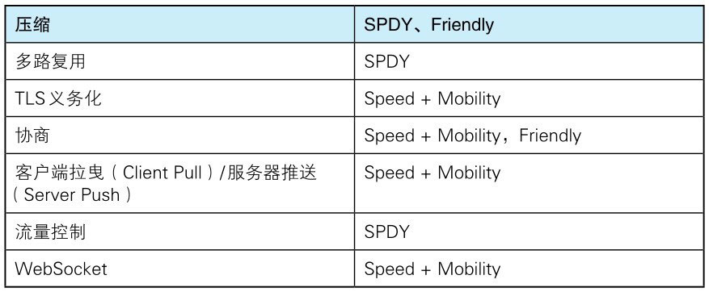

目前主流的 HTTP/1.1 标准，自 1999 年发布的 RFC2616 之后再未进行过改订。
SPDY 和 WebSocket 等技术纷纷出现，很难断言 HTTP/1.1 仍是适用于当下的 Web 的协议。

负责互联网技术标准的 IETF（Internet Engineering Task Force，互联网工程任务组）创立 [httpbis](http://datatracker.ietf.org/wg/httpbis/)（Hypertext Transfer ProtocolBis）工作组，
其目标是推进下一代 HTTP — HTTP/2.0 在 2014 年 11 月实现标准化。

## HTTP/2.0 的特点

HTTP/2.0 的目标是改善用户在使用 Web 时的速度体验。
由于基本上都会先通过 HTTP/1.1 与 TCP 连接，现在我们以下面的这些协议为基础，探讨一下它们的实现方法。

- SPDY、HTTP Speed+Mobility、Network-Friendly HTTP Upgrade

HTTP Speed+Mobility 由微软公司起草，是用于改善并提高移动端通信时的通信速度和性能的标准。它建立在 Google 公司提出的 SPDY 与 WebSocket 的基础之上。

Network-Friendly HTTP Upgrade 主要是在移动端通信时改善 HTTP 性能的标准。

## HTTP/2.0 的 7 项技术及讨论

HTTP/2.0 围绕着主要的 7 项技术进行讨论，现阶段（2012 年 8 月 13 日），大都倾向于采用以下协议的技术。
但是，讨论仍在持续，所以不能排除会发生重大改变的可能性。

> 注：HTTP Speed+Mobility 简写为 Speed+Mobility，Network-Friendly HTTP Upgrade 简写为 Friendly。
