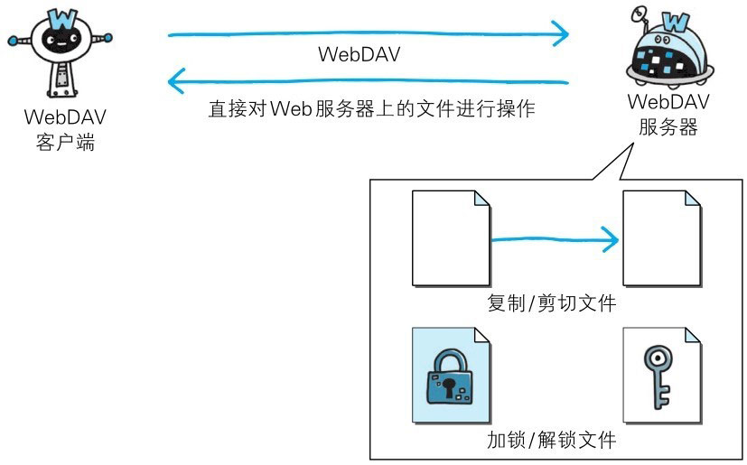

WebDAV（Web-based Distributed Authoring and Versioning，基于万维网的分布式创作和版本控制）是一个可对 Web 服务器上的内容直接进行文件复制、编辑等操作的分布式文件系统。
它作为扩展 HTTP/1.1 的协议定义在 RFC4918。

除了创建、删除文件等基本功能，它还具备文件创建者管理、文件编辑过程中禁止其他用户内容覆盖的加锁功能，以及对文件内容修改的版本控制功能。


> 图：WebDAV

使用 HTTP/1.1 的 PUT 方法和 DELETE 方法，就可以对 Web 服务器上的文件进行创建和删除操作。可是出于安全性及便捷性等考虑，一般不使用。


# 扩展 HTTP/1.1 的 WebDAV

针对服务器上的资源，WebDAV 新增加了一些概念，如下所示：


> 图：WebDAV 扩展的概念

- **集合**（Co lection）：是一种统一管理多个资源的概念。以集合为单位可进行各种操作。也可实现类似集合的集合这样的叠加。

- **资源**（Resource）：把文件或集合称为资源。

- **属性**（Property）：定义资源的属性。定义以“名称=值”的格式执行。

- **锁**（Lock）：把文件设置成无法编辑状态。多人同时编辑时，可防止在同一时间进行内容写入。


# WebDAV 内新增的方法及状态码

WebDAV 为实现远程文件管理，向 HTTP/1.1 中追加了以下这些方法：

- PROPFIND：获取属性
- PROPPATCH：修改属性
- MKCOL：创建集合
- COPY：复制资源及属性
- MOVE：移动资源
- LOCK：资源加锁
- UNLOCK：资源解锁

为配合扩展的方法，状态码也随之扩展。

- 102 Processing：可正常处理请求，但目前是处理中状态
- 207 Multi-Status：存在多种状态
- 422 Unprocessible Entity：格式正确，内容有误
- 423 Locked：资源已被加锁
- 424 Failed Dependency：处理与某请求关联的请求失败，因此不再维持依赖关系
- 507 Insufficient Storage：保存空间不足

**WebDAV 的请求实例**

> 下面是使用 PROPFIND 方法对 http://www.example.com/file 发起获取属性的请求。

```xml
PROPFIND /file HTTP/1.1
Host: www.example.com
Content-Type: application/xml;charset="utf-8"
Content-Length: 219
<?xml version="1.0" encoding="utf-8" ?>
<D:propfind xmlns:D="DAV:">
  <D:prop xmlns:R="http://ns.example.com/boxschema/">
      <R:bigbox/>
      <R:author/>
      <R:DingALing/>
      <R:Random/>
  </D:prop>
</D:propfind>
```

**WebDAV 的响应实例**

> 下面是针对之前的 PROPFIND 方法，返回 http://www.example.com/file 的属性的响应。

```xml
HTTP/1.1 207 Multi-Status
Content-Type: application/xml;charset="utf-8"
Content-Length: 831
<?xml version="1.0" encoding="utf-8" ?>
<D:multistatus xmlns:D="DAV:">
  <D:response xmlns:R="http://ns.example.com/boxschema/">
    <D:href>http://www.example.com/file</D:href>
    <D:propstat>
      <D:prop>
        <R:bigbox>
        <R:BoxType>Box type A</R:BoxType>
        </R:bigbox>
        <R:author>
        <R:Name>J.J.Johnson</R:Name>
        </R:author>
      </D:prop>
      <D:status>HTTP/1.1200 OK</D:status>
    </D:propstat>
    <D:propstat>
      <D:prop><R:DingALing/><R:Random/></D:prop>
      <D:status>HTTP/1.1403 Forbidden</D:status>
      <D:responsedescription>The user does not have access to the
      DingALing property.
      </D:responsedescription>
    </D:propstat>
  </D:response>
  <D:responsedescription>There has been an access violation error.
  </D:responsedescription>
</D:multistatus>
```


# 为何 HTTP 协议受众如此广泛

::: info
本章讲解了几个与 HTTP 相关联的协议使用案例。为什么 HTTP 协议受众能够如此广泛呢？
:::

过去，新编写接入互联网的系统或软件时，还需要同时编写实现与必要功能对应的新协议。
但最近，使用 HTTP 的系统和软件占了绝大多数。

这有着诸多原因，其中与企业或组织的防火墙设定有着莫大的关系。
防火墙的基本功能就是禁止非指定的协议和端口号的数据包通过。因此如果使用新协议或端口号则必须修改防火墙设置。

互联网上，使用率最高的当属 Web。不管是否具备访问 FTP 和 SSH 的权限，一般公司都会开放对 Web 的访问。
Web 是基于 HTTP 协议运作的，因此在构建 Web 服务器或访问 Web 站点时，需事先设置防火墙 HTTP（80/tcp）和 HTTPS（443/tcp）的权限。

许多公司或组织已设定权限将 HTTP 作为通信环境，因此无须再修改防火墙的设定。
可见 HTTP 具有导入简单这一大优势。而这也是基于 HTTP 服务或内容不断增加的原因之一。

还有一些其他原因，比如，作为 HTTP 客户端的浏览器已相当普遍，HTTP 服务器的数量已颇具规模，HTTP 本身就是优异的应用等。
