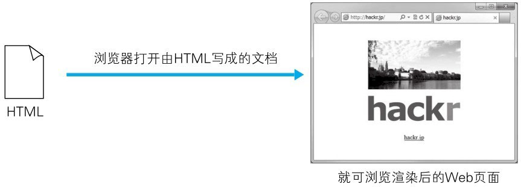

# Web 页面几乎全由 HTML 构建

HTML（HyperText Markup Language，超文本标记语言）是为了发送 Web 上的超文本（Hypertext）而开发的标记语言。

超文本是一种文档系统，可将文档中任意位置的信息与其他信息（文本或图片等）建立关联，即超链接文本。

标记语言是指通过在文档的某部分穿插特别的字符串标签，用来修饰文档的语言。我们把出现在 HTML 文档内的这种特殊字符串叫做 HTML 标签（Tag）。

平时我们浏览的 Web 页面几乎全是使用 HTML 写成的。由 HTML 构成的文档经过浏览器的解析、渲染后，呈现出来的结果就是 Web 页面。


> 图：HTML 构建 Web 页面

以下就是用 HTML 编写的文档的例子。而这份 HTML 文档内这种被 `<>` 包围着的文字就是标签。在标签的作用下，文档会改变样式，或插入图片、链接。

```html
<html>
  <head>
    <meta http-equiv="Content-Type" content="text/html;charset=utf-8" />
    <title>hackr.jp</title>
    <style type="text/css">
    .logo {
      padding:20px;
      text-align:center;
    }
    </style>
  </head>
  <body>
    <div class="logo">
      <p></p>
      <p></p>
      <p><a href="http://hackr.jp/">hackr.jp</a></p>
    </div>
  </body>
</html>
```


# HTML 的版本

Tim Berners-Lee 提出 HTTP 概念的同时，还提出了 HTML 原型。
1993 年在伊利诺伊大学的 NCSA（国家超级计算机应用中心）发布了 Mosaic 浏览器（世界首个图形界面浏览器程序），
而能够被 Mosaic 解析的 HTML，统一标准后即作为 HTML 1.0 发布。

目前的最新版本是 HTML 4.01 标准，1999年12月 W3C（World Wide Web Consortium）组织推荐使用这一版本。
下一个版本，预计会在 2014 年左右正式推荐使用 HTML5 标准。

HTML5 标准不仅解决了浏览器之间的兼容性问题，并且可把文本作为数据对待，更容易复用，动画等效果也变得更生动。

时至今日，HTML 仍存在较多悬而未决问题。有些浏览器未遵循 HTML 标准实现，或扩展自用标签等，这都反映了 HTML 的标准实际上尚未统一这一现状。


# 设计应用 CSS

CSS（Cascading Style Sheets，层叠样式表）可以指定如何展现 HTML 内的各种元素，属于样式表标准之一。
即使是相同的 HTML 文档，通过改变应用的 CSS，用浏览器看到的页面外观也会随之改变。CSS 的理念就是让文档的结构和设计分离，达到解耦的目的。

下面让我们来看一个 CSS 的用例：

```css
.logo {
  padding:20px;
  text-align:center;
}
```

可在选择器（selector）.logo 的指定范围内，使用 {} 括起来的声明块中写明的 padding: 20px 等声明语句应用指定的样式。

可通过指定 HTML 元素或特定的 class、ID 等作为选择器来限定样式的应用范围。
