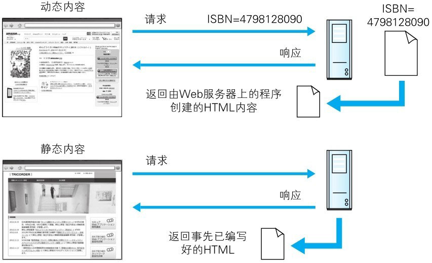
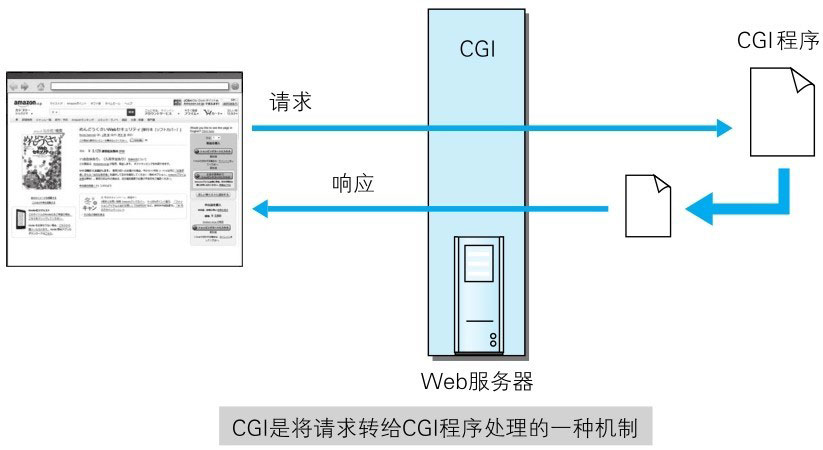
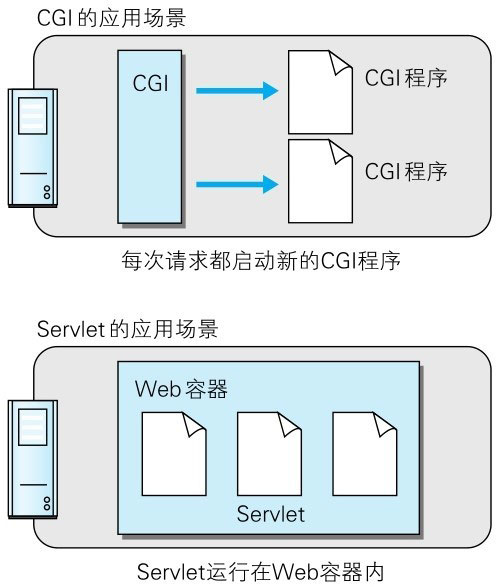

# 通过 Web 提供功能的 Web 应用

Web 应用是指通过 Web 功能提供的应用程序。
比如购物网站、网上银行、SNS、BBS、搜索引擎和 e-learning 等。互联网或企业内网上遍布各式各样的 Web 应用。

原本应用 HTTP 协议的 Web 的机制就是对客户端发来的请求，返回事前准备好的内容。
可随着 Web 越来越普及，仅靠这样的做法已不足以应对所有的需求，更需要引入由程序创建 HTML 内容的做法。

类似这种由程序创建的内容称为动态内容，而事先准备好的内容称为静态内容。Web 应用则作用于动态内容之上。

> 图：动态内容和静态内容

# 与 Web 服务器及程序协作的 CGI

CGI（Common Gateway Interface，通用网关接口）是指 Web 服务器在接收到客户端发送过来的请求后转发给程序的一组机制。
在 CGI 的作用下，程序会对请求内容做出相应的动作，比如创建 HTML 等动态内容。

使用 CGI 的程序叫做 CGI 程序，通常是用 Perl、PHP、Ruby 和 C 等编程语言编写而成。

> 图：CGI 程序

有关 CGI 更为翔实的内容请参考 RFC3875 “The Common GatewayInterface (CGI) Version 1.1”

::: tip 名词解释
**CGI**（Common Gateway Interface，**公共网关接口**）是 Web 服务器运行时外部程序的规范，按 CGI 编写的程序可以扩展服务器功能。

CGI 应用程序能与浏览器进行交互，还可通过数据 API 与数据库服务器等外部数据源进行通信，从数据库服务器中获取数据。
格式化为 HTML 文档后，发送给浏览器，也可以将从浏览器获得的数据放到数据库中。

几乎所有服务器都支持 CGI，可用任何语言编写 CGI，包括流行的 C、C ++、Java、VB 和 Delphi 等。

CGI 分为标准 CGI 和间接 CGI 两种。标准 CGI 使用命令行参数或环境变量表示服务器的详细请求，服务器与浏览器通信采用标准输入输出方式。
间接 CGI 又称缓冲 CGI，在 CGI 程序和 CGI 接口之间插入一个缓冲程序，缓冲程序与 CGI 接口间用标准输入输出进行通信。
:::

# 因 Java 而普及的 Servlet

Servlet 是一种能在服务器上创建动态内容的程序。
Servlet 是用 Java 语言实现的一个接口，属于面向企业级 Java（JavaEE，JavaEnterprise Edition）的一部分。

之前提及的 **CGI，由于每次接到请求，程序都要跟着启动一次。因此一旦访问量过大，Web 服务器要承担相当大的负载。**
而 Servlet 运行在与 Web 服务器相同的进程中，因此受到的负载较小。Servlet 的运行环境叫做 Web 容器或 Servlet 容器。

::: info 译者注
**Servlet 常驻内存，因此在每次请求时，可启动相对进程级别更为轻量的 Servlet，程序的执行效率从而变得更高。**
:::

Servlet 作为解决 CGI 问题的对抗技术，随 Java 一起得到了普及。

::: info 译者注
说对抗的原因在于，这个方向上已存在用 Per 编写的 CGl，实现在 Apache HTTP Server 上内置 mod_php 模块后可运行 PHP 程序、微软主导的 ASP 等技术。
:::

> 图：Servlet

随着 CGI 的普及，每次请求都要启动新 CGI 程序的 CGI 运行机制逐渐变成了性能瓶颈，
所以之后 Servlet 和 mod_perl 等可直接在 Web 服务器上运行的程序才得以开发、普及。
