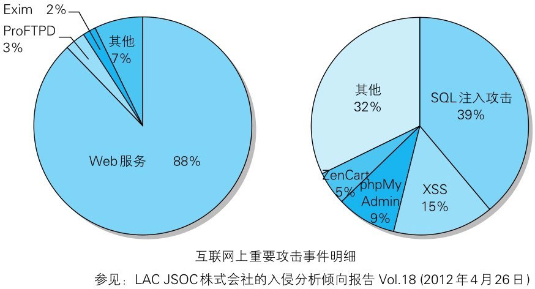
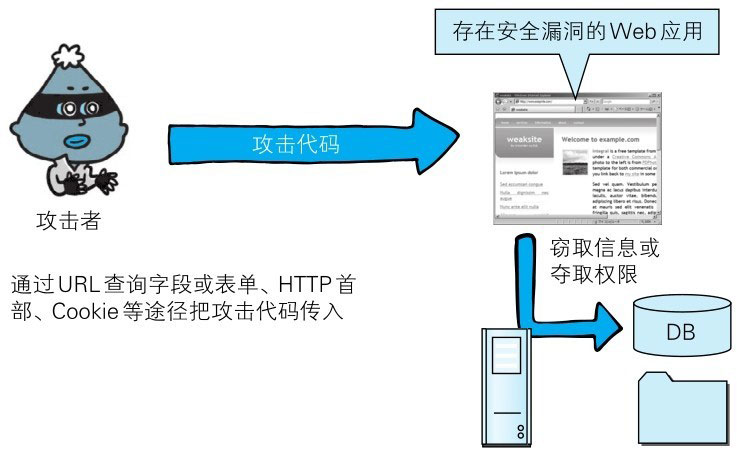
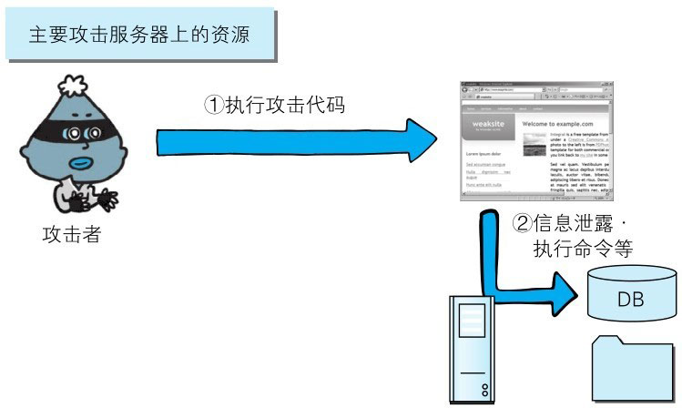
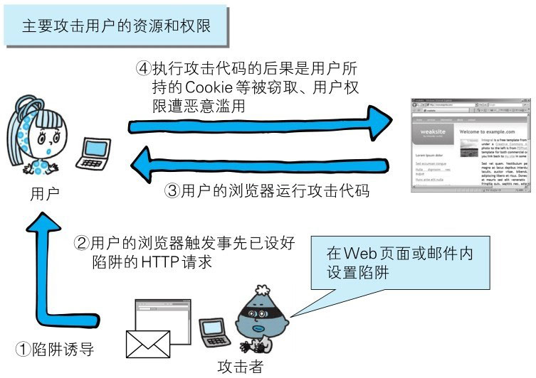
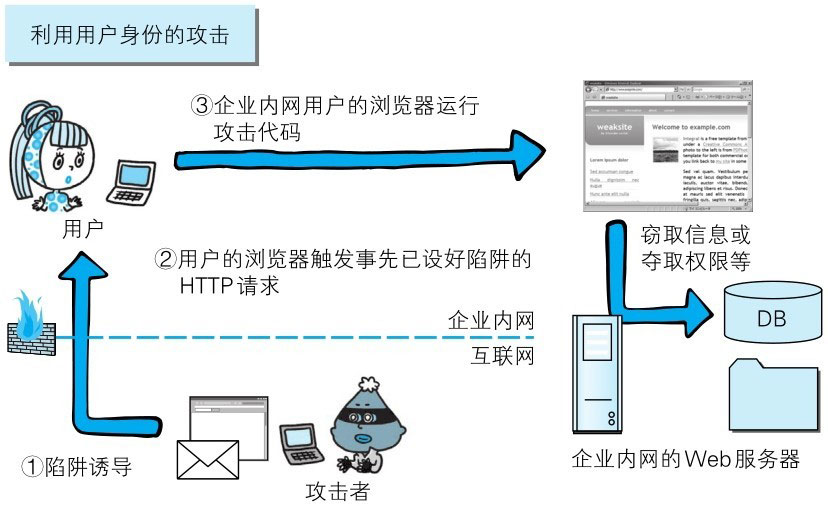

简单的 HTTP 协议本身并不存在安全性问题，因此协议本身几乎不会成为攻击的对象。
应用 HTTP 协议的服务器和客户端，以及运行在服务器上的 Web 应用等资源才是攻击目标。

目前，来自互联网的攻击大多是冲着 Web 站点来的，它们大多把 Web 应用作为攻击目标。本章主要针对 Web 应用的攻击技术进行讲解。

> 图：攻击事件倾向

# HTTP 不具备必要的安全功能

与最初的设计相比，现今的 Web 网站应用的 HTTP 协议的使用方式已发生了翻天覆地的变化。
几乎现今所有的 Web 网站都会使用会话（session）管理、加密处理等安全性方面的功能，而 HTTP 协议内并不具备这些功能。

从整体上看，HTTP 就是一个通用的单纯协议机制。因此它具备较多优势，但是在安全性方面则呈劣势。

就拿远程登录时会用到的 SSH 协议来说，SSH 具备协议级别的认证及会话管理等功能，HTTP 协议则没有。
另外在架设 SSH 服务方面，任何人都可以轻易地创建安全等级高的服务，而 HTTP 即使已架设好服务器，但若想提供服务器基础上的 Web 应用，很多情况下都需要重新开发。

因此，开发者需要自行设计并开发认证及会话管理功能来满足 Web 应用的安全。而自行设计就意味着会出现各种形形色色的实现。
结果，安全等级并不完备，可仍在运作的 Web 应用背后却隐藏着各种容易被攻击者滥用的安全漏洞的 Bug。

# 在客户端即可篡改请求

在 Web 应用中，从浏览器那接收到的 HTTP 请求的全部内容，都可以在客户端自由地变更、篡改。所以 Web 应用可能会接收到与预期数据不相同的内容。

在 HTTP 请求报文内加载攻击代码，就能发起对 Web 应用的攻击。
通过 URL 查询字段或表单、HTTP 首部、Cookie 等途径把攻击代码传入，若这时 Web 应用存在安全漏洞，那内部信息就会遭到窃取，或被攻击者拿到管理权限。

> 图：对 Web 应用的攻击

# 针对 Web 应用的攻击模式

对 Web 应用的攻击模式有以下两种：

- 主动攻击、被动攻击

## 以服务器为目标的主动攻击

主动攻击（active attack）是指攻击者通过直接访问 Web 应用，把攻击代码传入的攻击模式。
由于该模式是直接针对服务器上的资源进行攻击，因此攻击者需要能够访问到那些资源。

主动攻击模式里具有代表性的攻击是 **SQL 注入攻击和 OS 命令注入攻击**。

::: tip
**SQL 注入**：是指 web 应用程序对用户输入数据的合法性没有判断或过滤不严，攻击者可以在 web 应用程序中事先定义好的查询语句的结尾上添加额外的 SQL 语句，
在管理员不知情的情况下实现非法操作，以此来实现欺骗数据库服务器执行非授权的任意查询，从而进一步得到相应的数据信息。

**OS 命令注入攻击**：是指攻击者通过向程序传入恶意输入，使程序在操作系统层面执行未授权命令的攻击方式。
:::

> 图：主动攻击

## 以服务器为目标的被动攻击

被动攻击（passive attack）是指利用圈套策略执行攻击代码的攻击模式。在被动攻击过程中，攻击者不直接对目标 Web 应用访问发起攻击。

被动攻击通常的攻击模式如下所示：

> 步骤1: 攻击者诱使用户触发已设置好的陷阱，而陷阱会启动发送已嵌入攻击代码的 HTTP 请求。

> 步骤2: 当用户不知不觉中招之后，用户的浏览器或邮件客户端就会触发这个陷阱。

> 步骤3: 中招后的用户浏览器会把含有攻击代码的 HTTP 请求发送给作为攻击目标的 Web 应用，运行攻击代码。

> 步骤4: 执行完攻击代码，存在安全漏洞的 Web 应用会成为攻击者的跳板，可能导致用户所持的 Cookie 等个人信息被窃取，登录状态中的用户权限遭恶意滥用等后果。

被动攻击模式中具有代表性的攻击是**跨站脚本攻击 和 跨站点请求伪造**。

::: tip
**XSS**（Cross Site Scripting，**跨站脚本攻击**）通常指的是通过利用网页开发时留下的漏洞，通过巧妙的方法注入恶意指令代码到网页，使用户加载并执行攻击者恶意制造的网页程序。

这些恶意网页程序通常是 JavaScript，但实际上也可以包括 Java、 VBScript、ActiveX、 Flash 或者甚至是普通的 HTML。
攻击成功后，攻击者可能得到包括但不限于更高的权限（如执行一些操作）、私密网页内容、会话和 cookie 等各种内容。

**CSRF**（Cross-site request forgery，**跨站请求伪造**）是一种挟制用户在当前已登录的 Web 应用程序上执行非本意的操作的攻击方法。
跟 XSS 相比，XSS 利用的是用户对指定网站的信任，CSRF 利用的是网站对用户网页浏览器的信任。

简单地说，是攻击者通过一些技术手段欺骗用户的浏览器去访问一个自己曾经认证过的网站并运行一些操作（如发邮件，发消息，甚至财产操作如转账和购买商品）。
由于浏览器曾经认证过，所以被访问的网站会认为是真正的用户操作而去运行。
这利用了 web 中用户身份验证的一个漏洞：简单的身份验证只能保证请求发自某个用户的浏览器，却不能保证请求本身是用户自愿发出的。
:::

> 图：被动攻击

## 利用用户的身份攻击企业内部网络

利用被动攻击，可发起对原本从互联网上无法直接访问的企业内网等网络的攻击。
只要用户踏入攻击者预先设好的陷阱，在用户能够访问到的网络范围内，即使是企业内网也同样会受到攻击。

很多企业内网依然可以连接到互联网上，访问 Web 网站，或接收互联网发来的邮件。
这样就可能给攻击者以可乘之机，诱导用户触发陷阱后对企业内网发动攻击。

> 图：利用用户的身份攻击企业内部网络
